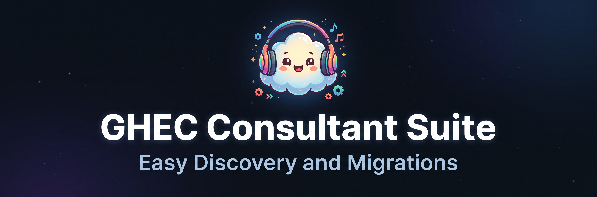
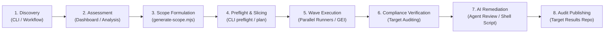

<p align="center">
  
</p>

# GHEC Consultant Suite

> Enterprise consulting platform and migration engineering toolkit for assessing, planning, executing, and auditing migrations from GitHub Enterprise Cloud (GHEC) to GitHub Enterprise Cloud with Enterprise Managed Users (GHEC-EMU).

---

## 🛠️ Tools & Packages Directory

The suite is structured as a modular TypeScript monorepo (`npm` workspaces). Every tool and engine operates with strict system boundaries, air-gapped guarantees, and zero-exposure security principles.

| Tool / Package                                      | What It Does                                                                                                                                                  |                 Interface / Access                  |                     Documentation                     |
| :-------------------------------------------------- | :------------------------------------------------------------------------------------------------------------------------------------------------------------ | :-------------------------------------------------: | :---------------------------------------------------: |
| **Consultant CLI**<br/>`apps/cli`                   | Discovery, preflight audits, planning, execution, verification, AI remediation, and audit repo publishing                                                     |          CLI binary: `ghec-consultant-cli`          |         [**CLI README**](apps/cli/README.md)          |
| **Offline Dashboard**<br/>`apps/dashboard`          | Air-gapped Vite + React 19 + Primer assessment UI for analyzing bundles, inventory sizing, and PDF exports                                                    | Web UI: `http://localhost:5173`<br/>(`npm run dev`) |   [**Dashboard README**](apps/dashboard/README.md)    |
| **Migration Engine**<br/>`packages/migration`       | 4-stage modular lifecycle (`discover` $\rightarrow$ `plan` $\rightarrow$ `apply` $\rightarrow$ `verify`), DAG dependency resolver, GEI runner, and strategies |                      Core API                       | [**Migration README**](packages/migration/README.md)  |
| **Discovery Engine**<br/>`packages/discovery`       | GraphQL/REST metadata aggregation, adaptive rate limiting, entity pseudonymization, and JSON bundle publisher                                                 |                      Core API                       | [**Discovery README**](packages/discovery/README.md)  |
| **Readiness Analysis**<br/>`packages/analysis`      | Deterministic heuristics, risk classification, blocker evaluation, and cross-resource dependency mapping                                                      |                      Core API                       |  [**Analysis README**](packages/analysis/README.md)   |
| **Dual GitHub Client**<br/>`packages/github-client` | Isolated source & target REST/GraphQL clients with per-tenant AdaptiveRateLimiters and retry engines                                                          |                      Core API                       | [**Client README**](packages/github-client/README.md) |
| **Data Contracts**<br/>`packages/contracts`         | Authoritative v1.0.0 JSON schema contracts, Zod runtime validators, and immutable DTO shapes                                                                  |                      Core API                       | [**Contracts README**](packages/contracts/README.md)  |

---

## 🚀 End-to-End Migration Lifecycle



1. **Discovery:** Extract source tenant inventory (orgs, repos, teams, secrets, variables, webhooks, rulesets) into an immutable, pseudonymized `DiscoveryBundle` JSON file.
2. **Offline Assessment:** Load bundles into the air-gapped `@ghec/dashboard` to assess sizing risks (>40 GiB repos, >2 GiB commits, Git LFS, large releases), inspect dependency graphs, and export executive PDF reports.
3. **Scope Formulation:** Define target waves (`scopes/*.json`) targeting specific organizations and repository subsets.
4. **Preflight & Slicing:** Validate credentials, token permissions, and ruleset bypass actors (DEC-012), dynamically partitioning repositories across runner cohorts.
5. **Wave Execution:** Run parallel migrations with dry-run simulation, GEI repo imports, and atomic `.checkpoint-*` tracking.
6. **Compliance Verification:** Perform deep destination auditing comparing actual tenant state against expected plan operations.
7. **AI Remediation Review:** Analyze discrepancies and synthesize actionable remediation runbooks (`remediation-plan.json` / `remediation.sh`).
8. **Audit Repository Publishing:** Push an immutable audit and compliance repository (`migration-audit-<date>`) directly to the target organization.

---

## ⚡ Quick Start

### 1. Prerequisites

- **Node.js:** `>=22.13.0` (Use `.nvmrc`: `nvm use`)
- **npm:** `>=10.0.0`
- **Optional External Tools:** `gh`, `git-sizer`, `git-lfs`

### 2. Installation & Build

```bash
# Clone the repository
git clone https://github.com/cloudgxp/ghec-consultant-suite.git
cd ghec-consultant-suite

# Install locked dependencies across all monorepo workspaces
npm ci

# Compile all packages and build applications
npm run build

# Run the full quality gate (lint, format, typecheck, unit tests)
npm run check
```

### 3. Launching the Local Dashboard

Run the offline assessment dashboard on `127.0.0.1:5173` without connecting to GitHub:

```bash
npm run dev
```

Open your browser to `http://localhost:5173` and upload any discovery bundle JSON file (or sample bundles from [`fixtures/synthetic/`](fixtures/synthetic/)).

### 4. Running the Consultant CLI

Execute the CLI directly from source:

```bash
# Display general help and available modules
npm run dev:cli -- --help

# Run a dry-run discovery scan against a test organization
npm run dev:cli -- discover --organization octocorp --modules all --dry-run
```

Or execute the compiled binary:

```bash
npm exec --workspace ghec-consultant-cli -- ghec-consultant-cli --help
```

---

## 🧭 CLI Commands At a Glance

| Command           | Usage                                                             | Description                                                        |
| :---------------- | :---------------------------------------------------------------- | :----------------------------------------------------------------- |
| `discover`        | `ghec-consultant-cli discover --organization <org> --modules all` | Enumerate tenant metadata and emit immutable JSON bundle           |
| `preflight`       | `ghec-consultant-cli preflight --scope <file>`                    | Audit token scopes, ruleset bypass actors, and sizing limits       |
| `plan`            | `ghec-consultant-cli plan --scope <file> --split-matrix 5`        | Generate migration plan and partition into parallel matrix cohorts |
| `migrate`         | `ghec-consultant-cli migrate --scope <file> --dry-run`            | Execute pre-approved migration wave (dry-run or live apply)        |
| `verify`          | `ghec-consultant-cli verify --plan <plan.json> --scope <file>`    | Compare target tenant state against expected plan operations       |
| `agent-review`    | `ghec-consultant-cli agent-review --report <report.json>`         | Analyze verification discrepancies and generate remediation script |
| `publish-results` | `ghec-consultant-cli publish-results --scope <file>`              | Publish immutable migration audit repository to destination org    |
| `console`         | `ghec-consultant-cli console --port 3000`                         | Launch local loopback proxy server and dashboard bridge            |

For complete command-line syntax and advanced flags, see the [**CLI README**](apps/cli/README.md).

---

## 🤖 GitHub Actions Workflow Automation

The repository includes streamlined, production-hardened workflows in [`.github/workflows/`](.github/workflows/):

- [**`discovery-scan.yml`**](.github/workflows/discovery-scan.yml): Unified discovery scan supporting single orgs, multiple orgs, or enterprise slugs with dual-mode App/PAT auth.
- [**`generate-scope.yml`**](.github/workflows/generate-scope.yml): Scaffolds and commits `scopes/<wave>.json` files with full CLI option support.
- [**`migration-execute-wave.yml`**](.github/workflows/migration-execute-wave.yml): Production wave runner with preflight checks, dynamic matrix cohort slicing, verification, agent review, and audit repo publishing (`dry_run: true` by default).
- [**`migration-resume.yml`**](.github/workflows/migration-resume.yml): Resumes interrupted runs by retrieving checkpoint manifests from workflow artifacts.
- [**`migration-plan-pr.yml`**](.github/workflows/migration-plan-pr.yml): Automatically plans and comments projected migration metrics on pull requests modifying `scopes/*.json`.

---

## 🔒 Security & Architectural Invariants

1. **Zero-Plaintext Local Secrets (DEC-004):** Source secrets are write-only in GitHub's API. Secret values are never fetched, logged, or stored. Target secrets default to sealed empty placeholders (`""`) or are provisioned via enterprise secret vault integrations.
2. **Air-Gapped Dashboard:** The `@ghec/dashboard` executes 100% in-browser with zero external network connectivity or telemetry.
3. **Offline Test Determinism:** The complete test suite (**540+ unit/integration tests**) runs 100% offline using synthetic fixtures in `fixtures/synthetic/`.
4. **Command Injection Prevention:** All external CLI tooling (`gh`, `git`, `git-lfs`, `git-sizer`) is executed with parameterized argument arrays (`execFile`), never raw shell concatenation.

---

## 📚 Architectural Specifications & Deep Dives

- [**Repository Charter & Agent Invariants**](AGENTS.md): Monorepo standards, code rules, and workflows.
- [**Architectural Decisions**](docs/architecture/decisions.md): DEC-001 through DEC-020+ covering rate limiters, storage, and identity models.
- [**Specifications Catalog**](docs/specs/README.md):
  - [Migration Module Contract](docs/specs/migration-module-contract.md)
  - [Migration Execution Model](docs/specs/migration-execution-model.md)
  - [Verification & Remediation Agent](docs/specs/verification-remediation-agent.md)
  - [Security and Privacy Requirements](docs/specs/security-and-privacy.md)
- [**Data Contracts Specification**](docs/data-contracts/README.md): Schema validation and bundle format documentation.
