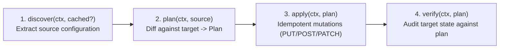

# Specification: Migration Module Contract & Lifecycle

**Specification Status:** Authoritative Architectural Standard  
**Target:** Modular API Migration Architecture in `@ghec/migration`  
**Applicability:** All implementation agents (Antigravity & Codex)

---

## 1. Overview

Targeted migration modules encapsulate the migration logic for specific GitHub configuration and governance resources that GitHub Enterprise Importer (GEI) does not transfer.

Examples include:

- `repo-variables`
- `repo-secrets`
- `org-variables`
- `org-secrets`
- `rulesets`
- `branch-protection`
- `environments`
- `teams`
- `webhooks`

Modules are decoupled from CLI argument parsing and can be invoked either programmatically, through GitHub Actions, or via the `ghec-consultant-cli` CLI.

---

## 2. Standard Module Lifecycle

Every migration module must implement the four standard lifecycle phases:

```text
discover ───► plan ───► apply ───► verify
```



### Phase 1: `discover`

- **Cached Mode:** Reads normalized entities from an already validated `DiscoveryBundle`. Network requests to the source GitHub API are completely bypassed.
- **Live Mode:** Invokes the corresponding collector in `@ghec/discovery` via the read-only `SourceClient`.
- **Output:** Returns a strongly typed `TDiscovered` data structure.

### Phase 2: `plan`

- Queries the current state of the destination organization/repository using `TargetClient`.
- Computes the granular difference (diff) between source and destination.
- Emits a `ModulePlan` containing discrete `PlannedOperation` items:
  - `create`: Resource exists on source but not on destination.
  - `update`: Resource exists on both but properties differ.
  - `noop`: Destination already matches source state exactly.
  - `skip`: Resource exists on destination and cannot be safely overwritten by policy.
  - `warn`: Ambiguous state or missing prerequisite (e.g. unknown EMU identity).

### Phase 3: `apply`

- Iterates over planned operations (excluding `noop` and `skip`).
- Executes idempotent REST or GraphQL mutations against `TargetClient`.
- Employs **PUT/PATCH over POST** where supported (e.g. repository secrets and variables).
- Immediately records each operation result in the `MigrationCheckpointManager`.
- Honors `--continue-on-error`:
  - If `false`: Halts execution upon first operation failure.
  - If `true`: Records operation failure in checkpoint and continues remaining independent operations.

### Phase 4: `verify`

- Re-reads destination state post-migration.
- Asserts that all planned `create` and `update` items now match expected target state.
- Emits a `VerificationResult` recording verified items and any observed discrepancies.

---

## 3. TypeScript Interface Definition

```typescript
// packages/migration/src/core/types.ts

export type MigrationScopeLevel = 'organization' | 'repository';

export interface MigrationContext {
  readonly runId: string;
  readonly scope: {
    readonly level: MigrationScopeLevel;
    readonly sourceOrg: string;
    readonly targetOrg: string;
    readonly sourceRepo?: string;
    readonly targetRepo?: string;
  };
  readonly sourceClient: GitHubReadClient;
  readonly targetClient: GitHubWriteClient;
  readonly signal: AbortSignal;
  readonly dryRun: boolean;
  readonly continueOnError: boolean;
  readonly logger: StructuredLogger;
}

export type OperationType = 'create' | 'update' | 'noop' | 'skip' | 'warn';

export interface PlannedOperation<T = unknown> {
  readonly id: string;
  readonly resourceType: string;
  readonly resourceName: string;
  readonly operation: OperationType;
  readonly sourceState?: T;
  readonly destinationCurrentState?: T;
  readonly payload?: unknown;
  readonly reason?: string;
}

export interface ModulePlan<T = unknown> {
  readonly moduleId: string;
  readonly scopeLevel: MigrationScopeLevel;
  readonly operations: readonly PlannedOperation<T>[];
  readonly warnings: readonly string[];
}

export interface OperationResult {
  readonly operationId: string;
  readonly status: 'succeeded' | 'failed' | 'skipped';
  readonly httpStatus?: number;
  readonly error?: string;
  readonly completedAt: string;
}

export interface ModuleExecutionResult {
  readonly moduleId: string;
  readonly status: 'complete' | 'partial' | 'failed' | 'skipped';
  readonly results: readonly OperationResult[];
  readonly durationMs: number;
}

export interface VerificationResult {
  readonly moduleId: string;
  readonly verified: boolean;
  readonly discrepancies: readonly {
    readonly resourceName: string;
    readonly expected: unknown;
    readonly actual: unknown;
    readonly message: string;
  }[];
}

/**
 * Standard contract for any targeted migration module.
 */
export interface MigrationModule<TDiscovered = unknown> {
  readonly id: string;
  readonly displayName: string;
  readonly scopeLevel: MigrationScopeLevel;
  readonly dependencies: readonly string[];

  discover(ctx: MigrationContext, cachedData?: unknown): Promise<TDiscovered>;
  plan(ctx: MigrationContext, sourceData: TDiscovered): Promise<ModulePlan>;
  apply(
    ctx: MigrationContext,
    plan: ModulePlan,
  ): Promise<ModuleExecutionResult>;
  verify(ctx: MigrationContext, plan: ModulePlan): Promise<VerificationResult>;
}
```

---

## 4. Module Registry & Topological Dependency Resolution

The `ModuleRegistry` maintains all available migration modules and calculates the execution order based on declared dependencies:

```typescript
export class ModuleRegistry {
  private readonly modules = new Map<string, MigrationModule>();

  register(module: MigrationModule): void {
    if (this.modules.has(module.id)) {
      throw new Error(`Module '${module.id}' is already registered.`);
    }
    this.modules.set(module.id, module);
  }

  get(id: string): MigrationModule | undefined {
    return this.modules.get(id);
  }

  resolveExecutionPlan(selectedModuleIds: string[]): MigrationModule[] {
    // Computes topological sort:
    // e.g. 'rulesets' requires 'gei-repo'
    // e.g. 'repo-secrets' requires 'gei-repo'
    // e.g. 'environments' requires 'gei-repo'
  }
}
```

---

## 5. Idempotency Guarantees

Every migration module must guarantee safe re-execution:

1. **Rerunning `apply` on an already-migrated resource must produce `noop`**, not duplicate records or HTTP 422 Unprocessable Entity errors.
2. **Upsert Semantics:** Where GitHub APIs support upserts (e.g. `PUT /repos/{owner}/{repo}/actions/variables/{name}`), prefer upsert endpoints.
3. **Check-Before-Write:** When APIs only provide `POST`, query the destination first. If an entity exists with identical configuration, treat it as `noop`. If it exists with different configuration, treat it as `update` (or `skip` if safety overrides prevent overwrite).

---

## 6. Secrets Strategy: Encrypted Blank Placeholders by Default (DEC-004)

Because GitHub APIs are write-only for secrets and do not disclose source secret values:

1. **Default Apply Behavior:** Secret modules (`repo-secrets`, `org-secrets`) will fetch the target's public key (`GET /actions/secrets/public-key`) and encrypt a blank string (`""`) or placeholder token using libsodium/`tweetnacl`. The encrypted payload is sent via `PUT /actions/secrets/{secret_name}`.
2. **Outcome:** The secret name and visibility scope exist in the target enterprise, preventing Actions workflow compile/runtime errors. Consultants and customers then only need to update the secret with its real value post-migration.
3. **Full Migration via Client Vault:** An optional Secret Provider interface allows fetching real secret values from client-provided vaults (HashiCorp Vault, Azure Key Vault, AWS Secrets Manager) during migration execution.

---

## 7. Teams Strategy: Structure & Repository Access (DEC-005)

1. **Scope of Team Migration:** Focuses strictly on team names, descriptions, parent-child hierarchies, and repository permission grants (`read`, `triage`, `write`, `maintain`, `admin`).
2. **User Membership Decoupled:** User membership synchronization via API is omitted. In GHEC-EMU, user-to-team membership is typically managed out-of-band by IdP Group Sync (SCIM/SAML). Attempting direct API user assignment could fail or conflict with IdP policies.
