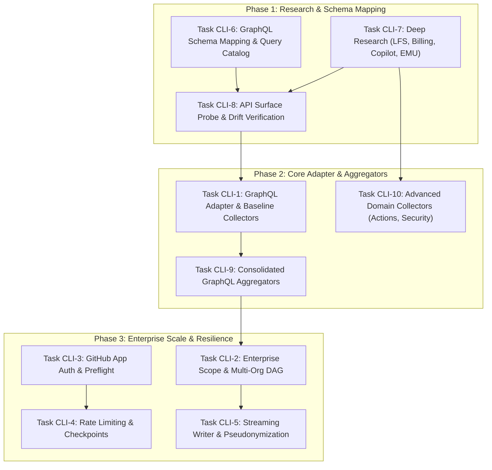

# GHEC Consultant Suite — Agent Task Specifications

This directory contains the engineering task specifications to transition the **GHEC Consultant Suite** from an MVP scaffolding to an **Enterprise-Ready Assessment Platform**.

Current execution status is maintained in [`CURRENT-TASKS.md`](CURRENT-TASKS.md).
Both agents record material work and verification results in the shared,
append-only [`CHANGELOG.md`](CHANGELOG.md). Task specification files define
scope; they do not, by themselves, prove completion.

The tasks are divided into two dedicated agent tracks, coordinated via `agent-communication/`:

- **`antigravity/`**: CLI, GitHub API Data Collection (GraphQL-First + REST Fallback), Research, Engine, Orchestration, Authentication, and Security.
- **`codex/`**: Dashboard (React/Primer), air-gapped data ingestion, virtualization, jsPDF reporting, analytics, design system, and scan diffing.
- **`agent-communication/`**: Asynchronous notes, contract coordination, and status updates between Antigravity and Codex.
- **`CURRENT-TASKS.md`**: Prioritized open work, ownership, blockers, and task disposition.
- **`CHANGELOG.md`**: Shared append-only work, decision, verification, and handoff history.

---

## Architecture Principles & Guidelines

### 1. Data Collection Strategy: GraphQL-First

GitHub REST endpoints often require $O(N)$ HTTP calls (e.g., one call per repository for branches, rulesets, and actions), rapidly triggering secondary rate limits on large enterprise estates.

- **Primary Mechanism**: Use **GitHub GraphQL API (`POST /graphql`)** wherever possible. A single nested GraphQL query can retrieve organization details, repositories, disk usage, branch protection rules, rulesets, and team permissions in batched pages of 100 items (>95% reduction in API calls).
- **Fallback Mechanism**: Use **GitHub REST API (`GET`)** only where GraphQL lacks coverage or is impractical (e.g., Code Scanning default setup, Dependabot alert enablement, Action secrets metadata, or Webhook configurations).
- **Research Foundation**: Tasks CLI-6, CLI-7, and CLI-8 produce the machine-readable query catalogs, domain reconciliations, and drift verification scripts that feed directly into live collector implementations.
- **Provenance Requirement**: Every collected entity must accurately declare its provenance source (`'graphql'` or `'rest'`).

### 2. Air-Gapped Dashboard Integrity

- The dashboard is completely client-side and air-gapped.
- It must **never** make external network calls, transmit metrics, or store sensitive customer data in persistent browser storage (`localStorage` / `IndexedDB`) without explicit user action.
- All PDF reports, CSV exports, schema validations, and analytics calculations execute strictly in-memory in the browser.

---

## Agent Task Index

### Current Disposition Summary

- **CLI-1 through CLI-10 are complete.** Offline, mock, schema-drift,
  scale verification pass across all 60 CLI tests, and live enterprise
  read-only smoke validation against `cloudgxp` is complete and verified.
- **DASH-1 through DASH-5 and DASH-11 through DASH-20 are complete.** The
  entire dashboard suite passes root unit and integration tests (116 total),
  production build with bundle budget enforcement, 11 Playwright e2e/a11y tests
  (0 WCAG violations), and 13 visual regression snapshots across 5 viewports.
  DASH-6 through DASH-10 used a Tailwind/DaisyUI approach and are superseded by
  the Primer work in DASH-16 through DASH-20.
- The 237 collector specifications are a researched operation catalog. The
  executable CLI currently exposes 11 user-facing modules and selected
  GraphQL/REST collection paths; the catalog is not a claim of 237 live
  implementations.

### Antigravity (CLI Track)

| File                                                                                                                                       | Title                                                             | Type           | Scope                                                                                                            |
| :----------------------------------------------------------------------------------------------------------------------------------------- | :---------------------------------------------------------------- | :------------- | :--------------------------------------------------------------------------------------------------------------- |
| [`antigravity/task-6-graphql-schema-mapping-and-query-catalog.md`](antigravity/task-6-graphql-schema-mapping-and-query-catalog.md)         | **GraphQL Schema Mapping & Query Catalog Specification**          | **Research**   | Map 237 planned collectors against GitHub GraphQL schema; output `research/github/graphql-query-catalog.json`.   |
| [`antigravity/task-7-deep-research-lfs-billing-copilot-emu.md`](antigravity/task-7-deep-research-lfs-billing-copilot-emu.md)               | **Deep Research: LFS, Billing, Copilot & EMU**                    | **Research**   | Reconcile 10 unresolved billing endpoints, non-destructive LFS metrics, Copilot APIs, and EMU identity mappings. |
| [`antigravity/task-8-api-surface-probe-and-drift-verification.md`](antigravity/task-8-api-surface-probe-and-drift-verification.md)         | **Automated API Surface Probe & Schema Drift Verification**       | **Tooling**    | Automated verification script (`probe-api-surface.ts`) testing endpoints against OpenAPI and GraphQL schemas.    |
| [`antigravity/task-1-graphql-adapter-and-core-collectors.md`](antigravity/task-1-graphql-adapter-and-core-collectors.md)                   | **GraphQL-First HTTP Adapter & Phase C2 Collectors**              | Implementation | Implement `POST /graphql` querying in adapter; wire up real metadata collectors for repos, policies, and teams.  |
| [`antigravity/task-9-consolidated-graphql-query-aggregators.md`](antigravity/task-9-consolidated-graphql-query-aggregators.md)             | **Consolidated GraphQL Query Aggregators Implementation**         | Implementation | Implement `OrgMetadataAggregator`, `RepositoryDeepDiscoveryAggregator`, and `TeamHierarchyAggregator`.           |
| [`antigravity/task-10-advanced-domain-collectors-actions-security.md`](antigravity/task-10-advanced-domain-collectors-actions-security.md) | **Advanced Domain Collectors (Actions, Security & Integrations)** | Implementation | Implement REST collectors for Actions compute/runners, cache usage, Code Scanning setup, and Integrations.       |
| [`antigravity/task-2-enterprise-scope-graphql-enumeration.md`](antigravity/task-2-enterprise-scope-graphql-enumeration.md)                 | **Enterprise Scope GraphQL Enumeration & Multi-Org DAG**          | Implementation | Query enterprise organizations via GraphQL; handle partial enumeration; orchestrate multi-org collection DAG.    |
| [`antigravity/task-3-github-app-auth-and-preflight.md`](antigravity/task-3-github-app-auth-and-preflight.md)                               | **Enterprise GitHub App Auth & Capability Preflight**             | Implementation | Add GitHub App JWT authentication; implement live preflight probe & cost estimation for `--dry-run`.             |
| [`antigravity/task-4-adaptive-rate-limiting-and-checkpoints.md`](antigravity/task-4-adaptive-rate-limiting-and-checkpoints.md)             | **Adaptive Rate Limiting & Disk Checkpointing**                   | Implementation | Dynamic rate-limiting based on GraphQL point costs and REST quotas; pause/resume scans with `--resume`.          |
| [`antigravity/task-5-streaming-large-scale-bundle-writer.md`](antigravity/task-5-streaming-large-scale-bundle-writer.md)                   | **Streaming Bundle Writer & HMAC Pseudonymization**               | Implementation | Stream 100k+ entities directly to disk with bounded memory (< 512MB RAM); HMAC-SHA256 identity anonymization.    |

### Codex (Dashboard Track)

| File                                                                                                                                         | Title                                                       | Type        | Scope                                                                                                               |
| :------------------------------------------------------------------------------------------------------------------------------------------- | :---------------------------------------------------------- | :---------- | :------------------------------------------------------------------------------------------------------------------ |
| [`codex/task-1-jspdf-executive-report-generator.md`](codex/task-1-jspdf-executive-report-generator.md)                                       | **Client-Side PDF Executive & Technical Report Generator**  | Reporting   | Build multi-page, air-gapped PDF export engine using `jspdf` and `jspdf-autotable` with executive scorecards.       |
| [`codex/task-2-web-worker-and-table-virtualization.md`](codex/task-2-web-worker-and-table-virtualization.md)                                 | **Web Worker Ingestion & Table Virtualization**             | Performance | Offload bundle parsing, validation, and analysis to a Web Worker; virtualize tables for 10,000+ entities.           |
| [`codex/task-3-multi-org-matrix-and-global-search.md`](codex/task-3-multi-org-matrix-and-global-search.md)                                   | **Enterprise Comparison Matrix & Global Search**            | Analytics   | Build enterprise organization comparison view; global command palette (`Ctrl+K`) across all entities.               |
| [`codex/task-4-scan-diffing-and-remediation-tracker.md`](codex/task-4-scan-diffing-and-remediation-tracker.md)                               | **Air-Gapped Scan Diffing & Remediation Tracker**           | Consulting  | Compare baseline scan ($T_0$) with follow-up scan ($T_1$); classify findings into Resolved, Persistent, and New.    |
| [`codex/task-5-migration-target-profiles-and-tuning.md`](codex/task-5-migration-target-profiles-and-tuning.md)                               | **Interactive Target Configuration & Policy Tuning UI**     | Tuning      | Customizable migration thresholds (target platform, repo size limits, ruleset strictness); real-time re-evaluation. |
| [`codex/task-6-tailwind-daisyui-design-system-foundation.md`](codex/task-6-tailwind-daisyui-design-system-foundation.md)                     | **Tailwind & DaisyUI Design System Foundation**             | Superseded  | Superseded by the Primer foundation and cleanup in DASH-16 through DASH-20.                                         |
| [`codex/task-7-responsive-left-navigation-app-shell.md`](codex/task-7-responsive-left-navigation-app-shell.md)                               | **Responsive Left Navigation & Application Shell**          | Superseded  | UX requirements retained; implementation replaced by the Primer shell in DASH-17.                                   |
| [`codex/task-8-daisyui-component-consolidation.md`](codex/task-8-daisyui-component-consolidation.md)                                         | **DaisyUI Component Consolidation**                         | Superseded  | Component requirements retained; DaisyUI implementation replaced by DASH-18 through DASH-20.                        |
| [`codex/task-9-material-dashboard-information-design.md`](codex/task-9-material-dashboard-information-design.md)                             | **Material-Inspired Information Design**                    | Superseded  | Information-design requirements retained in the Primer feature migration.                                           |
| [`codex/task-10-accessibility-responsive-and-visual-regression.md`](codex/task-10-accessibility-responsive-and-visual-regression.md)         | **Accessibility, Responsive & Visual Quality Gate**         | Superseded  | Quality requirements remain release gates under the Primer implementation.                                          |
| [`codex/task-11-packages-releases-and-artifacts-pages.md`](codex/task-11-packages-releases-and-artifacts-pages.md)                           | **Packages, Releases & Artifact Supply Chain**              | Inventory   | Add package, release, large-asset, and LFS inventory, drill-down, analysis, and exports.                            |
| [`codex/task-12-actions-automation-and-runner-operations-page.md`](codex/task-12-actions-automation-and-runner-operations-page.md)           | **Actions Automation & Runner Operations**                  | Automation  | Split Actions into workflow, run, runner, cache, artifact, environment, and policy views.                           |
| [`codex/task-13-secrets-variables-and-configuration-page.md`](codex/task-13-secrets-variables-and-configuration-page.md)                     | **Secrets, Variables & Sensitive Configuration**            | Governance  | Add metadata-only views for Actions, Dependabot, Codespaces, environment, and verified agent domains.               |
| [`codex/task-14-code-ownership-projects-and-portfolio-pages.md`](codex/task-14-code-ownership-projects-and-portfolio-pages.md)               | **Code Ownership, Projects & Portfolio**                    | Portfolio   | Add CODEOWNERS posture, Projects inventory, and custom-property/topic portfolio analysis.                           |
| [`codex/task-15-repository-dependency-map-and-migration-cohorts.md`](codex/task-15-repository-dependency-map-and-migration-cohorts.md)       | **Dependency Map & Migration Cohorts**                      | Analytics   | Add scalable dependency exploration, blast-radius analysis, connected groups, and cohort guidance.                  |
| [`codex/task-16-primer-react-foundation-and-migration-spike.md`](codex/task-16-primer-react-foundation-and-migration-spike.md)               | **Primer React Foundation & Compatibility Spike**           | Migration   | Complete. Verified with Primer React foundation and zero legacy style regressions.                                  |
| [`codex/task-17-primer-application-shell-and-navigation.md`](codex/task-17-primer-application-shell-and-navigation.md)                       | **Primer Application Shell & Navigation**                   | Shell       | Complete. Verified with Primer application shell, responsive navigation, and mobile drawer.                         |
| [`codex/task-18-primer-shared-components-forms-and-overlays.md`](codex/task-18-primer-shared-components-forms-and-overlays.md)               | **Primer Shared Components, Forms & Overlays**              | Components  | Complete. Verified with Primer shared components, accessible forms, and overlays.                                   |
| [`codex/task-19-primer-feature-pages-data-tables-and-visualization.md`](codex/task-19-primer-feature-pages-data-tables-and-visualization.md) | **Primer Feature Pages & Data Tables**                      | Features    | Complete. Verified with Primer feature pages, virtualized tables, and canvas visualization.                         |
| [`codex/task-20-remove-daisyui-tailwind-and-primer-quality-gate.md`](codex/task-20-remove-daisyui-tailwind-and-primer-quality-gate.md)       | **Remove DaisyUI/Tailwind & Establish Primer Quality Gate** | Cleanup     | Complete. Verified with zero legacy styles, pure token usage, and 100% green monorepo CI.                           |

---

## Suggested Antigravity Execution Sequence

