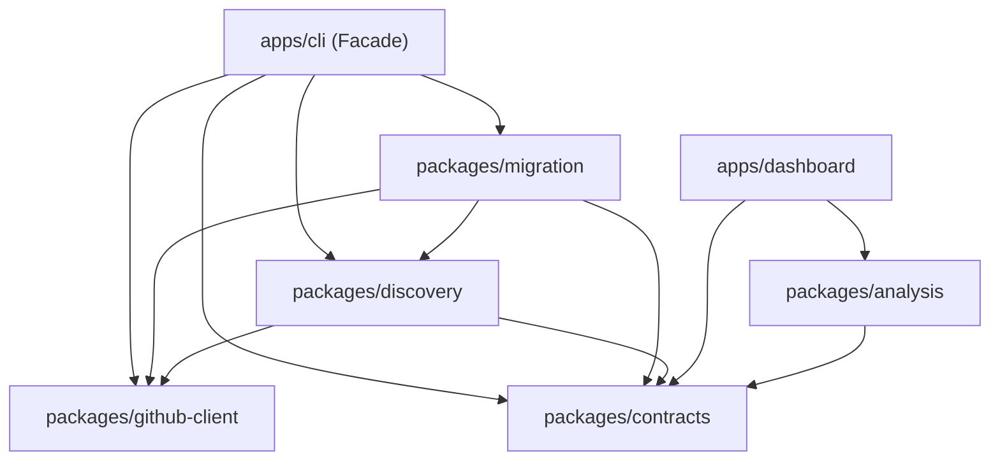

# Architecture Specification: Shared-Core Monorepo & Unified CLI

**Specification Status:** Authoritative Architectural Standard  
**Target:** GHEC Consultant Suite Expansion (Discovery + Migration)  
**Applicability:** All implementation agents (Antigravity)

---

## 1. Architectural Summary

The GHEC Consultant Suite expands from a read-only discovery tool into a complete enterprise migration platform using a **Shared-Core Monorepo Architecture with a Unified CLI Facade**.

```text
ghec-consultant-suite/
├── packages/
│   ├── contracts/        # Versioned data contracts & Zod validation
│   ├── github-client/    # Dual-tenant GitHub API client (source read / target write)
│   ├── discovery/        # Headless discovery engine & collectors
│   ├── migration/        # Migration engine, GEI orchestrator & targeted API modules
│   └── analysis/         # Pure readiness evaluation rules & dependency graphs
│
└── apps/
    ├── cli/              # Unified CLI facade: 'ghec-consultant-cli'
    └── dashboard/        # Offline React 19 / Primer reporting dashboard
```

---

## 2. Core Architectural Principles

### 2.1 The Single Domain Model Principle

Discovery and migration are not separate products; they represent sequential phases of the same migration lifecycle:
$$\text{Discovery (Read)} \longrightarrow \text{Readiness (Analysis)} \longrightarrow \text{Planning (Diff)} \longrightarrow \text{Migration (GEI + API)} \longrightarrow \text{Verification (Audit)}$$
Both phases operate on the identical underlying GitHub domain entities (repositories, teams, rulesets, secrets, variables, environments, and policies). They must share the same types, schemas, and API client primitives.

### 2.2 Unified CLI Facade

The external operator interface remains a single, cohesive binary:

```bash
ghec-consultant-cli <subcommand> [options]
```

Subcommands:

- `discover`: Read-only discovery against the source environment.
- `plan`: Compares source state (live or cached) against the destination; emits `migration-plan.json`.
- `migrate`: Applies changes to the destination (live discovery, cached discovery, or pre-approved plan).
- `verify`: Audits destination state against planned configuration or source state.

**Rule:** `apps/cli` is a thin facade. It handles option parsing, environment configuration, and top-level process management. It must **not** accumulate core domain logic, Octokit endpoints, or business algorithms.

### 2.3 Strict Read/Write Security Seams

- **Source Environment:** Strictly read-only. Source credentials must never be passed to mutation endpoints. Every source request uses operations marked `verifiedReadOnly: true`.
- **Target Environment:** Write/admin capabilities. Target credentials are used exclusively by `packages/migration` modules and the target write adapter.
- **Discovery Safety:** Running `ghec-consultant-cli discover` must never instantiate target write clients or accept target mutation credentials.

### 2.4 GEI Canonical Boundary

GitHub Enterprise Importer (GEI) is the canonical migration mechanism for all Git repository data, pull requests, issues, commit histories, comments, releases, and wikis.

- The suite **orchestrates** GEI; it never attempts to replicate GEI functionality.
- Targeted API migration modules handle configuration and governance that GEI does not migrate (variables, rulesets, modern branch protection, environment deployment policies, webhooks, and team memberships).
- Pipeline order: **Preflight Validation $\rightarrow$ Target Preparation $\rightarrow$ GEI Migration $\rightarrow$ Specialized Strategies $\rightarrow$ Post-GEI API Rehydration $\rightarrow$ Post-Migration Reconciliations $\rightarrow$ Verification**.

### 2.5 Multi-Tier Migration Primitives in `@ghec/migration`

To cleanly handle real-world GHEC $\rightarrow$ GHEC-EMU complexities without forcing non-CRUD capabilities into standard API modules, `@ghec/migration` defines five distinct architectural primitives:

1. **`MigrationPreflight` (`src/preflight/`):**
   - Read-only inspection of source repositories (git-sizer, 40 GiB repo size limit, 2 GiB commit limit, 255-byte ref length, 400 MiB / 100 MiB file limits, LFS detection, release sizing).
   - Destination blocker inspection (ensuring target rulesets include "Repository migrations" in **Exempt** bypass mode, IP allow list reachability, GHAS enablement, naming conflict detection).
   - Classifies repositories: `ready`, `ready-with-follow-up`, `requires-special-strategy`, `blocked`.

2. **`MigrationStrategy` (`src/strategies/`):**
   - Specialized multi-tool orchestration engines beyond simple Octokit CRUD.
   - Examples: `git-lfs` (dual-remote mirror & push), `releases-fallback` (REST-based chunked streaming when releases exceed 10 GiB or 40 GiB metadata limit and `--skip-releases` is used).

3. **`MigrationModule` (`src/modules/`):**
   - Standard idempotent Octokit REST/GraphQL CRUD engine implementing the 4-phase lifecycle (`discover -> plan -> apply -> verify`).
   - Examples: `repo-variables`, `org-variables`, `repo-secrets`, `org-secrets`, `environments`, `rulesets`, `branch-protection`, `webhooks`, `org-custom-properties`, `repo-custom-properties`, `teams`.

4. **`PostMigrationTask` (`src/post-migration/`):**
   - Operations that must run strictly after GEI creates the target repository.
   - Examples: `repo-visibility` (reversing GEI's private default), `mannequin-reclamation` (bulk reattribution with EMU `--skip-invitation`), `codeowners-repair` (rewriting `@source-org/team` references), `security-remediation-sync` (mirroring secret scanning alert dismissals).

5. **`AdvisoryPlanner` (`src/advisory/`):**
   - Generates actionable cutover matrices and checklists for platform entities that cannot or should not be copied via API (GitHub Apps reinstallation matrix, GitHub Packages cutover guide, Self-Hosted Runner topology specs, IdP Group Sync mapping).

---

## 3. Package Responsibilities and Dependency Rules



### Dependency Rules:

1. **`packages/contracts`** has **zero** internal dependencies. It must remain dependency-free except for runtime validation libraries (`zod`). It contains no Node-specific I/O or network code so that browser apps (like `apps/dashboard`) can consume it cleanly.
2. **`packages/github-client`** depends only on `packages/contracts` and external network packages (`octokit`).
3. **`packages/discovery`** depends on `packages/contracts` and `packages/github-client`. It exposes a headless discovery engine.
4. **`packages/migration`** depends on `packages/contracts`, `packages/github-client`, and `packages/discovery`. It does **not** depend on `apps/cli`.
5. **`apps/cli`** coordinates subcommands and dispatches to `@ghec/discovery` and `@ghec/migration`.

---

## 4. Dual-Tenant Credential and Client Architecture

Migration requires concurrent access to two distinct GitHub organizations or enterprises:

- **`SourceClient`:** Configured with read-only credentials against the source enterprise/organization. Governed by a dedicated `AdaptiveRateLimiter` tracking the source quota.
- **`TargetClient`:** Configured with admin/write credentials against the target GHEC-EMU enterprise/organization. Governed by an independent `AdaptiveRateLimiter` tracking the target quota.

**Rule:** Rate-limit exhaustion or secondary throttling in the target must not pause or corrupt the source client, and vice versa.
