# Migration Expansion Dependency Graph & Execution Matrix

This document defines the dependency ordering, critical path, and execution matrix across all 30 implementation tasks organized by domain category.

---

## 1. Visual Dependency Graph (Mermaid)

```mermaid
graph TD
    classDef feature fill:#1e3a8a,stroke:#3b82f6,stroke-width:2px,color:#ffffff;
    classDef security fill:#064e3b,stroke:#10b981,stroke-width:2px,color:#ffffff;
    classDef performance fill:#7c2d12,stroke:#ea580c,stroke-width:2px,color:#ffffff;

    subgraph "Phase 1: Foundation Refactoring"
        T001["001: Extract @ghec/github-client<br>(Features)"]:::feature
        T002["002: github-client Unit Tests<br>(Features)"]:::feature
        T003["003: Extract @ghec/discovery<br>(Features)"]:::feature
    end

    subgraph "Phase 2: Migration Contracts & Core"
        T004["004: Migration Schemas in Contracts<br>(Features)"]:::feature
        T005["005: Migration Core & Registry<br>(Features)"]:::feature
        T006["006: Migration Checkpoint Manager<br>(Features)"]:::feature
        T007["007: Migration Planner & Diff Engine<br>(Features)"]:::feature
    end

    subgraph "Phase 3: First End-to-End Module (repo-variables)"
        T008["008: repo-variables Module<br>(Features)"]:::feature
        T009["009: CLI Subcommands (plan, migrate, verify)<br>(Features)"]:::feature
        T010["010: repo-variables E2E Tests<br>(Features)"]:::feature
    end

    subgraph "Phase 4: Targeted API Modules"
        T011["011: repo-secrets Metadata Module<br>(Security)"]:::security
        T012["012: environments Module<br>(Features)"]:::feature
        T013["013: rulesets & branch-protection<br>(Security)"]:::security
        T016["016: org-variables & org-secrets<br>(Security)"]:::security
        T017["017: teams & EMU Identity Mapping<br>(Security)"]:::security
        T018["018: webhooks Reconciliation<br>(Features)"]:::feature
        T026["026: custom-properties Modules<br>(Features)"]:::feature
    end

    subgraph "Phase 5: Preflight & GEI Orchestration"
        T022["022: Source & Destination Preflight Engine<br>(Features)"]:::feature
        T014["014: GEI Process Execution Wrapper<br>(Features)"]:::feature
        T023["023: Git LFS Migration Strategy<br>(Performance)"]:::performance
        T024["024: Large Releases Fallback Strategy<br>(Performance)"]:::performance
        T015["015: 7-Stage Pipeline Orchestrator<br>(Features)"]:::feature
    end

    subgraph "Phase 6: Post-Migration Reconciliations & Advisory"
        T025["025: repo-visibility & PR Settings<br>(Security)"]:::security
        T027["027: Mannequin Reclamation Engine<br>(Security)"]:::security
        T028["028: CODEOWNERS & Team References<br>(Security)"]:::security
        T029["029: GHAS Remediation Sync<br>(Security)"]:::security
        T030["030: External Integrations & Advisory<br>(Features)"]:::feature
    end

    subgraph "Phase 7: GitHub Actions CI/CD"
        T019["019: GitHub Actions Step Summary<br>(Features)"]:::feature
        T020["020: Scope Matrix Slicer & Topologies<br>(Performance)"]:::performance
        T021["021: CI/CD Workflow Templates<br>(Features)"]:::feature
    end

    %% Dependencies
    T001 --> T002
    T001 --> T003
    T003 --> T005
    T004 --> T005
    T004 --> T006
    T004 --> T007
    T005 --> T007

    T005 --> T008
    T007 --> T008
    T005 --> T009
    T007 --> T009
    T008 --> T009
    T008 --> T010
    T009 --> T010

    T008 --> T011
    T008 --> T012
    T008 --> T013
    T008 --> T016
    T011 --> T016
    T005 --> T017
    T008 --> T017
    T008 --> T018
    T005 --> T026
    T008 --> T026

    T004 --> T022
    T005 --> T022
    T005 --> T014
    T006 --> T014
    T005 --> T023
    T006 --> T023
    T014 --> T023
    T005 --> T024
    T006 --> T024
    T014 --> T024
    T022 --> T024

    T009 --> T015
    T013 --> T015
    T014 --> T015
    T022 --> T015
    T023 --> T015
    T024 --> T015

    T005 --> T025
    T008 --> T025
    T014 --> T025
    T015 --> T025

    T005 --> T027
    T006 --> T027
    T014 --> T027
    T017 --> T027
    T015 --> T027

    T005 --> T028
    T017 --> T028
    T015 --> T028

    T005 --> T029
    T008 --> T029
    T022 --> T029
    T015 --> T029

    T003 --> T030
    T005 --> T030

    T009 --> T019
    T009 --> T020
    T015 --> T020
    T019 --> T021
    T020 --> T021
```

---

## 2. Critical Path

The critical path determines the minimum completion sequence for the migration expansion:

$$\text{Task 001} \longrightarrow \text{Task 003} \longrightarrow \text{Task 005} \longrightarrow \text{Task 007} \longrightarrow \text{Task 008} \longrightarrow \text{Task 009} \longrightarrow \text{Task 022} \longrightarrow \text{Task 015} \longrightarrow \text{Task 020} \longrightarrow \text{Task 021}$$

1. **Task 001:** Extract GitHub client
2. **Task 003:** Extract discovery package
3. **Task 005:** Migration core framework & registry
4. **Task 007:** Migration planning & diff engine
5. **Task 008:** First migration module: `repo-variables`
6. **Task 009:** CLI subcommands wiring
7. **Task 022:** Source & destination preflight engine
8. **Task 015:** 7-stage pipeline orchestrator
9. **Task 020:** Scope matrix slicer
10. **Task 021:** Production GitHub Actions workflows

---

## 3. Implementation Phasing by Domain Category

| Phase        | Tasks Included     | Primary Category | Deliverable Summary                                                              |
| :----------- | :----------------- | :--------------- | :------------------------------------------------------------------------------- |
| **Phase 1**  | 001, 002, 003, 004 | Features         | Headless `@ghec/github-client`, `@ghec/discovery`, and `@ghec/contracts` schemas |
| **Phase 2**  | 005, 006, 007      | Features         | Core DAG framework, `ModuleRegistry`, Checkpoint manager, and diff planner       |
| **Phase 3**  | 008, 009, 010      | Features         | First end-to-end module (`repo-variables`) and CLI `plan`, `migrate`, `verify`   |
| **Phase 4**  | 011, 013, 016, 017 | Security         | Secrets rehydration, rulesets, org security, and EMU identity mapper             |
| **Phase 4b** | 012, 018, 026      | Features         | Environments, webhooks, and custom properties modules                            |
| **Phase 5**  | 022, 014, 015      | Features         | Source/destination preflight engine and 7-stage GEI orchestrator pipeline        |
| **Phase 5b** | 023, 024           | Performance      | Git LFS mirroring strategy and release asset fallback streamer                   |
| **Phase 6**  | 025, 027, 028, 029 | Security         | Visibility settings, mannequin reclamation, CODEOWNERS repair, and GHAS sync     |
| **Phase 6b** | 030                | Features         | External integrations and advisory planner                                       |
| **Phase 7**  | 019, 021           | Features         | Step summary reporting and CI/CD workflow templates                              |
| **Phase 7b** | 020                | Performance      | Enterprise scope matrix slicer & parallel topology execution                     |
