# Migration Expansion Dependency Graph & Execution Matrix

This document defines the dependency ordering, critical path, and parallel work opportunities between **Antigravity** and **Codex** across all 30 implementation tasks.

---

## 1. Visual Dependency Graph (Mermaid)

```mermaid
graph TD
    classDef antigravity fill:#1e3a8a,stroke:#3b82f6,stroke-width:2px,color:#ffffff;
    classDef codex fill:#064e3b,stroke:#10b981,stroke-width:2px,color:#ffffff;
    classDef ready fill:#b45309,stroke:#f59e0b,stroke-width:3px,color:#ffffff;

    subgraph "Phase 1: Foundation Refactoring"
        T001["001: Extract @ghec/github-client<br>(Antigravity)"]:::ready
        T002["002: github-client Unit Tests<br>(Codex)"]:::codex
        T003["003: Extract @ghec/discovery<br>(Antigravity)"]:::antigravity
    end

    subgraph "Phase 2: Migration Contracts & Core"
        T004["004: Migration Schemas in Contracts<br>(Codex)"]:::ready
        T005["005: Migration Core & Registry<br>(Antigravity)"]:::antigravity
        T006["006: Migration Checkpoint Manager<br>(Codex)"]:::codex
        T007["007: Migration Planner & Diff Engine<br>(Antigravity)"]:::antigravity
    end

    subgraph "Phase 3: First End-to-End Module (repo-variables)"
        T008["008: repo-variables Module<br>(Codex)"]:::codex
        T009["009: CLI Subcommands (plan, migrate, verify)<br>(Antigravity)"]:::antigravity
        T010["010: repo-variables E2E Tests<br>(Codex)"]:::codex
    end

    subgraph "Phase 4: Targeted API Modules"
        T011["011: repo-secrets Metadata Module<br>(Codex)"]:::codex
        T012["012: environments Module<br>(Codex)"]:::codex
        T013["013: rulesets & branch-protection<br>(Antigravity)"]:::antigravity
        T016["016: org-variables & org-secrets<br>(Codex)"]:::codex
        T017["017: teams & EMU Identity Mapping<br>(Antigravity)"]:::antigravity
        T018["018: webhooks Reconciliation<br>(Codex)"]:::codex
        T026["026: custom-properties Modules<br>(Codex)"]:::codex
    end

    subgraph "Phase 5: Preflight & GEI Orchestration"
        T022["022: Source & Destination Preflight Engine<br>(Antigravity)"]:::antigravity
        T014["014: GEI Process Execution Wrapper<br>(Codex)"]:::codex
        T023["023: Git LFS Migration Strategy<br>(Codex)"]:::codex
        T024["024: Large Releases Fallback Strategy<br>(Antigravity)"]:::antigravity
        T015["015: 7-Stage Pipeline Orchestrator<br>(Antigravity)"]:::antigravity
    end

    subgraph "Phase 6: Post-Migration Reconciliations & Advisory"
        T025["025: repo-visibility & PR Settings<br>(Codex)"]:::codex
        T027["027: Mannequin Reclamation Engine<br>(Antigravity)"]:::antigravity
        T028["028: CODEOWNERS & Team References<br>(Codex)"]:::codex
        T029["029: GHAS Remediation Sync<br>(Codex)"]:::codex
        T030["030: External Integrations & Advisory<br>(Antigravity)"]:::antigravity
    end

    subgraph "Phase 7: GitHub Actions CI/CD"
        T019["019: GitHub Actions Step Summary<br>(Codex)"]:::codex
        T020["020: Scope Matrix Slicer & Topologies<br>(Antigravity)"]:::antigravity
        T021["021: CI/CD Workflow Templates<br>(Antigravity)"]:::antigravity
    end

    %% Dependencies
    T001 --> T002
    T001 --> T003
    T003 --> T005
    T004 --> T005
    T004 --> T006
    T004 --> T007
    T005 --> T007

    T005 --> T008
    T007 --> T008
    T005 --> T009
    T007 --> T009
    T008 --> T009
    T008 --> T010
    T009 --> T010

    T008 --> T011
    T008 --> T012
    T008 --> T013
    T008 --> T016
    T011 --> T016
    T005 --> T017
    T008 --> T017
    T008 --> T018
    T005 --> T026
    T008 --> T026

    T004 --> T022
    T005 --> T022
    T005 --> T014
    T006 --> T014
    T005 --> T023
    T006 --> T023
    T014 --> T023
    T005 --> T024
    T006 --> T024
    T014 --> T024
    T022 --> T024

    T009 --> T015
    T013 --> T015
    T014 --> T015
    T022 --> T015
    T023 --> T015
    T024 --> T015

    T005 --> T025
    T008 --> T025
    T014 --> T025
    T015 --> T025

    T005 --> T027
    T006 --> T027
    T014 --> T027
    T017 --> T027
    T015 --> T027

    T005 --> T028
    T017 --> T028
    T015 --> T028

    T005 --> T029
    T008 --> T029
    T022 --> T029
    T015 --> T029

    T003 --> T030
    T005 --> T030

    T009 --> T019
    T009 --> T020
    T015 --> T020
    T019 --> T021
    T020 --> T021
```

---

## 2. Immediate Parallel Starters

The following two tasks have **zero dependencies** and can begin immediately in parallel:

1. **Task 001 (Antigravity):** Extract `@ghec/github-client` Shared Package
   - Touches: `apps/cli/src/github/`, creates `packages/github-client/`.
2. **Task 004 (Codex):** Migration Schemas & Validation in `@ghec/contracts`
   - Touches: `packages/contracts/src/` (`scope/`, `plan/`, `preflight/`, `results/`, `verification/`).
   - Zero overlap with Task 001.

---

## 3. Critical Path

The critical path determines the minimum completion time for the migration expansion:

$$\text{Task 001} \longrightarrow \text{Task 003} \longrightarrow \text{Task 005} \longrightarrow \text{Task 007} \longrightarrow \text{Task 008} \longrightarrow \text{Task 009} \longrightarrow \text{Task 022} \longrightarrow \text{Task 015} \longrightarrow \text{Task 020} \longrightarrow \text{Task 021}$$

1. **Task 001:** Extract GitHub client (Antigravity)
2. **Task 003:** Extract discovery package (Antigravity)
3. **Task 005:** Migration core framework & registry (Antigravity)
4. **Task 007:** Migration planning & diff engine (Antigravity)
5. **Task 008:** First migration module: `repo-variables` (Codex)
6. **Task 009:** CLI subcommands wiring (Antigravity)
7. **Task 022:** Source & destination preflight engine (Antigravity)
8. **Task 015:** 7-stage pipeline orchestrator (Antigravity)
9. **Task 020:** Scope matrix slicer (Antigravity)
10. **Task 021:** Production GitHub Actions workflows (Antigravity)

---

## 4. Workstream Parallelism Table

| Stage        | Antigravity Workstream                                       | Codex Workstream                                                                 | Coordination Seam        |
| :----------- | :----------------------------------------------------------- | :------------------------------------------------------------------------------- | :----------------------- |
| **Phase 1**  | Task 001: Extract `@ghec/github-client`                      | Task 004: Migration Schemas in `@ghec/contracts`                                 | None (separate packages) |
| **Phase 1b** | Task 003: Extract `@ghec/discovery`                          | Task 002: Unit Tests for `@ghec/github-client`                                   | Task 001 handoff         |
| **Phase 2**  | Task 005: Core & Module Registry                             | Task 006: Checkpoint Manager                                                     | Task 004 handoff         |
| **Phase 2b** | Task 007: Planning & Diff Engine                             | Task 006 (continued)                                                             | Task 005 handoff         |
| **Phase 3**  | Task 009: CLI Subcommands                                    | Task 008: `repo-variables` Module                                                | Task 007 handoff         |
| **Phase 3b** | Task 009 (continued)                                         | Task 010: E2E Integration Tests                                                  | Task 008 & 009 handoff   |
| **Phase 4**  | Task 013: `rulesets` & `branch-protection`                   | Task 011: `repo-secrets` & Task 012: `environments`                              | Task 008 handoff         |
| **Phase 4b** | Task 017: `teams` & EMU Identity Mapping                     | Task 016: `org-variables` & Task 018: `webhooks` & Task 026: `custom-properties` | Task 008 & 011 handoff   |
| **Phase 5**  | Task 022: Preflight Engine & Task 024: Releases Fallback     | Task 014: GEI Process Execution Wrapper & Task 023: Git LFS Strategy             | Task 014 & 022 handoff   |
| **Phase 5b** | Task 015: 7-Stage Pipeline Orchestrator                      | Task 025: `repo-visibility` & Task 028: `codeowners`                             | Task 014 & 015 handoff   |
| **Phase 6**  | Task 027: Mannequin Reclamation & Task 030: Advisory Planner | Task 029: GHAS Remediation Sync                                                  | Task 015 & 017 handoff   |
| **Phase 7**  | Task 020: Matrix Slicer & Task 021: Workflows                | Task 019: GitHub Actions Step Summary                                            | Task 009 & 015 handoff   |
