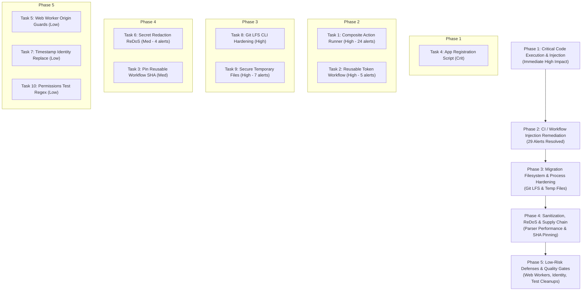

# CodeQL Security Remediation Plan & Backlog

## Executive Summary

A comprehensive CodeQL security remediation planning pass was performed for the `cloudgxp/ghec-consultant-suite` repository.
Using the GitHub CLI (`gh api --paginate repos/cloudgxp/ghec-consultant-suite/code-scanning/alerts`), all **50 open CodeQL code-scanning alerts** were extracted, inspected in source context, traced to their root causes, and synthesized into **10 implementation-ready tasks** in accordance with the project's task lifecycle specification (`agents/agent-specs/agent-workflow.md`).

---

## 1. Metrics & Overview

- **Total Open CodeQL Alerts Reviewed:** 50
- **Unique CodeQL Rules Represented:** 10
- **Remediation Tasks Created:** 10
- **Existing Tasks Updated:** 0 (all 50 alerts are new findings; tracked in `CURRENT-TASKS.md`)
- **Suspected False Positives / Clarification Targets:** 3 alerts across 2 tasks (#12, #13: dedicated web workers; #8: test assertion regex)
- **Additional Vulnerable Locations Discovered Outside Alert List:** 7 locations across GitHub Actions workflows, migration mannequin engines, and test fixtures

### Breakdown by Priority

| Priority     | Task Count | Alert Count | Key Risk Domains                                                                                                                        |
| :----------- | :--------: | :---------: | :-------------------------------------------------------------------------------------------------------------------------------------- |
| **Critical** |     1      |      3      | Command line injection & SSRF in App registration (`scripts/register-app.mjs`)                                                          |
| **High**     |     4      |     38      | GitHub Actions runner injection (`action.yml`, `reusable-ghec-token.yml`), Git LFS argument injection, insecure temporary file creation |
| **Medium**   |     2      |      5      | Polynomial ReDoS in secret redactors / diagnostics, unpinned external reusable workflow                                                 |
| **Low**      |     3      |      4      | Web worker origin handling, discovery publisher identity replacement, test regex anchor                                                 |
| **Total**    |   **10**   |   **50**    |                                                                                                                                         |

---

## 2. CodeQL Rules Inventory

| CodeQL Rule ID                           | Rule Name                                  | Security Severity | Open Alert Count | Associated Remediation Task                                                                                      |
| :--------------------------------------- | :----------------------------------------- | :---------------- | :--------------: | :--------------------------------------------------------------------------------------------------------------- |
| `actions/code-injection/medium`          | Code injection in GitHub Actions           | Medium            |        29        | `codeql-02-fix-action-runner-code-injection.md` (24)<br>`codeql-03-fix-reusable-token-workflow-injection.md` (5) |
| `js/insecure-temporary-file`             | Insecure temporary file creation           | High              |        7         | `codeql-04-secure-temporary-file-creation.md`                                                                    |
| `js/polynomial-redos`                    | Polynomial regular expression backtracking | High              |        4         | `codeql-06-fix-secret-redaction-redos-and-diagnostic-backtracking.md`                                            |
| `js/command-line-injection`              | Command line injection                     | Critical          |        2         | `codeql-01-fix-app-registration-command-injection-ssrf.md`                                                       |
| `js/second-order-command-line-injection` | Second order command line injection        | High              |        2         | `codeql-05-prevent-git-lfs-command-injection.md`                                                                 |
| `js/missing-origin-check`                | Missing origin check in postMessage        | Medium            |        2         | `codeql-08-harden-web-worker-message-origins.md`                                                                 |
| `js/request-forgery`                     | Server-side request forgery (SSRF)         | Critical          |        1         | `codeql-01-fix-app-registration-command-injection-ssrf.md`                                                       |
| `actions/unpinned-tag`                   | Unpinned tag for non-immutable Action      | Medium            |        1         | `codeql-07-pin-reusable-workflow-commit-sha.md`                                                                  |
| `js/identity-replacement`                | Replacement of string with itself          | Medium            |        1         | `codeql-09-fix-timestamp-identity-replacement.md`                                                                |
| `js/regex/missing-regexp-anchor`         | Missing regular expression anchor          | High              |        1         | `codeql-10-fix-permissions-test-regex-anchor.md`                                                                 |

---

## 3. Remediation Task Backlog

| Priority     | Task Specification                                                                                                                           | Primary Area                                                    | CodeQL Alerts       | Status |
| :----------- | :------------------------------------------------------------------------------------------------------------------------------------------- | :-------------------------------------------------------------- | :------------------ | :----: |
| **Critical** | [`codeql-01-fix-app-registration-command-injection-ssrf.md`](codeql-01-fix-app-registration-command-injection-ssrf.md)                       | Admin Script (`scripts/register-app.mjs`)                       | #9, #10, #11        |  Open  |
| **High**     | [`codeql-02-fix-action-runner-code-injection.md`](codeql-02-fix-action-runner-code-injection.md)                                             | Composite Action Runner (`action.yml`)                          | #28–#51 (24 alerts) |  Open  |
| **High**     | [`codeql-03-fix-reusable-token-workflow-injection.md`](codeql-03-fix-reusable-token-workflow-injection.md)                                   | Reusable Workflow (`.github/workflows/reusable-ghec-token.yml`) | #2, #3, #4, #5, #6  |  Open  |
| **High**     | [`codeql-04-secure-temporary-file-creation.md`](codeql-04-secure-temporary-file-creation.md)                                                 | Advisory & Mannequins (`packages/migration/`)                   | #21–#27 (7 alerts)  |  Open  |
| **High**     | [`codeql-05-prevent-git-lfs-command-injection.md`](codeql-05-prevent-git-lfs-command-injection.md)                                           | Git LFS Client (`packages/migration/src/strategies/git-lfs/`)   | #19, #20            |  Open  |
| **Medium**   | [`codeql-06-fix-secret-redaction-redos-and-diagnostic-backtracking.md`](codeql-06-fix-secret-redaction-redos-and-diagnostic-backtracking.md) | Redaction & Diagnostics (`packages/discovery`, `client`)        | #14, #15, #16, #17  |  Open  |
| **Medium**   | [`codeql-07-pin-reusable-workflow-commit-sha.md`](codeql-07-pin-reusable-workflow-commit-sha.md)                                             | Dependabot Workflows (`.github/workflows/`)                     | #1                  |  Open  |
| **Low**      | [`codeql-08-harden-web-worker-message-origins.md`](codeql-08-harden-web-worker-message-origins.md)                                           | Dashboard Web Workers (`apps/dashboard/src/lib/`)               | #12, #13            |  Open  |
| **Low**      | [`codeql-09-fix-timestamp-identity-replacement.md`](codeql-09-fix-timestamp-identity-replacement.md)                                         | Discovery Publisher (`packages/discovery/src/output/`)          | #18                 |  Open  |
| **Low**      | [`codeql-10-fix-permissions-test-regex-anchor.md`](codeql-10-fix-permissions-test-regex-anchor.md)                                           | CLI Permissions Test (`apps/cli/tests/`)                        | #8                  |  Open  |

---

## 4. Analysis of Suspected False Positives / Nuanced Contexts

1. **Alerts #12 & #13: `js/missing-origin-check` in `apps/dashboard/src/lib/*.worker.ts`**
   - **Context:** `dependency-map.worker.ts` and `importer.worker.ts` are dedicated Web Workers (`DedicatedWorkerGlobalScope`).
   - **Technical Reality:** Under the W3C/WHATWG HTML Standard, dedicated web workers do not have an open message bus and cannot receive cross-window `postMessage` calls from foreign domains. `event.origin` in a dedicated worker is empty string `""` or `self.location.origin`. CodeQL flags `onmessage` indiscriminately without checking if the script is a worker.
   - **Disposition:** Rather than dismissing as a false positive, we defensively add `if (event.origin && event.origin !== self.location.origin) return;` and add message type validation. This satisfies CodeQL and provides defense-in-depth.

2. **Alert #8: `js/regex/missing-regexp-anchor` in `apps/cli/tests/permissions.test.ts:163`**
   - **Context:** `assert.match(report, /https:\/\/github\.com\/orgs\/acme-corp\/sso/);` is inside a unit test verifying human-readable report formatting.
   - **Technical Reality:** The regex is not validating an untrusted URL origin in production code; it is checking that a formatted multiline text output contains the SSO link.
   - **Disposition:** Replace with `assert.ok(report.includes('https://github.com/orgs/acme-corp/sso'))`. This clarifies test intent, improves speed, and eliminates the heuristic warning without changing production logic.

---

## 5. Architectural Security Patterns & Root Causes

Our codebase investigation revealed 4 repeated architectural anti-patterns that gave rise to multiple CodeQL findings:

1. **Unsafe Shell and Script Interpolation in CI Workflows:**
   - _Manifestation:_ 29 alerts in `action.yml` and `reusable-ghec-token.yml`.
   - _Architectural Root Cause:_ Using GitHub expression macros `${{ ... }}` directly inside bash script text blocks instead of exporting inputs into the process `env:` block.
   - _Systemic Fix:_ Establish a repository-wide standard that all GitHub Actions inputs and outputs must pass through `env:` before bash execution.

2. **Insecure OS Temporary File Allocation:**
   - _Manifestation:_ 7 alerts in `planner.ts` and `engine.ts`, plus 4 unflagged occurrences in `engine.ts` and tests.
   - _Architectural Root Cause:_ Direct path concatenation with `os.tmpdir()` and predictable timestamps (`Date.now()`).
   - _Systemic Fix:_ Standardize on `fs.promises.mkdtemp(path.join(os.tmpdir(), '<prefix>-'))` with `0700` POSIX directory isolation and mandatory `finally { rm(...) }` lifecycle cleanup.

3. **Catastrophic Backtracking Regular Expressions:**
   - _Manifestation:_ 4 alerts in `sanitizer.ts`, `diagnostics.ts`, and `http-target-write-client.ts`.
   - _Architectural Root Cause:_ Using unbounded wildcard `[\s\S]*?` between repeated headers and using regex for string suffix trimming.
   - _Systemic Fix:_ Constrain multiline pattern content using negative lookaheads (`(?:(?!-----BEGIN)[\s\S])*?`), and replace string trimming regexes with linear string methods (`while (str.endsWith('/')) ...`).

4. **Command Execution with Shell Invocation Instead of Argument Arrays:**
   - _Manifestation:_ 2 Critical alerts in `scripts/register-app.mjs`.
   - _Architectural Root Cause:_ Calling `execSync` with template literals and `--body "${pem}"`.
   - _Systemic Fix:_ Use `execFileSync` or `spawnSync` without shell interpolation, passing sensitive keys and IDs exclusively via standard input (`stdin`).

---

## 6. Additional Vulnerable Locations Discovered During Investigation

During the audit, we searched the repository for similar vulnerable patterns beyond those reported by CodeQL:

1. **Workflow Expression Interpolation:**
   - `.github/workflows/enterprise-multi-org-scan.yml` (lines 219–220, 279–280): `${{ inputs.redaction_profile }}` interpolated in bash commands.
   - `.github/workflows/migration-execute-wave.yml` (lines 191, 198): `${{ inputs.cached_bundle }}` and `${{ inputs.modules }}` interpolated directly in `INPUT_ARG` and script commands.
   - `.github/workflows/migration-execute-wave.yml` (lines 277–279): `${{ inputs.scope }}` echoed into step summaries.
2. **Predictable Temporary Directory / File Creation:**
   - `packages/migration/src/post-migration/mannequins/engine.ts` (line 129): `path.join(os.tmpdir(), \`mannequins-\${targetOrg}-\${Date.now()}.csv\`)`.
   - `packages/migration/src/post-migration/mannequins/engine.ts` (line 415): `path.join(os.tmpdir(), \`mannequins-\${options.targetOrg}-\${Date.now()}.csv\`)`.
   - `packages/migration/tests/advisory/planner.test.ts` (line 350): `join(tmpdir(), \`advisory-test-\${Date.now()}\`)`.
   - `packages/migration/tests/planner.test.ts` (line 321): `join(tmpdir(), \`test-plan-\${Date.now()}.json\`)`.

---

## 7. Recommended Implementation Sequence & Dependency Map

The remediation tasks should be executed in the following phased order based on risk, architectural dependency, and verification velocity:



### Detailed Sequence:

1. **Task 01 ([`codeql-01-fix-app-registration-command-injection-ssrf.md`](codeql-01-fix-app-registration-command-injection-ssrf.md))**: Remediate the only Critical vulnerabilities in the repository (`scripts/register-app.mjs`). Stops shell execution and stdin leakage.
2. **Task 02 ([`codeql-02-fix-action-runner-code-injection.md`](codeql-02-fix-action-runner-code-injection.md))**: Remediates 24 open CodeQL alerts in `action.yml` and stops credential exposure on CLI arguments.
3. **Task 03 ([`codeql-03-fix-reusable-token-workflow-injection.md`](codeql-03-fix-reusable-token-workflow-injection.md))**: Remediates 5 alerts in `reusable-ghec-token.yml` by switching to native job outputs.
4. **Task 04 ([`codeql-04-secure-temporary-file-creation.md`](codeql-04-secure-temporary-file-creation.md))**: Standardizes `fs.mkdtemp` across migration packages, fixing 7 alerts (#21–#27) and 4 unflagged locations.
5. **Task 05 ([`codeql-05-prevent-git-lfs-command-injection.md`](codeql-05-prevent-git-lfs-command-injection.md))**: Introduces `--` delimiter and input validation to Git LFS client commands (#19, #20).
6. **Task 06 ([`codeql-06-fix-secret-redaction-redos-and-diagnostic-backtracking.md`](codeql-06-fix-secret-redaction-redos-and-diagnostic-backtracking.md))**: Fixes polynomial ReDoS in token sanitizers and URL parsers (#14–#17).
7. **Task 07 ([`codeql-07-pin-reusable-workflow-commit-sha.md`](codeql-07-pin-reusable-workflow-commit-sha.md))**: Pins external reusable workflow in `combine-dependabot-prs.yml` (#1).
8. **Task 08 ([`codeql-08-harden-web-worker-message-origins.md`](codeql-08-harden-web-worker-message-origins.md))**: Defensively guards dedicated web worker message handlers (#12, #13).
9. **Task 09 ([`codeql-09-fix-timestamp-identity-replacement.md`](codeql-09-fix-timestamp-identity-replacement.md))**: Cleans up bundle publisher `.replace('Z', 'Z')` (#18).
10. **Task 10 ([`codeql-10-fix-permissions-test-regex-anchor.md`](codeql-10-fix-permissions-test-regex-anchor.md))**: Replaces unanchored regex in permissions test with `includes()` (#8).

---

## 8. Verification & Quality Gates

### Local Monorepo Verification

All changes must pass the project's quality check:

```bash
# 1. Typecheck and build all workspace packages
npm run build
npm run typecheck

# 2. Lint and formatting check
npm run lint

# 3. Comprehensive test suite
npm test

# 4. Master Quality Gate
npm run check
```

### GitHub Actions CodeQL Verification

CodeQL is configured via **GitHub CodeQL Default Setup**:

- **Configuration:** Extended query suite, remote threat model, languages: `actions`, `javascript`, `javascript-typescript`, `python`, `typescript`.
- **Triggers:** Automatically runs on pushes to `main` and on pull requests targeting `main`.
- **Triggering a Verification Run via GitHub CLI:**
  Pushing a feature/fix branch or opening a pull request automatically schedules the dynamic CodeQL analysis:
  ```bash
  # Check recent runs
  gh run list --workflow codeql --limit 5

  # View execution status of active run
  gh run view <run-id>

  # Re-query open CodeQL alerts to confirm zero remaining findings
  gh api --paginate "repos/cloudgxp/ghec-consultant-suite/code-scanning/alerts?state=open" --jq '.[].rule.id'
  ```
