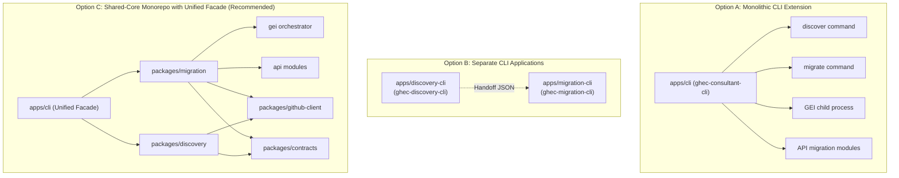
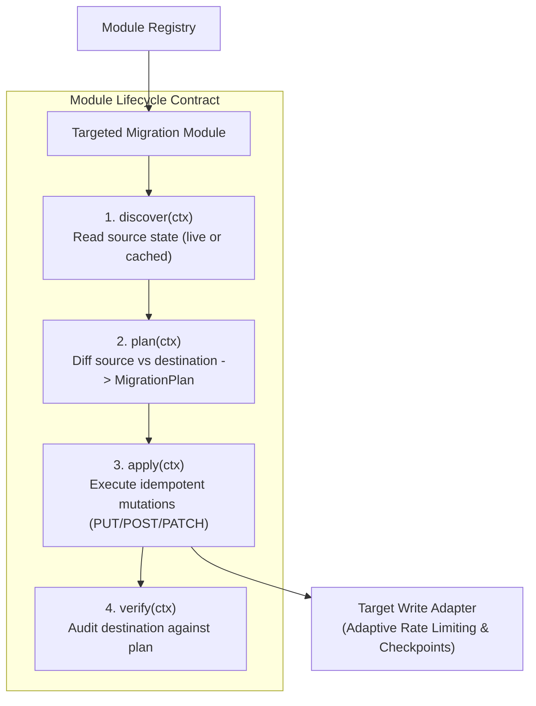
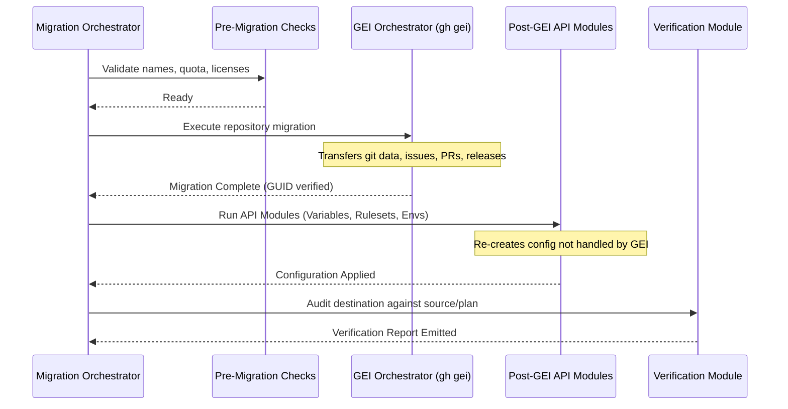
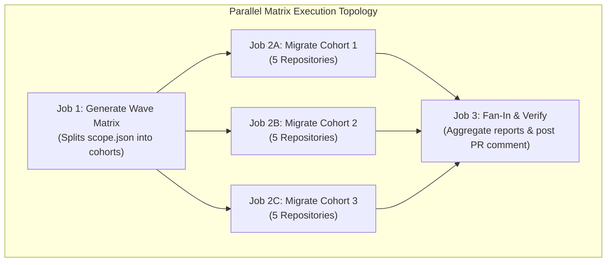
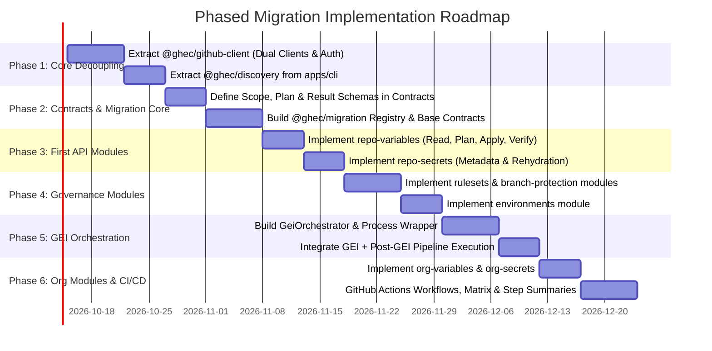

# Architecture Assessment: Expanding Discovery to GHEC Migration

**Document Status:** Complete Architectural Evaluation  
**Author:** Antigravity (Google DeepMind)  
**Date:** October 2026  
**Target Repository:** `cloudgxp/ghec-consultant-suite`  
**Scope:** GitHub Enterprise Cloud (GHEC) → GitHub Enterprise Cloud with Enterprise Managed Users (GHEC-EMU)

---

## Executive Summary

This architecture assessment evaluates how to expand the **GHEC Consultant Suite** beyond read-only discovery into an enterprise-grade migration platform. The target state supports both organization-level and repository-level migrations from **GHEC to GHEC-EMU**, orchestrating GitHub Enterprise Importer (GEI) for repository data while executing targeted API migration modules (via Octokit) for configuration and governance objects not handled by GEI.

We evaluated three architectural paths:

1. **Option A:** Extending the existing CLI (`apps/cli`) directly.
2. **Option B:** Creating separate applications (`ghec-discovery-cli` and `ghec-migration-cli`).
3. **Option C:** A shared-core, layered monorepo architecture with domain-specific packages and a unified CLI facade.

**Final Recommendation:** **Option C (Shared-Core Monorepo with Unified CLI Facade)**.  
Discovery and migration share the identical underlying GitHub domain model (repositories, teams, rulesets, secrets, environments, and policies). Discovery represents the _read_ phase of migration, while validation and audit represent the _verification_ phase. Splitting them into detached CLIs would lead to contract drift, duplicated client logic, and a fragmented consultant user experience. Conversely, stuffing migration directly into `apps/cli` would create an unmaintainable monolith mixing read-only guarantees with privileged write operations.

By decomposing shared functionality into domain-scoped packages (`@ghec/contracts`, `@ghec/github-client`, `@ghec/discovery`, `@ghec/migration`, and `@ghec/analysis`) while offering a single, cohesive CLI facade (`ghec-consultant-cli`), the suite achieves optimal separation of concerns, strict failure isolation, dual-tenant credential safety, and automated execution in local and GitHub Actions CI/CD environments.

---

## 1. Current Architecture

### 1.1 Monorepo Workspace Structure

The repository is organized as an npm workspace monorepo (`Node >= 22.13.0`, `npm >= 10`):

```text
ghec-consultant-suite/
├── packages/
│   ├── contracts/    # Zod schemas, data contracts, and bundle validation
│   └── analysis/     # Deterministic readiness evaluation rules & graph algorithms
├── apps/
│   ├── cli/          # 'ghec-consultant-cli' discovery tool
│   └── dashboard/    # Offline React 19 / Primer desktop & web reporting interface
├── scripts/          # Collector design, API surface probes, and app setup
└── research/         # GraphQL catalog, endpoint inventory, and API drift reports
```

### 1.2 Inspection of Existing Subsystems

#### 1.2.1 CLI Architecture & Command Grammar (`apps/cli`)

- **Entrypoint:** `bin/ghec-consultant-cli.mjs` bootstraps compiled output in `dist/index.js`, delegating to `runCli()`.
- **Parsing:** `src/commands/discover.ts` parses options using Node's native `parseArgs` (`node:util`).
- **Command Grammar:** Currently supports only the `discover` subcommand:
  ```bash
  ghec-consultant-cli discover --modules <list|all> (--organization <name> | --enterprise <slug>)
  ghec-consultant-cli discover --resume [checkpoint-id|latest]
  ```
- **Exit Codes:**
  - `0`: Complete scan or dry-run success.
  - `1`: Fatal runtime or filesystem error.
  - `2`: Invalid syntax or conflicting options.
  - `4`: Partial discovery produced (with `--continue-on-error`).
  - `130`: Interrupted by operator (SIGINT).

#### 1.2.2 Engine & Orchestration (`src/engine/`)

- `DiscoveryOrchestrator` implements a Directed Acyclic Graph (DAG) execution pipeline:
  1. **Preflight Probe:** Lightweight GraphQL probes against `/graphql` to check identity, rate limits, and target existence.
  2. **Permission Audit:** Preflight verification of credentials against required scopes.
  3. **Anchor Collection:** Runs `orgs` anchor (`rest.orgs.get`) followed by `repos` anchor (`OrgRepositories` GraphQL or `rest.repos.list-for-org`).
  4. **Child Fan-Out:** Dependent collectors execute with bounded concurrency (concurrency limit = 2 per org) to avoid secondary rate limiting.
  5. **Enterprise Scope Handling:** For enterprise targets, paginates all organizations via `EnterpriseOrganizations` GraphQL query, running the org pipeline across organizations with concurrency = 2.
- `CheckpointManager`: Atomic writes to `./scans/.checkpoint-<runId>/manifest.json` and module JSONs, tracking completed modules and enabling uninterrupted resumability via `--resume`.

#### 1.2.3 Collector System (`src/collectors/`)

- 11 baseline collectors implementing the `Collector` interface (`orgs`, `repos`, `lfs`, `teams`, `actions`, `actions-secrets`, `policies`, `security`, `integrations`, `users`, `packages`).
- Composite GraphQL query aggregators (`OrgMetadataAggregator`, `RepositoryDeepDiscoveryAggregator`, `TeamHierarchyAndAccessAggregator`) maximize request density by batching queries.

#### 1.2.4 GitHub API & Octokit Abstraction (`src/github/`)

- **Strict Read-Only Design:** The interface `GitHubReadAdapter` strictly defines read operations. Every `ReadOperation` carries `readonly verifiedReadOnly: true`.
- **Octokit Integration:** `HttpGitHubReadAdapter` uses `Octokit v5` configured with `@octokit/plugin-throttling` and `@octokit/plugin-retry`.
- **Adaptive Rate Limiting:** `AdaptiveRateLimiter` tracks REST and GraphQL quotas separately. It introduces dynamic pacing (500ms delay, concurrency 1) when quota drops below 500, and pauses execution until reset when quota drops below 100.
- **Authentication:** `loadConfig` supports Personal Access Tokens (`GHEC_TOKEN`) or GitHub App authentication (`appId`, `privateKeyPem`, `installationId`). `GitHubAppAuthProvider` generates RS256 JWTs using native `node:crypto` and caches installation tokens with automated 5-minute pre-expiration refreshes.

#### 1.2.5 Data Contracts (`packages/contracts`)

- Defined with **Zod** (`packages/contracts/src/index.ts`).
- Frozen at `SCHEMA_VERSION = '1.0.0'` per **ADR 0002** and **ADR 0004**.
- Strict validation via `validateBundle()` enforcing relational integrity (no cross-org dangling references, correct module-to-entity mappings, and exact summary counts).
- Guarantees **Zero Secret Leakage**: Secret values are strictly excluded by schema; only metadata names, levels, and update timestamps are captured.

#### 1.2.6 Analysis Engine (`packages/analysis`)

- Exports pure, deterministic migration readiness rules (`AnalysisRule`) targeting `ghec_emu`, `aggressive_cutover`, `ghes_on_prem`, and `strict_compliance`.
- Provides dependency graph algorithms (`buildDependencyIndex`, `transitiveDependencies`, `stronglyConnectedComponents`) capable of indexing 100,000 repository dependency edges in sub-second worker threads.

#### 1.2.7 Publication & Security Sanitization (`src/output/`)

- `publishBundle`: Streams up to 100,000 entities to a temporary file (`.tmp`) with restricted permissions (`0600`) and atomically renames to `ghec-discovery-*.json` preventing clobbering.
- `sanitizer.ts`: Pre-publication screening catching secret patterns (tokens, JWTs, private keys) and HMAC-SHA256 pseudonymization of user identities with run-specific salts.

---

## 2. Reusable Components

A key finding of this inspection is that substantial parts of the discovery infrastructure can be reused directly or evolved for migration.

| Existing Component          | Current Role                                                    | Reusability in Migration            | Required Modifications / Evolution                                                                             |
| :-------------------------- | :-------------------------------------------------------------- | :---------------------------------- | :------------------------------------------------------------------------------------------------------------- |
| **`packages/contracts`**    | Zod schemas for discovery bundles, entities, provenance, errors | **Directly Reusable (Core Models)** | Extend with schemas for **Migration Scope Files**, **Migration Plans**, and **Verification Results**.          |
| **`packages/analysis`**     | Readiness rules & dependency graph traversal                    | **Directly Reusable**               | Dependency graph algorithms will determine **repository migration wave order** and cyclic dependency cohorts.  |
| **`AdaptiveRateLimiter`**   | Dual REST & GraphQL quota tracking & pacing                     | **Reusable with Extension**         | Must be instantiated **twice**: one for the Source tenant and one for the Target tenant.                       |
| **`GitHubAppAuthProvider`** | RS256 JWT generation and token exchange                         | **Directly Reusable**               | Support dual configuration (Source App credentials vs Target App credentials).                                 |
| **`HttpGitHubReadAdapter`** | Read-only GraphQL queries and REST pagination                   | **Reusable for Discovery Phase**    | Evolve into a generalized client layer (`@ghec/github-client`) pairing read adapters with write adapters.      |
| **`CheckpointManager`**     | Atomic JSON persistence and resume manifest                     | **Reusable Pattern**                | Adapt manifest structure to track migration stages (`planned`, `gei-completed`, `api-rehydrated`, `verified`). |
| **`PermissionChecker`**     | Preflight Classic PAT & App scope verification                  | **Reusable with Extension**         | Add write/admin scope verification for target environments (`admin:org`, `repo`, `workflow`).                  |
| **`output/sanitizer.ts`**   | Zero-leakage token & credential redaction                       | **Directly Reusable**               | Ensure diagnostic logs and migration plan diffs never leak secret payloads or private keys.                    |
| **Baseline Collectors**     | Discovers source orgs, repos, secrets, rulesets                 | **Directly Reusable**               | Forms the exact `discover()` implementation for targeted migration modules!                                    |

---

## 3. Architectural Options

We analyzed three architectural alternatives for adding GHEC → GHEC-EMU migration capabilities.



### Option A: Extend the Existing CLI (`apps/cli`)

Add `migrate` directly into `apps/cli/src/commands/migrate.ts` alongside `discover.ts`, keeping all migration modules, GEI orchestration, and API logic inside `apps/cli`.

- **Benefits:**
  - Fast initial implementation; no immediate monorepo restructuring.
  - Single binary for consultants to run.
  - Zero package dependency management overhead.
- **Drawbacks & Risks:**
  - **Monolithic Bloat:** `apps/cli` becomes a heavyweight application mixing read-only discovery, write-heavy API mutations, GEI binary execution, and complex state machines.
  - **Security Seam Erosion:** The strict read-only guarantees built into `GitHubReadAdapter` (`verifiedReadOnly: true`) risk being diluted or bypassed by write helpers.
  - **Testing Friction:** End-to-end tests for migration will slow down discovery test suites, and mock boundaries will blur.

### Option B: Separate Applications (`ghec-discovery-cli` and `ghec-migration-cli`)

Fork or create a completely separate application in `apps/migration-cli` with its own command parser, API client, and release cadence.

- **Benefits:**
  - Absolute isolation between discovery and migration.
  - Read-only discovery tool can be deployed into highly restricted customer environments without write dependencies.
  - Independent versioning and deployment lifecycles.
- **Drawbacks & Risks:**
  - **Code Duplication & Drift:** Authentication, rate limiting, logging, token scrubbing, and API adapters would either be duplicated or require ad-hoc copying.
  - **Poor Consultant Experience:** Migration engineers must install, configure, and maintain two separate CLIs with different parameter styles and credentials.
  - **Fragmented CI/CD:** GitHub Actions workflows must chain disparate CLIs with fragile handoffs.

### Option C: Shared-Core Monorepo Architecture with Unified CLI Facade (Recommended)

Refactor the repository into discrete domain packages under `packages/` while keeping a single, unified CLI entry point in `apps/cli`:

- `packages/contracts`: Schemas for discovery, scope, planning, and verification.
- `packages/github-client`: Dual-tenant Octokit client (source read, target write), rate limiting, authentication, and token refreshing.
- `packages/discovery`: Headless discovery engine and collectors.
- `packages/migration`: Migration orchestrator, GEI executor, and targeted API migration modules.
- `packages/analysis`: Readiness rules and dependency graph traversal.
- `apps/cli`: Thin CLI orchestration exposing `discover`, `plan`, `migrate`, and `verify`.

- **Benefits:**
  - **Strict Separation of Concerns:** Domain logic lives in headless, testable packages.
  - **Maximum Code Reuse:** The same discovery collectors power standalone discovery _and_ live migration preflight.
  - **Unified Operator UX:** Consultants use a single command suite (`ghec-consultant-cli discover|plan|migrate|verify`).
  - **Credential Safety:** Source read-only clients and target write clients are decoupled at the architectural boundary.
  - **Flexible Distribution:** If a client requires an air-gapped read-only binary, `apps/discovery-cli` can be compiled from `@ghec/discovery` with zero code duplication.

---

### Comparative Evaluation Matrix

| Evaluation Criteria              | Option A: Extend Existing CLI       | Option B: Separate Applications      | Option C: Shared-Core Monorepo (Recommended)         |
| :------------------------------- | :---------------------------------- | :----------------------------------- | :--------------------------------------------------- |
| **Separation of Concerns**       | ❌ Poor (mixed read/write concerns) | 🟡 Moderate (app-level only)         | 🟢 **Superior (strict package boundaries)**          |
| **Code Reuse**                   | 🟡 Moderate (internal file imports) | ❌ Poor (high risk of drift/copying) | 🟢 **Maximum (shared npm workspace packages)**       |
| **Maintainability**              | ❌ Degrades into a monolith         | 🟡 Average                           | 🟢 **High (independent modular packages)**           |
| **Testability**                  | 🟡 Coupled tests                    | 🟡 Fragmented suites                 | 🟢 **Isolated unit, mock & integration suites**      |
| **CLI Usability & UX**           | 🟢 Single binary                    | ❌ Disjointed tools & flags          | 🟢 **Unified subcommands under one tool**            |
| **Deployment Complexity**        | 🟢 Single binary publish            | ❌ Multiple binaries to publish      | 🟢 **Single CLI binary (with optional splits)**      |
| **GitHub Actions Usability**     | 🟡 Workable but bulky               | ❌ Awkward tool chaining             | 🟢 **Clean composite action / job matrix**           |
| **Security & Credential Scope**  | ❌ Blast radius mixed               | 🟢 Strict physical isolation         | 🟢 **Isolated client instances (Source vs Target)**  |
| **Dual Rate-Limit Handling**     | ❌ Hard to maintain cleanly         | 🟡 Separate instances                | 🟢 **Dual-tenant `AdaptiveRateLimiter`**             |
| **Resumability & Checkpointing** | 🟡 Local file state                 | 🟡 Fragmented manifests              | 🟢 **Unified state machine across phases**           |
| **Extensibility (New Modules)**  | 🟡 Adds files to single app         | 🟡 Adds files to migration app       | 🟢 **Modular plug-in contracts & registries**        |
| **Audit & Validation Support**   | 🟡 Ad-hoc flags                     | ❌ Duplicate logic needed            | 🟢 **First-class shared `verify` pipeline**          |
| **Future Migration Targets**     | ❌ Hardcoded GHEC assumptions       | ❌ Requires another separate app     | 🟢 **Adapter pattern supports GHES / GitLab / etc.** |
| **Monolith Risk**                | 🔴 **High risk**                    | 🟢 Low risk                          | 🟢 **Eliminated via modular packaging**              |

---

## 4. Architectural Recommendation

We recommend **Option C: Shared-Core Monorepo Architecture with Unified CLI Facade**.

### Why This Is the Best Fit

1. **Discovery and Migration are Not Separate Applications:**  
   They represent successive phases of the same engineering engagement:
   $$\text{Discovery (Read)} \longrightarrow \text{Readiness (Analysis)} \longrightarrow \text{Planning (Diff)} \longrightarrow \text{Migration (GEI + API)} \longrightarrow \text{Verification (Audit)}$$
   Forcing an artificial boundary at the application level causes schema drift and doubles authentication maintenance.

2. **The Discovery Cache is the Natural Seam:**  
   A migration module running in _cached mode_ consumes a `DiscoveryBundle` produced by the `discover` command. A migration module running in _live mode_ calls the exact same collector on the fly. Placing discovery collectors in `@ghec/discovery` allows `@ghec/migration` and `apps/cli` to invoke them interchangeably.

3. **Protection of Read-Only Guarantees:**  
   In Option C, read operations remain strictly governed by `@ghec/contracts` and the read adapter. Mutation capabilities live exclusively in `@ghec/migration` and `@ghec/github-client`. An engineer running `ghec-consultant-cli discover` is physically incapable of triggering write operations because the `discover` command path does not instantiate target write adapters.

4. **Dual-Tenant Credential Cleanliness:**  
   Migrations involve two distinct organizations or enterprises:
   - **Source:** Read-only access (often a classic GHEC enterprise or org).
   - **Target:** Admin/write access (a new GHEC-EMU enterprise or org).  
     Packaging the GitHub client layer prevents target write credentials from leaking into source discovery requests.

---

## 5. Proposed Repository Structure

```text
ghec-consultant-suite/
├── packages/
│   ├── contracts/                    # [EXPANDED] Schemas & validation
│   │   ├── src/
│   │   │   ├── discovery/            # Existing DiscoveryBundle & Entity schemas
│   │   │   ├── scope/                # [NEW] MigrationScope schema & validation
│   │   │   ├── plan/                 # [NEW] MigrationPlan & Operation schemas
│   │   │   └── verification/         # [NEW] VerificationReport schemas
│   │   └── package.json
│   │
│   ├── github-client/                # [NEW] Shared GitHub API & transport layer
│   │   ├── src/
│   │   │   ├── auth/                 # Token & GitHub App auth (source & target)
│   │   │   ├── rate-limiting/        # AdaptiveRateLimiter with dual-tenant quotas
│   │   │   ├── adapters/
│   │   │   │   ├── read-adapter.ts   # Existing HttpGitHubReadAdapter
│   │   │   │   └── write-adapter.ts  # [NEW] Idempotent PUT/POST/PATCH adapter
│   │   │   └── client.ts             # Unified GitHubDualClient container
│   │   └── package.json
│   │
│   ├── discovery/                    # [EXTRACTED FROM CLI] Headless discovery
│   │   ├── src/
│   │   │   ├── collectors/           # 11 baseline collectors & aggregators
│   │   │   ├── engine/               # DiscoveryOrchestrator & CheckpointManager
│   │   │   └── permissions/          # Read-only permission checking
│   │   └── package.json
│   │
│   ├── migration/                    # [NEW] Headless migration engine
│   │   ├── src/
│   │   │   ├── core/                 # MigrationModule contract & module registry
│   │   │   ├── gei/                  # GEI process wrapper, polling, log parsing
│   │   │   ├── planner/              # Plan generator (dry-run diff calculation)
│   │   │   ├── orchestrator/         # MigrationOrchestrator & wave executor
│   │   │   ├── checkpoint/           # MigrationCheckpointManager
│   │   │   ├── modules/              # Targeted API migration modules
│   │   │   │   ├── org-secrets/
│   │   │   │   ├── org-variables/
│   │   │   │   ├── repo-secrets/
│   │   │   │   ├── repo-variables/
│   │   │   │   ├── rulesets/
│   │   │   │   ├── environments/
│   │   │   │   ├── branch-protection/
│   │   │   │   ├── webhooks/
│   │   │   │   └── teams/
│   │   │   └── verification/         # Post-migration state diff verifier
│   │   └── package.json
│   │
│   └── analysis/                     # [EXISTING] Pure readiness & graph rules
│       ├── src/
│       └── package.json
│
├── apps/
│   ├── cli/                          # [REFINED] Cohesive CLI Facade
│   │   ├── bin/ghec-consultant-cli.mjs
│   │   ├── src/
│   │   │   ├── commands/
│   │   │   │   ├── discover.ts       # Subcommand: discover
│   │   │   │   ├── plan.ts           # Subcommand: plan (dry-run / plan artifact)
│   │   │   │   ├── migrate.ts        # Subcommand: migrate (execute plan / live)
│   │   │   │   └── verify.ts         # Subcommand: verify destination state
│   │   │   └── index.ts              # Command router & top-level dispatcher
│   │   └── package.json
│   │
│   └── dashboard/                    # [EXISTING] React 19 / Primer UI
│       └── ...
```

---

## 6. Migration Module Architecture

Migration modules should follow a strict, standardized contract decoupled from CLI argument handling.



### 6.1 TypeScript Interface Definitions

```typescript
// packages/migration/src/core/types.ts

import type { AbortSignal } from 'node:events';

export type MigrationScopeLevel = 'organization' | 'repository';

export interface MigrationContext {
  readonly runId: string;
  readonly scope: {
    readonly level: MigrationScopeLevel;
    readonly sourceOrg: string;
    readonly targetOrg: string;
    readonly sourceRepo?: string;
    readonly targetRepo?: string;
  };
  readonly sourceClient: GitHubReadClient;
  readonly targetClient: GitHubWriteClient;
  readonly signal: AbortSignal;
  readonly dryRun: boolean;
  readonly logger: StructuredLogger;
}

export type OperationType = 'create' | 'update' | 'noop' | 'skip' | 'warn';

export interface PlannedOperation<T = unknown> {
  readonly id: string;
  readonly resourceType: string;
  readonly resourceName: string;
  readonly operation: OperationType;
  readonly sourceState?: T;
  readonly destinationCurrentState?: T;
  readonly payload?: unknown;
  readonly reason?: string;
}

export interface ModulePlan<T = unknown> {
  readonly moduleId: string;
  readonly scopeLevel: MigrationScopeLevel;
  readonly operations: readonly PlannedOperation<T>[];
  readonly warnings: readonly string[];
}

export interface OperationResult {
  readonly operationId: string;
  readonly status: 'succeeded' | 'failed' | 'skipped';
  readonly httpStatus?: number;
  readonly error?: string;
  readonly completedAt: string;
}

export interface ModuleExecutionResult {
  readonly moduleId: string;
  readonly status: 'complete' | 'partial' | 'failed' | 'skipped';
  readonly results: readonly OperationResult[];
  readonly durationMs: number;
}

export interface VerificationResult {
  readonly moduleId: string;
  readonly verified: boolean;
  readonly discrepancies: readonly {
    readonly resourceName: string;
    readonly expected: unknown;
    readonly actual: unknown;
    readonly message: string;
  }[];
}

/**
 * Authoritative lifecycle contract for any targeted migration module.
 */
export interface MigrationModule<TDiscovered = unknown> {
  readonly id: string;
  readonly displayName: string;
  readonly scopeLevel: MigrationScopeLevel;
  readonly dependencies: readonly string[]; // e.g. ['gei-repo'] or ['teams']

  /**
   * Discovers source state or reads from normalized cached discovery bundle.
   */
  discover(ctx: MigrationContext, cachedData?: unknown): Promise<TDiscovered>;

  /**
   * Compares source state against target state and plans operations.
   */
  plan(ctx: MigrationContext, sourceData: TDiscovered): Promise<ModulePlan>;

  /**
   * Applies the planned mutations against the target environment.
   */
  apply(
    ctx: MigrationContext,
    plan: ModulePlan,
  ): Promise<ModuleExecutionResult>;

  /**
   * Verifies destination state matches the planned configuration.
   */
  verify(ctx: MigrationContext, plan: ModulePlan): Promise<VerificationResult>;
}
```

### 6.2 Module Registry & DAG Execution

Modules are registered in a centralized `ModuleRegistry`:

```typescript
export class ModuleRegistry {
  private readonly modules = new Map<string, MigrationModule>();

  register(module: MigrationModule): void {
    this.modules.set(module.id, module);
  }

  resolveExecutionOrder(requestedModuleIds: string[]): MigrationModule[] {
    // Topological sort ensuring dependencies run first:
    // e.g. 'teams' must run before 'team-repo-permissions'
    // e.g. 'gei-repo' must run before 'repo-secrets' and 'rulesets'
  }
}
```

### 6.3 Idempotency and Mutation Strategy

All modules must enforce **idempotency**:

- **Prefer `PUT` and `PATCH` over `POST`:** Use upsert endpoints where supported by GitHub APIs (e.g. `PUT /repos/{owner}/{repo}/actions/secrets/{secret_name}`).
- **Check-Before-Write:** When creating objects (e.g. environments, rulesets, webhooks), probe the destination first. If an object with the same name exists:
  - If identical: emit `noop`.
  - If modified: emit `update` (or `skip` if overwriting is prohibited by policy).
- **Zero Incomplete Mutations:** Each operation result is recorded immediately in the migration checkpoint before proceeding to the next item.

---

## 7. Discovery / Migration Data Boundary

### 7.1 Supporting Cached vs. Live Discovery

The architecture guarantees that discovery logic is written once and consumed in two modes:

```text
[Cached Mode]
discovery.json (Version 1.0.0) ──> validateBundle() ──> Normalized Entities ──┐
                                                                              ├──> plan() ──> apply()
[Live Mode]                                                                   │
@ghec/discovery Collectors ──────> Discovered State in Memory ────────────────┘
```

1. **Cached Mode (`--input discovery.json`):**  
   The migration orchestrator passes the bundle through `@ghec/contracts` `validateBundle()`. It filters entities matching the selected scope and supplies them directly to `module.discover()`, skipping all source GitHub network calls.
2. **Live Mode (No `--input` supplied):**  
   The migration orchestrator invokes the corresponding `@ghec/discovery` collector against the source client, storing results in the active migration checkpoint.

### 7.2 Migration Scope File Schema

Scope files define the exact migration boundaries. We recommend a versioned schema in `@ghec/contracts`:

```json
{
  "$schema": "https://ghec-consultant-suite/schemas/migration-scope-v1.json",
  "version": "1.0.0",
  "name": "Wave-1-Core-Services",
  "enterprise": {
    "sourceSlug": "legacy-corp",
    "targetSlug": "emu-corp"
  },
  "organizations": [
    {
      "source": "north-division",
      "target": "north-division-emu",
      "modules": ["org-variables", "rulesets", "webhooks"],
      "options": {
        "prefixSecrets": false
      }
    }
  ],
  "repositories": [
    {
      "sourceOrg": "north-division",
      "sourceRepo": "payment-gateway",
      "targetOrg": "north-division-emu",
      "targetRepo": "payment-gateway",
      "modules": ["repo-variables", "environments", "rulesets"],
      "useGei": true
    },
    {
      "sourceOrg": "north-division",
      "sourceRepo": "auth-service",
      "targetOrg": "north-division-emu",
      "targetRepo": "auth-service",
      "modules": ["repo-variables", "environments", "rulesets"],
      "useGei": true
    }
  ],
  "identityMapping": {
    "type": "emu-saml",
    "suffix": "_emucorp"
  }
}
```

### 7.3 Migration Plan Artifact (`migration-plan.json`)

To enable GitHub Actions review gates and safe dry-runs, `plan` outputs an immutable, versioned plan artifact:

```json
{
  "schemaVersion": "1.0.0",
  "planId": "plan-7f8e9a2b",
  "createdAt": "2026-10-04T10:15:30Z",
  "sourceScope": "north-division",
  "targetScope": "north-division-emu",
  "summary": {
    "create": 14,
    "update": 2,
    "noop": 35,
    "skip": 1,
    "warn": 0
  },
  "modules": [
    {
      "moduleId": "repo-variables",
      "scope": "payment-gateway",
      "operations": [
        {
          "id": "op-001",
          "resourceType": "actions-variable",
          "resourceName": "DEPLOY_REGION",
          "operation": "create",
          "payload": {
            "name": "DEPLOY_REGION",
            "value": "us-east-1"
          }
        },
        {
          "id": "op-002",
          "resourceType": "actions-variable",
          "resourceName": "API_GATEWAY_URL",
          "operation": "update",
          "sourceState": { "value": "https://api-v2.internal" },
          "destinationCurrentState": { "value": "https://api-v1.internal" },
          "payload": {
            "value": "https://api-v2.internal"
          }
        }
      ]
    }
  ]
}
```

---

## 8. GEI Integration Boundary

### 8.1 Responsibility Separation

GitHub Enterprise Importer (GEI) is GitHub's canonical migration tool for Git data, PRs, issues, commits, comments, and wikis.  
**Rule:** The suite must **orchestrate** GEI, never attempt to reimplement GEI.

```text
┌────────────────────────────────────────────────────────┐
│             ghec-consultant-cli migrate                │
└──────────────────────────┬─────────────────────────────┘
                           │
         ┌─────────────────┴─────────────────┐
         ▼                                   ▼
┌──────────────────┐               ┌──────────────────┐
│ GEI Orchestrator │               │  API Migration   │
│  (gh gei CLI)    │               │  Modules (Octo)  │
└────────┬─────────┘               └────────┬─────────┘
         │                                  │
         │ Git data, commits,               │ Variables, Rulesets,
         │ PRs, issues, releases,           │ Environments, Secrets,
         │ wikis                            │ Policies, Webhooks
         ▼                                  ▼
┌────────────────────────────────────────────────────────┐
│                 Target GHEC-EMU Org                    │
└────────────────────────────────────────────────────────┘
```

### 8.2 GEI Orchestration Engine (`packages/migration/src/gei/`)

GEI should be encapsulated inside a dedicated sub-package service `GeiOrchestrator`:

- **Execution Mechanism:** Wraps the GitHub CLI (`gh gei migrate-repo`) via child process execution (`node:child_process.spawn`) or invokes GitHub's underlying GraphQL migration endpoints where suitable.
- **Preflight Verification:**
  1. Checks for GitHub CLI (`gh --version`) and the GEI extension (`gh extension list | grep gei`).
  2. Probes target organization permissions to verify repository creation rights.
  3. Verifies that the destination repository does not already exist.
- **Execution & Status Tracking:**
  - Captures GEI's migration GUID.
  - Streams GEI stdout/stderr into the suite's structured JSON log without leaking sensitive auth flags (`--github-source-pat`, `--github-target-pat`).
  - Implements polling with exponential backoff to check migration status (`gh gei migration-status --migration-id <id>`).
- **Failure Recovery:** If GEI fails, records the failure in the migration checkpoint and halts dependent post-GEI API modules for that repository.

### 8.3 Repository Migration Pipeline Order

For each repository in the migration wave:



---

## 9. Execution Model

The architecture supports five distinct execution modes:

```text
1. discover only:       ghec-consultant-cli discover --modules all --organization orgA
2. plan only:           ghec-consultant-cli plan --scope scope.json [--input discovery.json]
3. migrate (live):      ghec-consultant-cli migrate --scope scope.json --modules repo-variables,rulesets
4. migrate (cached):    ghec-consultant-cli migrate --scope scope.json --input discovery.json
5. apply plan:          ghec-consultant-cli migrate --plan migration-plan.json
6. verify only:         ghec-consultant-cli verify --scope scope.json [--plan migration-plan.json]
```

### 9.1 Mode Descriptions

1. **`discover only`**: Executes read-only discovery, produces validated `discovery.json`. Zero mutations.
2. **`plan only` (`--dry-run`)**: Compares source state (live or from discovery cache) against the destination. Generates a deterministic `migration-plan.json` showing all planned additions, updates, and noops. No destination changes made.
3. **`migrate using cached discovery`**: Ingests previously validated discovery data, computes plan, and applies changes directly to destination. Ideal for cutover windows where discovery was performed during pre-migration planning.
4. **`migrate (live)`**: Performs live source discovery immediately followed by planning and migration.
5. **`apply plan`**: Consumes an approved, reviewed `migration-plan.json` artifact (e.g. approved in a PR or change ticket) and executes only the recorded operations.
6. **`verify only`**: Inspects the destination organization/repository, compares its current state against the expected source state or plan, and produces a compliance diff report (`verification-report.json`).

### 9.2 Checkpointing and Resumability

Migration uses a stage-based checkpoint manager (`MigrationCheckpointManager`):

- Directory: `./migrations/.checkpoint-<runId>/`
- Tracks granular progress:
  ```json
  {
    "runId": "mig-9a8b7c",
    "scope": "Wave-1",
    "stage": "in-progress",
    "repositories": {
      "payment-gateway": {
        "gei": {
          "status": "completed",
          "migrationId": "RM_0001",
          "durationMs": 45000
        },
        "modules": {
          "repo-variables": { "status": "completed" },
          "environments": { "status": "completed" },
          "rulesets": { "status": "failed", "error": "Rule condition conflict" }
        }
      }
    }
  }
  ```
- Running with `--resume [runId|latest]` immediately picks up at the first failed or incomplete module, skipping all succeeded repositories and GEI transfers.

---

## 10. GitHub Actions Execution

The architecture is built natively for non-interactive CI/CD execution:

### 10.1 Environment Variables & Dual-Tenant Authentication

```bash
# Source Environment (Read-Only)
GHEC_SOURCE_BASE_URL="https://api.github.com"
GHEC_SOURCE_TOKEN="ghp_source..."              # Or GitHub App:
GHEC_SOURCE_APP_ID="123456"
GHEC_SOURCE_APP_PRIVATE_KEY="-----BEGIN..."
GHEC_SOURCE_APP_INSTALLATION_ID="789101"

# Target Environment (GHEC-EMU Admin / Write)
GHEC_TARGET_BASE_URL="https://api.github.com"
GHEC_TARGET_TOKEN="ghp_target..."              # Or Target GitHub App:
GHEC_TARGET_APP_ID="654321"
GHEC_TARGET_APP_PRIVATE_KEY="-----BEGIN..."
GHEC_TARGET_APP_INSTALLATION_ID="101987"
```

### 10.2 Structured Output & Machine Readability

- **Standard Streams:** Clean stdout formatting with `--no-color` support.
- **GitHub Step Summary:** Emits markdown tables directly to `$GITHUB_STEP_SUMMARY`:
  ```markdown
  ### 🚀 Migration Summary: Wave 1 (payment-gateway)

  | Module               | Total Planned | Succeeded | Failed | Duration |
  | :------------------- | :-----------: | :-------: | :----: | :------: |
  | GEI Repository Data  |       1       |     1     |   0    |   45s    |
  | Repository Variables |       6       |     6     |   0    |   1.2s   |
  | Rulesets             |       2       |     2     |   0    |  800ms   |
  | Environments         |       3       |     3     |   0    |  950ms   |
  ```
- **Job Status & Exit Codes:**
  - Code `0`: Wave succeeded completely.
  - Code `1`: Fatal error (authentication, network, or filesystem failure).
  - Code `4`: Partial completion (some repositories failed, but others succeeded under `--continue-on-error`).

### 10.3 GitHub Actions Workflow Topologies



1. **Job 1 (Slicer):** Runs `ghec-consultant-cli plan --scope scope.json --split-matrix 5`, outputting an Actions matrix of repository chunks.
2. **Job 2 (Workers):** Runs `ghec-consultant-cli migrate --scope ${{ matrix.scopeChunk }}` concurrently across separate runners. Each runner manages its own GEI and API calls without colliding.
3. **Job 3 (Fan-In):** Downloads artifacts, validates overall destination state (`verify`), and generates executive migration sign-off documents.

---

## 11. Risks and Open Questions

### 11.1 Secret Values vs. Secret Metadata (Critical Security Boundary)

- **The Problem:** GitHub APIs **never** expose secret values (e.g. `GET /repos/{owner}/{repo}/actions/secrets` returns only secret names and timestamps).
- **Architecture Strategy:**
  - Variables are fully migratable (names and values are readable via API).
  - Secrets require an explicit **Secret Ingestion Strategy**:
    - _Option A (Metadata Only):_ The module recreates the secret names/scopes and flags them as requiring population.
    - _Option B (External Vault Integration):_ A secure plugin hook queries an external secrets vault (Azure Key Vault, HashiCorp Vault, AWS Secrets Manager) using the secret name to populate the value at the destination.
    - _Option C (Encrypted Secret Payload):_ A local encrypted file containing secret values provided explicitly for cutover.

### 11.2 Enterprise Managed Users (EMU) Identity Transformation

- **The Problem:** In GHEC-EMU, usernames are managed by IdP (e.g. Entra ID / Okta) and have mandatory enterprise suffixes (e.g. `octocat_acme`). Source user logins will not match target user logins.
- **Architecture Strategy:** Scope files must support identity mapping rules (`IdentityMappingEngine`). When migrating branch protection, CODEOWNERS references, or team memberships, source logins must be transformed before applying to the destination.

### 11.3 GEI Runtime Dependencies

- **The Problem:** GEI requires the `gh` CLI binary and the `gh-gei` extension installed on the host machine.
- **Architecture Strategy:** The suite must provide preflight diagnostics (`checkGeiInstalled()`) and provide an official Docker container image containing Node 22, `gh`, and `gh gei` pre-installed for friction-free GitHub Actions runner execution.

### 11.4 Idempotency on Existing Resources

- **The Problem:** If a repository already has environments or default rulesets created by an organization policy at the target, simple creation calls will fail.
- **Architecture Strategy:** Modules must implement smart reconciliation: merge ruleset conditions, update existing environments, and clearly flag discrepancies.

---

## 12. Recommended Implementation Sequence

A realistic, phased implementation sequence that maintains 100% green test passing at every step:



### Phase 1: Foundation Refactoring & Package Extraction

- Create `packages/github-client` containing:
  - `TokenProvider`, `GitHubAppAuthProvider`, `AdaptiveRateLimiter` (with dual-tenant support).
  - Bi-directional adapters: `GitHubReadAdapter` and `GitHubWriteAdapter`.
- Move collectors and orchestrator from `apps/cli` into `packages/discovery`.
- Verify existing 116 tests pass and `ghec-consultant-cli discover` maintains identical CLI syntax and behavior.

### Phase 2: Contracts & Migration Framework

- Add migration data contracts to `packages/contracts`:
  - `MigrationScopeSchema`, `MigrationPlanSchema`, `VerificationReportSchema`.
- Create `packages/migration` with:
  - `MigrationModule` lifecycle interface.
  - `ModuleRegistry` with topological dependency sorting.
  - `MigrationCheckpointManager`.
  - Base `MigrationOrchestrator`.

### Phase 3: First Repository-Level Migration Module (`repo-variables`)

- Implement `repo-variables` module (clean end-to-end slice):
  - `discover()`: Reads repository variables from source (or cached bundle).
  - `plan()`: Diffs source variables against target variables.
  - `apply()`: Idempotently creates/updates variables on target via Octokit.
  - `verify()`: Verifies variables exist and values match.
- Add `plan` and `migrate` subcommands to `apps/cli`.
- Implement `repo-secrets` metadata recreation.

### Phase 4: Governance & Policy Modules

- Implement `rulesets` migration module (mapping repository rulesets, rules, and bypass actors).
- Implement `branch-protection` module (classic branch protection rules).
- Implement `environments` module (deployment protection rules, reviewers, and secrets/variables scopes).

### Phase 5: GEI Orchestration

- Implement `GeiOrchestrator` in `packages/migration/src/gei/`:
  - Preflight validation of `gh` and `gh gei`.
  - Subprocess execution, migration GUID extraction, log streaming, and status polling.
- Bind GEI repository migration to post-GEI API rehydration modules in `MigrationOrchestrator`.

### Phase 6: Organization-Level Migration Modules

- Implement `org-variables` and `org-secrets`.
- Implement `teams` migration module with EMU IdP group sync compatibility.
- Implement `webhooks` migration module.

### Phase 7: GitHub Actions CI/CD Execution & Reporting

- Implement GitHub Step Summary markdown generator (`$GITHUB_STEP_SUMMARY`).
- Build scope file matrix splitter for parallel repository migration jobs.
- Add reusable GitHub Actions workflow templates (`.github/workflows/migration-wave.yml`).

---

## 13. Conclusion

Expanding the GHEC Consultant Suite from discovery to migrations via **Option C (Shared-Core Monorepo Architecture)** provides the optimal balance of engineering rigor, architectural cleanliness, operational safety, and developer experience.

By treating discovery and migration as connected phases of a unified lifecycle sharing a common domain model in `@ghec/contracts`, the suite avoids code duplication and schema drift. By isolating write capabilities, rate limiters, and dual-tenant credentials in specialized packages (`@ghec/migration`, `@ghec/github-client`), the application protects its strict read-only discovery guarantees. Finally, by orchestrating GEI for core repository data and using targeted Octokit modules for configuration and governance, the platform delivers an automated, idempotent migration capability engineered specifically for enterprise migrations to **GitHub Enterprise Cloud with Enterprise Managed Users**.
