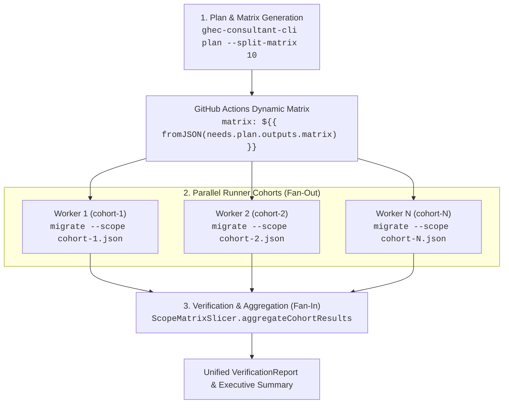

# Scope Matrix Slicing & Parallel Execution Topologies

## 1. Overview

In large enterprise migrations containing hundreds or thousands of repositories, executing migrations sequentially in a single job causes several operational failures:

- **Runner Timeout Exceeded**: GitHub Actions standard jobs have a 6-hour execution timeout limit.
- **Resource Starvation**: High repository counts bottleneck on network bandwidth, disk I/O, and rate limit exhaustion.
- **Blast Radius**: A single failure late in a monolithic run complicates selective retries and delays the entire migration window.

To resolve these constraints, the **GHEC Consultant Suite** incorporates **Scope Matrix Slicing** (`ScopeMatrixSlicer`) and the `--split-matrix <batch-size>` CLI flag. This architecture partitions large `MigrationScope` manifests into balanced, independent repository cohorts that execute in parallel across a dynamic GitHub Actions job matrix, followed by a fan-in verification consolidation step.

---

## 2. Dynamic Matrix Topology

The matrix execution topology follows a fan-out / fan-in workflow across 3 phases:



### GitHub Actions Workflow Specification Example

```yaml
name: Enterprise Repository Migration
on:
  workflow_dispatch:
    inputs:
      batch_size:
        description: 'Repositories per runner cohort'
        required: true
        default: '10'

jobs:
  plan:
    runs-on: ubuntu-latest
    outputs:
      matrix: ${{ steps.set-matrix.outputs.matrix }}
    steps:
      - uses: actions/checkout@v4
      - uses: actions/setup-node@v4
        with:
          node-version: 22
      - run: npm ci && npm run build
      - name: Generate Migration Plan & Matrix
        id: set-matrix
        run: |
          node apps/cli/dist/index.js plan \
            --scope ./scans/production-scope.json \
            --split-matrix ${{ github.event.inputs.batch_size }} \
            --output-matrix ./scans/migration-matrix.json
          echo "matrix=$(jq -c . ./scans/migration-matrix.json)" >> "$GITHUB_OUTPUT"

  migrate-cohorts:
    needs: plan
    runs-on: ubuntu-latest
    strategy:
      fail-fast: false
      max-parallel: 4
      matrix: ${{ fromJSON(needs.plan.outputs.matrix) }}
    steps:
      - uses: actions/checkout@v4
      - name: Execute Migration Pipeline for ${{ matrix.cohortId }}
        run: |
          echo '${{ matrix.scopeJson }}' > cohort-scope.json
          node apps/cli/dist/index.js migrate \
            --scope cohort-scope.json \
            --output ./results/${{ matrix.cohortId }}-result.json
      - uses: actions/upload-artifact@v4
        with:
          name: ${{ matrix.cohortId }}-result
          path: ./results/${{ matrix.cohortId }}-result.json

  fan-in-summary:
    needs: migrate-cohorts
    if: always()
    runs-on: ubuntu-latest
    steps:
      - uses: actions/checkout@v4
      - uses: actions/download-artifact@v4
        with:
          path: ./all-results
      - name: Aggregate Verification & Migration Results
        run: |
          node -e "
            const { ScopeMatrixSlicer } = require('./packages/migration/dist/index.js');
            // Consolidate all cohort result JSONs
            // Emit unified verification summary and fail job if discrepancies exist
          "
```

---

## 3. Dependency-Aware Grouping & Cyclic Preservation

Naive partitioning (e.g. slicing strictly by array indexing) introduces serious dependency boundary hazards:

- Internal package dependencies (e.g. npm/pip packages or Go modules published across repositories) can fail during build or integration tests if consumer and provider repositories migrate out of order.
- Cyclic submodule dependencies or shared webhook targets must migrate atomically.

`ScopeMatrixSlicer` incorporates graph analytics from `@ghec/analysis`:

1. **Strongly Connected Components (Cycles)**:
   - Uses Tarjan's strongly connected components algorithm (`stronglyConnectedComponents(graph)`).
   - If repositories participate in a dependency cycle (e.g. `repo-A <-> repo-B`), they are **strictly kept within the same cohort**.
   - If the size of an atomic cycle exceeds the requested `--split-matrix` batch size, the slicer **does not fracture the cycle**. Instead, it emits an oversized cohort with an explanatory rationale (e.g. `Cycle of 4 repositories must migrate together.`).
2. **Weakly Connected Components (Coupled Clusters)**:
   - Repositories connected via one-way directed dependency chains are kept in the same cohort if their combined count is $\le \text{batchSize}$.
3. **Independent Repositories**:
   - Independent or orphan repositories are packed into balanced cohorts up to `batchSize`.

---

## 4. Rate Limiting Across Parallel Runners

When multiple runners execute in parallel against the same destination GitHub Enterprise Cloud tenant, individual runner rate limits do not isolate total tenant impact:

> [!WARNING]
> **Secondary / Abuse Rate Limits**:
> GitHub enforces secondary concurrency rate limits on mutation endpoints (`POST`, `PATCH`, `PUT`). Spawning too many parallel runners (e.g. $> 10$) will trigger HTTP 403 / 429 secondary rate limit responses.
>
> **Best Practices**:
>
> 1. Set `strategy.max-parallel: 4` (or at most `5`) in GitHub Actions workflows.
> 2. Ensure each runner job uses internal concurrency of at most 2 parallel repositories (`concurrency: 2`).
> 3. Use dedicated GitHub App installations with distinct installation tokens when migrating multiple large organizations simultaneously.

---

## 5. Fan-In Result Aggregation

Parallel worker jobs upload discrete execution results and verification reports. `ScopeMatrixSlicer.aggregateCohortResults()` synthesizes these inputs:

- Computes aggregated totals: `totalCohorts`, `completedCohorts`, `failedCohorts`, `totalRepositories`, `completedRepositories`, `failedRepositories`, `totalDiscrepancies`.
- Synthesizes an overall migration status:
  - `'complete'`: 100% of cohorts succeeded with zero failures and zero discrepancies.
  - `'failed'`: All cohorts failed or zero repositories completed.
  - `'partial'`: Some cohorts succeeded while others experienced rate limits, network timeouts, or preflight blocks.
- Preserves structured error traces per cohort to facilitate targeted partial retries without rerunning already-verified cohorts.
