# GitHub Actions Enterprise Migration Guide

This operational runbook details how to execute large-scale, enterprise-grade GitHub migrations from **GitHub Enterprise Server (GHES)** or **GitHub Enterprise Cloud (GHEC)** to **GHEC Enterprise Managed Users (EMU)** using the **GHEC Consultant Suite** and GitHub Actions.

---

## 1. Architecture & Execution Topology

The migration pipeline leverages GitHub Actions for automated planning, parallel execution, and verification without manual terminal babysitting:

```mermaid
flowchart TD
    subgraph PR["1. Pre-Migration Planning (PR)"]
        PR_Trigger["PR on scopes/*.json"] --> PR_Plan["ghec-consultant-cli plan"]
        PR_Plan --> PR_Artifact["Upload migration-plan.json"]
        PR_Plan --> PR_Comment["Post PR Planning Summary"]
    end

    subgraph Wave["2. Parallel Wave Execution (Workflow Dispatch)"]
        Dispatch["workflow_dispatch (scope, batch_size)"] --> Slicer["Job 1: Scope Matrix Slicer"]
        Slicer --> Slicer_Plan["Generate Plan & Matrix JSON"]
        Slicer_Plan --> Gate{"Environment Approval Gate<br/>(production-migration)"}

        Gate -->|Approved| Worker1["Worker Cohort 1<br/>(ghec-consultant-cli migrate)"]
        Gate -->|Approved| Worker2["Worker Cohort 2<br/>(ghec-consultant-cli migrate)"]
        Gate -->|Approved| WorkerN["Worker Cohort N<br/>(ghec-consultant-cli migrate)"]

        Worker1 --> Checkpoint1["Checkpoint / Artifacts"]
        Worker2 --> Checkpoint2["Checkpoint / Artifacts"]
        WorkerN --> CheckpointN["Checkpoint / Artifacts"]

        Checkpoint1 --> Aggregator["Job 3: Fan-In & Verify"]
        Checkpoint2 --> Aggregator
        CheckpointN --> Aggregator

        Aggregator --> Verify["ghec-consultant-cli verify"]
        Verify --> Summary["GitHub Step Summary Report"]
    end

    subgraph Recovery["3. Failure Resumption"]
        Resume_Trigger["workflow_dispatch (run_id)"] --> Resume_Run["ghec-consultant-cli migrate --resume"]
        Resume_Run --> Resume_Summary["Resumption Step Summary"]
    end
```



---

## 2. Infrastructure & Runner Configuration (DEC-007)

For enterprise migrations involving hundreds of repositories, multi-gigabyte LFS histories, and weekend maintenance windows, **self-hosted Linux runners** are strongly recommended over GitHub-hosted runners.

### Rationale

1. **Runner Timeouts:** Standard GitHub-hosted runners enforce a 6-hour execution timeout. Multi-gigabyte repository clones and GEI archives can exceed this limit on large monorepos.
2. **Persistent Storage Volumes:** Self-hosted runners maintain persistent scratch mounts (`/mnt/ghec-scans` and `/mnt/ghec-checkpoints`). If network blips interrupt execution, checkpoints remain preserved on local disk without relying exclusively on artifact upload/download cycles.
3. **High-Speed Network Egress:** Co-locating migration runners near the source network infrastructure minimizes data transfer latency for large blobs.

### Runner Sizing Matrix

| Wave Scope                | Recommended Parallel Runners | CPU per Runner | RAM per Runner | Disk Mount per Runner |
| :------------------------ | :--------------------------: | :------------: | :------------: | :-------------------: |
| **Small (<50 Repos)**     |             2–4              |     4 vCPU     |     16 GB      |      100 GB NVMe      |
| **Medium (50–250 Repos)** |             4–8              |     8 vCPU     |     32 GB      |      250 GB NVMe      |
| **Large (>250 Repos)**    |             8–16             |    16 vCPU     |     64 GB      |      500 GB NVMe      |

---

## 3. Credential Setup & Security Boundaries

### Token Separation & Least Privilege

Never share credentials between source and target tenants. Two distinct repository or organization secrets must be configured:

- `GHEC_SOURCE_TOKEN`: Read-only access to source organizations and repositories (or GitHub App Installation Token with Repository & Organization read permissions).
- `GHEC_TARGET_TOKEN`: Write access to destination GHEC-EMU organizations (must be Organization Owner or GitHub App with administrative permissions).

### Zero-Exposure Secrets (DEC-004)

Repository and environment secret values are write-only. The migration suite rehydrates secret names by fetching destination public keys and encrypting blank placeholders (`""`) or ephemeral vault-supplied secrets using libsodium sealed-box encryption. Secret values are **never** printed to logs, written to `$GITHUB_STEP_SUMMARY`, or included in migration plans.

---

## 4. Friday $\rightarrow$ Sunday Cutover Runbook

This battle-tested operational timeline enables smooth weekend enterprise cutovers:

```
Friday 09:00 UTC ──▶ Preflight & Discovery Scan
Friday 14:00 UTC ──▶ Scope PR & Automated Planning
Friday 18:00 UTC ──▶ Code Freeze & Pre-Cutover Verification
Saturday 00:00 UTC ─▶ Wave Execution Dispatch (Parallel Matrix)
Saturday 08:00 UTC ─▶ Fan-In Verification & Discrepancy Audit
Saturday 12:00 UTC ─▶ Mannequin Reclamation & Identity Reattribution
Sunday 10:00 UTC ───▶ Post-Migration Webhook Re-enabling & Team Sign-off
```

### Phase 1: Friday Morning — Preflight Discovery

Run a full read-only assessment using `.github/workflows/enterprise-multi-org-scan.yml` to refresh repository sizes, rulesets, and dependencies.

### Phase 2: Friday Afternoon — Scope Definition & PR Plan

1. Commit the target repository scope file into `scopes/wave-1.json`:
   ```json
   {
     "schemaVersion": "1.0.0",
     "sourceOrg": "source-enterprise-org",
     "targetOrg": "target-emu-org",
     "repositories": ["service-api", "frontend-app", "data-pipeline"],
     "modules": ["all"]
   }
   ```
2. Open a Pull Request.
3. `.github/workflows/migration-plan-pr.yml` runs automatically:
   - Validates scope syntax.
   - Calculates planned entity diffs against destination.
   - Generates plan artifacts.
   - Posts a summary comment on the PR detailing planned creations, updates, no-ops, and warnings.

### Phase 3: Saturday 00:00 UTC — Wave Execution

1. Navigate to **Actions** $\rightarrow$ **Parallel Matrix Migration Wave** (`migration-execute-wave.yml`).
2. Click **Run workflow**:
   - `scope`: `scopes/wave-1.json`
   - `batch_size`: `5` (partitions repos into balanced cohorts)
   - `modules`: `all`
   - `environment_gate`: `production-migration`
3. The designated release manager approves the `production-migration` environment gate.
4. Matrix runners pick up cohorts in parallel, performing GEI transfer, LFS mirroring, variable replication, and secret rehydration.

### Phase 4: Saturday Morning — Verification & Discrepancy Review

1. The **aggregate-and-verify** job consolidates all cohort reports.
2. Formats a full `$GITHUB_STEP_SUMMARY` report in the Actions UI.
3. Inspect discrepancies:
   - If any variables or environments differ, review the generated `./scans/verification-report.json`.

### Phase 5: Saturday Afternoon — Mannequin Reclamation

Run the mannequin reattribution engine using the target EMU identity map:

```bash
gh gei reclaim-mannequin \
  --github-target-org target-emu-org \
  --csv mannequin-mapping.csv \
  --skip-invitation
```

---

## 5. Failure Recovery & Resumption Runbook

If a network timeout or temporary GitHub API rate limit interrupts a worker during execution:

1. Identify the interrupted `runId` from the failed cohort log (e.g. `migration-20261004-123456`).
2. Checkpoint manifests are safely preserved in `./migrations/.checkpoint-<runId>/`.
3. Navigate to **Actions** $\rightarrow$ **Resume Interrupted Migration** (`migration-resume.yml`).
4. Enter the `run_id`:
   - The workflow restores the checkpoint state.
   - Automatically skips previously completed stages (e.g., GEI repository transfer, LFS assets).
   - Resumes execution starting from the failed stage.
5. All operations are idempotent; rerun operations safely apply with no duplicate entity generation.
