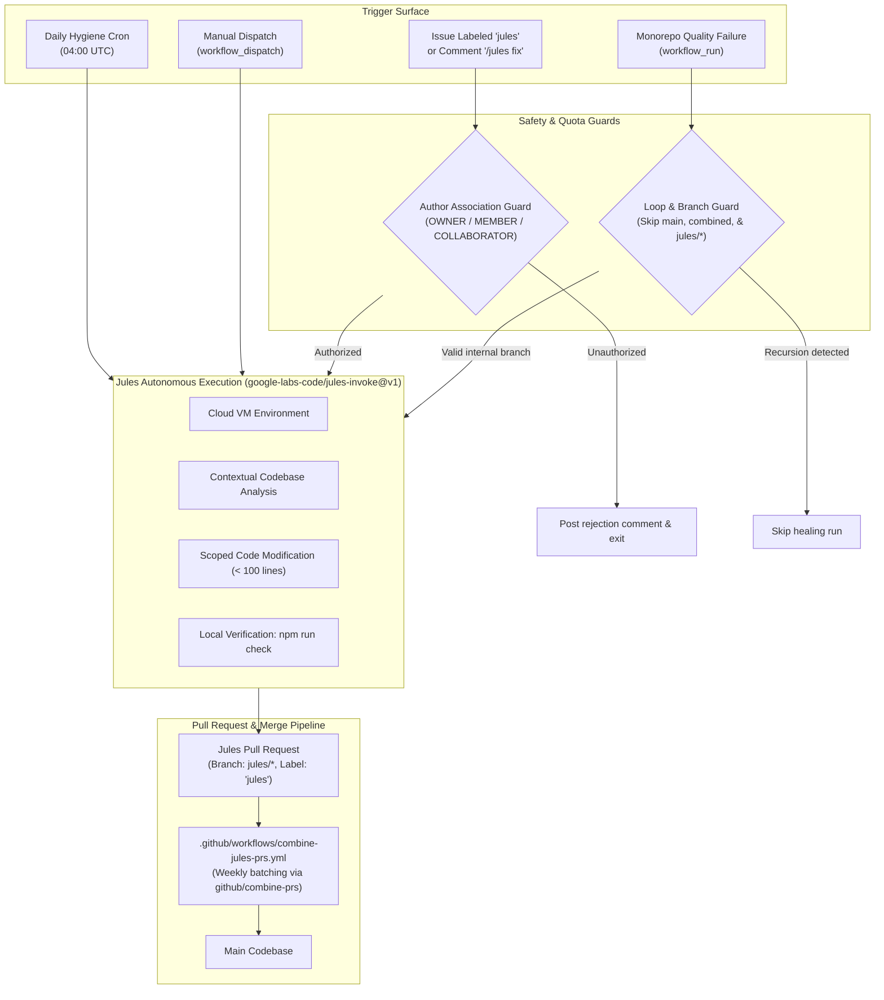

# Jules Autonomous Maintenance & CI Healing Setup Guide

This guide describes how to configure, operate, and maintain the autonomous AI development workflows powered by Google Labs' **Jules** (`google-labs-code/jules-invoke@v1`) within the GHEC Consultant Suite monorepo.

---

## 1. Overview & Architecture

Jules is an autonomous, cloud-hosted AI software engineering agent developed by Google Labs and powered by Gemini 3 Pro. The GHEC Consultant Suite integrates Jules to eliminate maintenance friction, autonomously heal broken CI builds on feature branches, resolve minor issues, and execute daily preventative codebase hygiene sweeps.



---

## 2. API Key Configuration

To activate Jules automations, you must configure a Google Jules API key as a repository secret.

### Step 2.1: Generate a Jules API Key

1. Navigate to [jules.google.com](https://jules.google.com) and authenticate with your GitHub account.
2. Select your user avatar in the top-right corner and open **Account Settings**.
3. Under **API Keys**, select **Create New API Key**.
4. Copy the generated key token.

### Step 2.2: Add to GitHub Repository Secrets

1. Navigate to your repository on GitHub.
2. Go to **Settings** $\rightarrow$ **Secrets and variables** $\rightarrow$ **Actions**.
3. Click **New repository secret**.
4. Name: `JULES_API_KEY`
5. Secret: _Paste your Jules API token_.
6. Click **Add secret**.

> [!NOTE]
> If you wish to use a Personal Access Token with elevated permissions to combine and merge PRs in `combine-jules-prs.yml`, you can optionally set `COMBINE_PRS_PAT` in the same secrets settings. If omitted, the default `GITHUB_TOKEN` is used.

---

## 3. Operational Workflows & Triggers

### Trigger A: Issue-to-Fix Agent

Maintainers can delegate bug fixes, documentation corrections, or minor enhancements directly from GitHub Issues.

#### 1. Via Issue Label

- Apply the label `jules` to any issue.
- **Workflow:** `.github/workflows/jules-agent.yml` triggers automatically.
- **Acknowledgement:** The issue receives an `:eyes:` reaction.
- **Authorization:** Only repository `OWNER`, `MEMBER`, or `COLLABORATOR` actors can invoke Jules. If an unauthorized user applies the label, the workflow posts an explanatory comment and terminates without consuming quota.

#### 2. Via Issue Comment (Slash Command)

- Post a comment on an open issue containing:
  ```text
  /jules fix
  ```
  _(or `/jules`, `/jules <custom instructions>`, `!jules fix`, or `jules: fix`)_
- **Workflow:** `.github/workflows/jules-agent.yml` triggers on `issue_comment: created`.
- **Acknowledgement:** The comment receives a `:rocket:` reaction.

> [!TIP]
> Always use slash commands like `/jules fix` or `/jules` rather than `@jules`. This triggers the automation without pinging or notifying the external GitHub user named `jules`.

---

### Trigger B: CI Auto-Healer

When code changes in internal branches trigger a failure in `monorepo-quality.yml`, the auto-healer steps in.

- **Workflow:** `.github/workflows/jules-ci-healer.yml` triggers via `workflow_run` on completion of `Monorepo quality`.
- **Diagnostic Collection:** The action queries the GitHub REST API to locate failed jobs and steps (such as ESLint lint errors, Prettier formatting violations, or TypeScript compilation issues).
- **Anti-Recursion Protection:**
  - Auto-healing only runs on internal branches (`github.repository == workflow_run.head_repository.full_name`).
  - Auto-healing is disabled on `main`, `combined-jules-prs`, and branches created by Jules itself (`jules/*`, `*-jules-*`, or timestamped refs). This prevents infinite error feedback loops.
- **Remediation:** Jules runs on the head branch with `include_last_commit: 'true'` and pushes a remediation pull request or commit.

---

### Trigger C: Daily Scheduled Hygiene Sweep

- **Schedule:** Runs every morning at **04:00 UTC** via cron (`0 4 * * *`).
- **Scope:**
  - Replaces loose `any` types in `@ghec/contracts` and `@ghec/github-client` with strict types or generics.
  - Cleans up dead variables and unreferenced imports across packages.
  - Updates stale JSDoc annotations to match exported function signatures.
  - Adds unit test coverage for pure helper functions in `@ghec/analysis` and `@ghec/migration`.
- **Quality Constraint:** Diff must be $< 100$ lines, and `npm run check` must pass cleanly.

---

### Trigger D: Manual Dispatch

Maintainers can manually trigger targeted Jules interventions from the GitHub Actions UI:

1. Navigate to **Actions** $\rightarrow$ **Jules Agent**.
2. Click **Run workflow**.
3. Configure the inputs:
   - **Type of task:**
     - `custom`: Supply custom instructions in the prompt.
     - `hygiene-sweep`: Run a targeted hygiene sweep on a specific branch.
     - `issue-fix`: Fix a specific issue by number.
   - **Custom prompt instructions:** Specific instructions or constraints.
   - **Starting branch:** Branch to base work on (defaults to `main`).
   - **Target issue number:** Issue number (if `issue-fix` selected).

---

## 4. Jules PR Auto-Batching & Merging

When Jules completes a task, it opens a pull request. To prevent repository noise and PR sprawl, `.github/workflows/combine-jules-prs.yml` handles batching:

1. **Immediate Labeling (`pull_request_target`)**:
   As soon as a Jules PR is opened, the workflow detects Jules branch names (`jules/*`, timestamped suffixes), Jules PR bodies, or `[Jules]` titles and attaches the `jules` label.

2. **Weekly Combination Schedule**:
   Every Sunday at 00:00 UTC (or upon manual dispatch), `combine-prs` aggregates all open, passing Jules PRs into a single combined PR (`combined-jules-prs`):
   - Only PRs with the `jules` label and passing CI checks (`ci_required: true`) are merged into the batch.
   - Maintainers can review and merge one combined PR per week instead of handling dozens of minor PRs individually.

---

## 5. Quota & Safety Guardrails

Google AI Ultra provides up to **300 Jules fixes per day**. The suite implements multiple layers of protection to ensure this quota is used efficiently:

| Safeguard                       | Implementation                                                | Benefit                                                              |
| :------------------------------ | :------------------------------------------------------------ | :------------------------------------------------------------------- |
| **Maintainer Allowlists**       | Author association checks (`OWNER`, `MEMBER`, `COLLABORATOR`) | Prevents external issue spammers from draining API quota             |
| **Anti-Loop Filter**            | Filters out `jules/*`, `main`, and `combined-*` branches      | Eliminates infinite CI failure feedback loops                        |
| **Diff Limitation**             | Prompt template strictly caps diffs at $< 100$ lines          | Ensures fast execution, low token usage, and high success rates      |
| **Strict Quality Verification** | Mandatory `npm run check` in Jules prompt before PR creation  | Zero broken builds or regressions introduced into the monorepo       |
| **Rate-Limited Cron**           | Single daily hygiene run                                      | Predictable daily background quota allocation ($< 1\%$ of daily cap) |

---

## 6. Verification & Troubleshooting

### Validating Workflow Configurations

Run a quick YAML validation check locally:

```bash
python3 -c "
import yaml, glob
for f in sorted(glob.glob('.github/workflows/*.yml')):
    with open(f) as fp:
        yaml.safe_load(fp)
print('All workflows valid YAML.')
"
```

### Checking Jules Invocation Logs

1. Go to **Actions** $\rightarrow$ **Jules Agent** or **Jules CI Auto-Healer**.
2. Inspect the **Prepare Jules Context & Prompt** step to review the generated prompt and authorization decision.
3. Review the **Invoke Jules Action** step for the remote VM execution link (e.g. `https://jules.google.com/task/<task-id>`).
