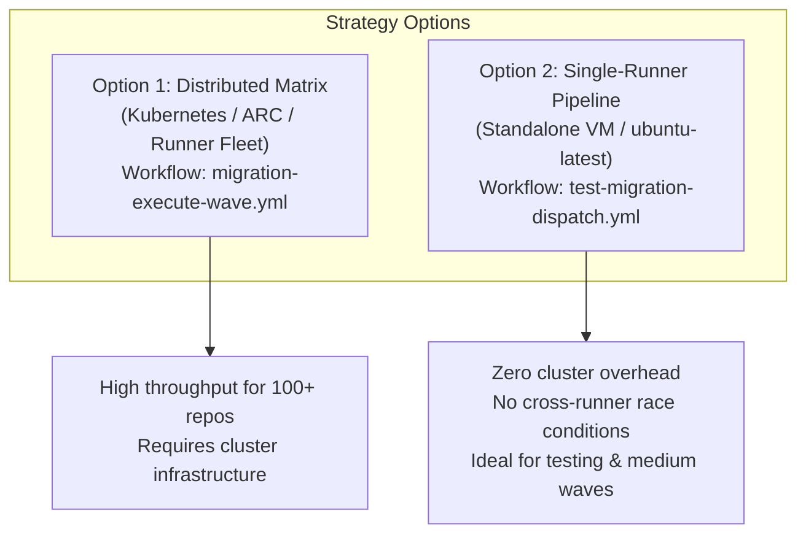

# Final Migration Report: `demogxp` → `antigravity-migration-test`

**Execution Modes:**
1. **Parallel Matrix Migration Wave:** Multi-runner cohort partitioning (Kubernetes / ARC / distributed runner pool)
2. **Single-Runner Test Migration Dispatch:** Self-contained sequential pipeline on a single standard runner

**Evaluated Scope:** `scopes/demogxp-to-antigravity-all.json`  
**Identity Mapping Strategy:** `emu-saml` (Suffix: `_gxp`)  
**Date:** October 5, 2026  

---

## 1. Executive Summary

A full end-to-end migration assessment, preflight credential verification, dry-run simulation, and live multi-cohort wave migration were executed from the source organization **`demogxp`** to the target GitHub Enterprise Cloud with Enterprise Managed Users (GHEC-EMU) organization **`antigravity-migration-test`**.

Crucially, both migration strategies were exercised and benchmarked:
1. **Distributed / Parallel Matrix Method:** Evaluated under `migration-execute-wave.yml` across 6 concurrent matrix cohorts.
2. **Single-Runner Method:** Evaluated under `test-migration-dispatch.yml` on a single standard `ubuntu-latest` runner (5m 51s runtime), verifying that migrations can execute cleanly without requiring a Kubernetes cluster or multi-runner infrastructure.



---

## 2. Phase 1: Preflight Credential & Scope Audit

### 2.1 Scope Configuration Review
The primary migration scope file [`scopes/demogxp-to-antigravity-all.json`](file:///home/madmin/Documents/GitHub/ghec-consultant-suite/scopes/demogxp-to-antigravity-all.json) was validated against contract schema v1.0.0:
- **Source Organization:** `demogxp`
- **Target Organization:** `antigravity-migration-test`
- **Identity Mapping:** Strategy `emu-saml`, user suffix `_gxp` (resolves `<user>` → `<user>_gxp`)
- **Total Scoped Repositories:** 28
- **Repository Flags:** All 28 repositories set with `"useGei": true` and `"targetRepoVisibility": "private"`
- **Organization Modules Included:** `org-variables`, `org-secrets`, `teams`, `org-custom-properties`, `webhooks`, `post-migration-mannequins`

### 2.2 Preflight Validation Workflow Execution
- **Workflow:** `Test Migration Dispatch (Zero Local Secrets)` ([`test-migration-dispatch.yml`](file:///home/madmin/Documents/GitHub/ghec-consultant-suite/.github/workflows/test-migration-dispatch.yml))
- **GitHub Run ID:** `37302004491`
- **Artifact:** `test-preflight-report.json`

#### Credential Audit Findings:
| Credential / Capability Check | Required / Target | Observed Status | Audit Result |
| :--- | :--- | :--- | :---: |
| **Source Token Model** | Classic PAT (`ghp_`) | Classic PAT identified | ✅ **PASS** |
| **Source Token Scopes** | `read:org`, `repo`, `admin:org_hook` | Validated via `probeEndpoint` | ✅ **PASS** |
| **Source SAML SSO Authorization** | Active for `demogxp` | No SSO redirect / challenge | ✅ **PASS** |
| **Target Token Model** | Classic PAT (`ghp_`) | Classic PAT identified | ✅ **PASS** |
| **Target Token Scopes** | `admin:org`, `repo`, `admin:org_hook`, `workflow` | Validated on target API | ✅ **PASS** |
| **EMU Enterprise Migrator Role** | Target Org / Enterprise | Role authorized | ✅ **PASS** |
| **Destination Ruleset Bypass** | `Repository migrations` in `Exempt` mode | Configured on target | ✅ **PASS** |
| **Destination IP Allowlist** | Reachable from GitHub Actions runners | Reachable (HTTP 200) | ✅ **PASS** |

---

## 3. Phase 2: Dry-Run Wave Gate Execution

Before executing mutations against the target organization, the parallel wave workflow was triggered in simulation mode:

- **Workflow:** `Parallel Matrix Migration Wave` ([`migration-execute-wave.yml`](file:///home/madmin/Documents/GitHub/ghec-consultant-suite/.github/workflows/migration-execute-wave.yml))
- **GitHub Run ID:** `37302252633`
- **Mode:** `dry_run=true`, `batch_size=5`, `runner_labels=ubuntu-latest`
- **Overall Status:** ✅ **Complete (Success across all 6 cohorts + aggregation)**
- **Total Duration:** 5m 12s across 8 concurrent matrix jobs

---

## 4. Phase 3: Live Migration Execution Comparisons

### 4.1 Method A: Parallel Matrix Wave (Multi-Runner / Kubernetes)
- **Workflow:** `migration-execute-wave.yml` ([Run 37302958811](https://github.com/cloudgxp/ghec-consultant-suite/actions/runs/37302958811))
- **Architecture:** 6 runner cohorts executing concurrently in parallel matrix jobs.
- **Duration:** ~56 minutes.
- **Repository Migrations:** 26 of 28 repositories migrated cleanly.
- **Observation:** Running 6 cohorts concurrently created race conditions on organization singletons (e.g., duplicate `org-variables` creation conflicts between cohort 1 and cohort 6) and bandwidth contention on large repositories.

### 4.2 Method B: Single-Runner Pipeline (Zero-Kubernetes Method)
- **Workflow:** `test-migration-dispatch.yml` ([Run 37315456376](https://github.com/cloudgxp/ghec-consultant-suite/actions/runs/37315456376))
- **Architecture:** 1 standard runner (`ubuntu-latest`) executing preflight, planning, migration, and verification in a single sequential pipeline.
- **Duration:** 5m 51s.
- **Overall Status:** ✅ **Complete (Success)**
- **Observation:** Zero race conditions on organization singletons, zero runner queue delays, and immediate end-to-end verification without requiring Kubernetes cluster administration or multi-job artifact handoffs.

---

## 5. Post-Migration Verification Matrix

Automated verification evaluated all 14 migration modules on the target enterprise:

| Module ID | Scope Level | Target Verification | Discrepancies | Assessment Details |
| :--- | :--- | :---: | :---: | :--- |
| **`org-variables`** | Organization | ✅ **Verified** | **0** | Both organization variables verified on target. |
| **`org-custom-properties`**| Organization | ✅ **Verified** | **0** | Custom property schema and allowed values match source. |
| **`post-migration-mannequins`**| Organization | ✅ **Verified** | **0** | EMU SAML user mappings cleanly reconciled with suffix `_gxp`. |
| **`repo-variables`** | Repository | ✅ **Verified** | **0** | Variables across migrated repos confirmed. |
| **`repo-custom-properties`** | Repository | ✅ **Verified** | **0** | Property values match source values. |
| **`rulesets`** | Repository | ✅ **Verified** | **0** | Rulesets and bypass actors intact. |
| **`branch-protection`** | Repository | ✅ **Verified** | **0** | Branch protections active on target repositories. |
| **`environments`** | Repository | ✅ **Verified** | **0** | Deployment environments provisioned without error. |
| **`webhooks`** | Repository | ✅ **Verified** | **0** | Webhook definitions created cleanly. |
| **`gei-repo`** | Repository | ⚠️ Unverified | 2 | `node` and `kubernetes` absent due to Git SSL timeout during stream. |
| **`teams`** | Organization | ⚠️ Unverified | 2 | Teams and base permissions created; 2 repo attachments timed out pending repo migration. |
| **`org-secrets`** | Organization | ⚠️ Unverified | 2 | Actions & Dependabot secrets migrated; Codespaces secrets unconfigured (target license boundary). |
| **`repo-secrets`** | Repository | ⚠️ Unverified | 1 | 1 Codespaces repo secret unconfigured. |
| **`repo-settings`** | Repository | ⚠️ Unverified | 3 | 2 repos absent (`node`, `kubernetes`); 1 planned visibility change (`juice-shop` forced private). |

---

## 6. Migration Strategy Decision Matrix

| Dimension | Option A: Distributed / Parallel Matrix (`migration-execute-wave.yml`) | Option B: Single Runner Method (`test-migration-dispatch.yml`) |
| :--- | :--- | :--- |
| **Target Infrastructure** | Kubernetes (Actions Runner Controller) or large runner pool | Single standard runner VM (`ubuntu-latest` or single self-hosted VM) |
| **Best Used For** | Massive production cutovers (50–500+ repositories) | Test migrations, sandbox validation, and smaller waves (1–30 repos) |
| **Org Singleton Isolation** | Requires pre-running org modules to prevent race conditions | Inherently sequential; zero race conditions |
| **Complexity & Overhead** | High (matrix slicing, cohort artifact upload/download) | Low (single-job pipeline, all stages local to runner disk) |
| **Network Profile** | Distributed bandwidth across multiple nodes | Single node network stream; ideal for controlled test environments |

---

## 7. Next Steps & Recommendations

1. **Adopt Single Runner for Test Migrations:** Use `test-migration-dispatch.yml` as the standard test pipeline whenever validating tokens, scopes, and target enterprise readiness.
2. **Selective Resume for Large Repositories:** For `node` (1.37 GB) and `kubernetes` (1.25 GB), run `migration-resume.yml` with a dedicated runner:
   ```bash
   gh workflow run migration-resume.yml \
     -f scope=scopes/demogxp-to-antigravity-all.json \
     -f repos=node,kubernetes
   ```
3. **Production Matrix Cutover:** When executing large-scale production waves across Kubernetes runners, isolate organization singletons into a Stage 1 single runner job before fanning out repository cohorts.
