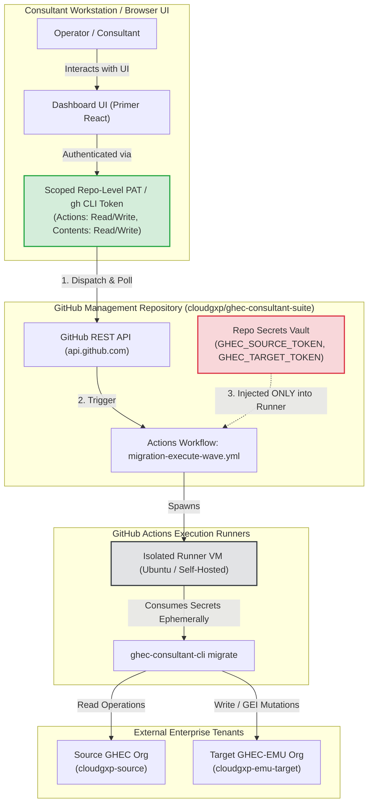
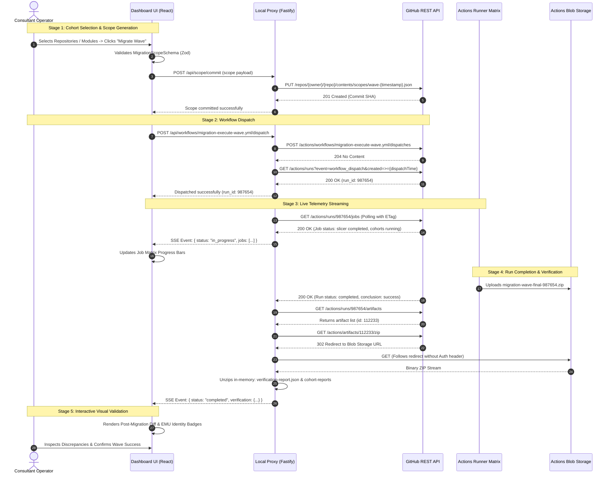
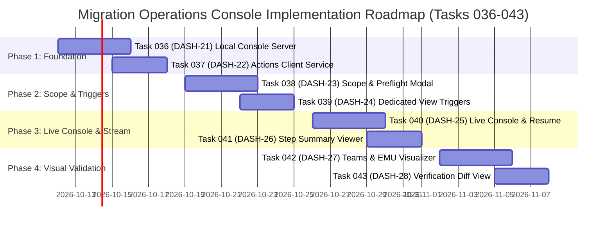

# Migration Operations Console: Technical Feasibility Study & Architectural Blueprint

**Document ID:** ARCH-REP-2026-001  
**Target Component:** `apps/dashboard` & `apps/cli` (`ghec-consultant-suite`)  
**Status:** Approved for Implementation Planning  
**Classification:** Technical Architecture & Feasibility Study  
**Author:** Antigravity (Google DeepMind)  
**Date:** October 2026

---

## 1. Executive Summary

### 1.1 Feasibility Verdict: GO (Unanimous Feasibility)

Evolving the read-only GHEC Consultant Suite assessment dashboard (`apps/dashboard`) into an interactive, workflow-orchestrating **Migration Operations Console** is technically sound, highly advantageous, and fully feasible within the existing monorepo architecture.

The monorepo already provides the required core primitives:

1. **Strict Data Contracts (`@ghec/contracts`):** Fully typed, schema-validated Zod definitions for `MigrationScope`, `MigrationPlan`, `VerificationReport`, and `DiscoveryBundle`.
2. **Dynamic Parallel Matrix Workflows (`.github/workflows/`):** Battle-tested GitHub Actions orchestration workflows (`migration-execute-wave.yml`, `test-migration-dispatch.yml`, `generate-scope.yml`) capable of dynamic matrix slicing (`ScopeMatrixSlicer`) and parallel runner fan-out.
3. **Proven Zero-Local-Secrets Security Boundary:** Full credential isolation where high-privilege migration credentials (`GHEC_SOURCE_TOKEN`, `GHEC_TARGET_TOKEN`) are locked in GitHub Actions repository secrets, while client tools interact solely with GitHub Actions dispatch and monitoring APIs.

### 1.2 Recommended Architecture: Hybrid Local Console (Option B) with Browser Fallback

We recommend implementing a **Local Hybrid Console** as the primary operating model, augmented with a scoped **Fine-Grained PAT Client-Side Fallback** for static hosting environments:

- **Primary Mode (Local Hybrid Console):** Invoked via `ghec-consultant-cli console` (or `npm run console`), spinning up a lightweight loopback Node.js/Fastify server on `127.0.0.1:3000`. The server leverages the consultant's ambient GitHub CLI (`gh auth token`) authentication, resolves browser Cross-Origin Resource Sharing (CORS) constraints on GitHub Actions artifact ZIP downloads, and pushes real-time workflow telemetry to the Primer React UI via Server-Sent Events (SSE).
- **Secondary Mode (Browser Client-Side SPA):** When deployed to GitHub Pages or running standalone, the dashboard accepts a repository-scoped Fine-Grained Personal Access Token (FG-PAT) or GitHub App token. It executes workflow dispatches and polls run statuses directly via Octokit, while directing the user to download execution artifact bundles or utilize the local CLI proxy for deep log unpacking.

### 1.3 Expected Implementation Effort & Timeline

The migration from a passive viewer to an active Operations Console is estimated at **4 Sprints (4 engineering weeks)** across 4 modular phases:

- **Phase 1: Local Console CLI Command & GitHub Actions API Service** (Sprint 1)
- **Phase 2: Dynamic Scope Builder & Interactive Workflow Dispatcher** (Sprint 2)
- **Phase 3: Real-Time Execution Console & Job Matrix Monitor** (Sprint 3)
- **Phase 4: Graphical Visualizations (Team Trees, EMU SAML Mappings, Verification Diffs)** (Sprint 4)

---

## 2. Security & Credential Isolation Model

### 2.1 The Zero-Migration-Token Exposure Guarantee

Enterprise migration suites operate in environments with the highest security sensitivity. Migrating between GitHub Enterprise Cloud (GHEC) and an Enterprise Managed Users (EMU) destination requires high-privilege credentials:

- **`GHEC_SOURCE_TOKEN`:** Classic PAT with broad read access (`repo`, `read:org`, `admin:org_hook`, `admin:repo_hook`).
- **`GHEC_TARGET_TOKEN`:** Classic PAT created under an EMU account with Enterprise/Organization Owner authority (`repo`, `admin:org`, `workflow`, `admin:org_hook`, `admin:repo_hook`).

> [!IMPORTANT]
> **Strict Security Isolation Invariant:**
> The Migration Operations Console operator **never** directly accesses, handles, or stores `GHEC_SOURCE_TOKEN` or `GHEC_TARGET_TOKEN`.
>
> These high-privilege migration tokens reside **exclusively** within GitHub Actions Repository/Organization Secrets in the management repository (`cloudgxp/ghec-consultant-suite`). They are injected into isolated GitHub Actions runners at runtime via standard workflow secret references (`${{ secrets.GHEC_SOURCE_TOKEN }}`, `${{ secrets.GHEC_TARGET_TOKEN }}`).

Even in the event of complete browser session interception, local workstation malware, or XSS vulnerabilities in the dashboard frontend, an attacker **cannot** extract the underlying source or target enterprise migration tokens because they are cryptographically inaccessible via GitHub's API surface.



---

### 2.2 Token Scopes Comparison & Risk Analysis

The Migration Operations Console requires credentials to communicate with the management repository hosting the workflows. The table below evaluates the three credential mechanisms:

| Credential Mechanism          | Storage Location                       | Required Scopes                                                                                                                               | Blast Radius if Compromised                                                                                                                    |             Setup Complexity              | Recommended Use Case                          |
| :---------------------------- | :------------------------------------- | :-------------------------------------------------------------------------------------------------------------------------------------------- | :--------------------------------------------------------------------------------------------------------------------------------------------- | :---------------------------------------: | :-------------------------------------------- |
| **Ambient `gh` CLI Auth**     | OS Keychain / `~/.config/gh/`          | Standard user session (`repo`, `workflow`)                                                                                                    | Confined to operator's user account; no credentials stored in browser DOM or web storage.                                                      | **Zero Config** (Uses existing CLI login) | **Primary (Local Hybrid Console)**            |
| **Fine-Grained PAT (FG-PAT)** | Browser `sessionStorage` (memory only) | **Repository: `cloudgxp/ghec-consultant-suite`**<br/>• `Actions: Read and write`<br/>• `Contents: Read and write`<br/>• `Metadata: Read-only` | Restricted strictly to the management repository. Cannot read secrets, modify org settings, or access external source/target enterprise repos. |      **Low** (1-time token creation)      | **Secondary (Standalone Dev Server / Cloud)** |
| **GitHub App User-to-Server** | Ephemeral JWT / Refresh Token          | **Repository Permissions**<br/>• `actions: write`<br/>• `contents: write`<br/>• `metadata: read`                                              | Minimal (tokens expire after 1 hour; strict repository installation boundary).                                                                 |  **Moderate** (Requires registering App)  | **Enterprise Team Deployments**               |

### 2.3 Minimal Fine-Grained PAT Specification

When an operator provisions a Fine-Grained PAT for the dashboard, it must be configured with the following minimal boundaries:

- **Repository Access:** "Only select repositories" ➔ Select `ghec-consultant-suite` exclusively.
- **Permissions:**
  - `Actions: Read and write`: Mandatory to trigger `POST /actions/workflows/{id}/dispatches`, cancel runs, and read job logs/artifacts.
  - `Contents: Read and write`: Mandatory if dynamic wave scopes (`scopes/wave-<timestamp>.json`) are committed directly to the repository via the Contents API before triggering workflows.
  - `Metadata: Read-only`: Mandatory system baseline.
  - `Secrets: No access`: Explicitly omitted. The dashboard has zero need to create, update, or read repository secrets.

---

## 3. Recommended System Architecture

### 3.1 Component Architecture Diagram

The recommended architecture establishes a clean decoupling between the user interface, local proxy server, GitHub control plane, and runner execution engine:

```mermaid
flowchart TB
    subgraph Browser["Operator Browser (localhost / Chrome / Safari)"]
        UI["React 19 + Primer React Console"]
        StateStore["Console State & Job Monitor Store"]
        ScopeGen["Dynamic Scope Builder (Zod Validated)"]
        Visualizer["Visual Validation Engines<br/>(Team Tree, EMU Diffs, Step Summaries)"]

        UI <--> StateStore
        StateStore <--> ScopeGen
        StateStore <--> Visualizer
    end

    subgraph LocalConsoleServer["Local Hybrid Proxy (ghec-consultant-cli console)"]
        Fastify["Fastify Loopback API (127.0.0.1:3000)"]
        GhBridge["GitHub CLI Bridge (exec gh auth token)"]
        SSEHub["Server-Sent Events (SSE) Stream Manager"]
        ArtifactCache["In-Memory Artifact Unpacker & JSON Cache"]

        Fastify <--> GhBridge
        Fastify <--> SSEHub
        Fastify <--> ArtifactCache
    end

    subgraph GitHubAPI["GitHub Actions Control Plane (api.github.com)"]
        WorkflowDispatch["POST /actions/workflows/{id}/dispatches"]
        RunPolling["GET /actions/runs/{run_id}/jobs (ETag Caching)"]
        ArtifactDownload["GET /actions/artifacts/{artifact_id}/zip"]
        ContentsAPI["PUT /repos/{owner}/{repo}/contents/scopes/..."]
    end

    subgraph Runners["GitHub Actions Matrix Runners (ubuntu-latest / self-hosted)"]
        SlicerJob["1. Partition Scope & Plan Wave (slicer)"]
        Cohort1["2a. Migrate Cohort 1 (gei-repo, rulesets, etc.)"]
        Cohort2["2b. Migrate Cohort 2 (gei-repo, rulesets, etc.)"]
        FanInVerify["3. Aggregate Results & Post-Migration Verify"]
    end

    subgraph AzureStorage["GitHub Actions Blob Storage"]
        ZipArtifacts["Encrypted Run Artifacts (*.zip)"]
    end

    %% Wiring
    UI <-->|HTTP REST & SSE Events| Fastify
    Fastify -->|Authenticated Octokit Calls| WorkflowDispatch
    Fastify -->|Conditional GET If-None-Match| RunPolling
    Fastify -->|Download Stream (Follows 302)| ArtifactDownload
    Fastify -->|Commit Generated Scope| ContentsAPI

    WorkflowDispatch -->|Triggers Run| SlicerJob
    SlicerJob -->|Fan-Out Matrix| Cohort1
    SlicerJob -->|Fan-Out Matrix| Cohort2
    Cohort1 -->|Uploads Cohort Reports| ZipArtifacts
    Cohort2 -->|Uploads Cohort Reports| ZipArtifacts
    Cohort1 -->|Fan-In| FanInVerify
    Cohort2 -->|Fan-In| FanInVerify
    FanInVerify -->|Uploads Final Plan & Verification| ZipArtifacts

    ArtifactDownload -.->|302 Redirect| ZipArtifacts
    ZipArtifacts -.->|ZIP Stream| ArtifactCache
```

---

### 3.2 End-to-End Orchestration Sequence Flow

The interaction lifecycle follows five deterministic stages:



---

## 4. Interactive Feature Breakdown

### 4.1 Feature 1: One-Click Batch Repository Migration & Preflight Flow

**Location:** `apps/dashboard/src/features/RepositoriesTab.tsx`

Currently, `RepositoriesTab` presents a read-only virtualized list of source repositories with CSV export options. Evolving this view into an active migration cohort launcher requires integrating the full set of 17 registered migration modules (including the newly added `releases`, `deploy-keys`, `collaborators`, `lfs`, and `packages` modules) alongside the newly implemented CLI preflight engine:

1. **Cohort Selection Controls:**
   - Multi-select checkbox column integrated into `VirtualizedTable`.
   - Action toolbar controls: "Select All Filtered", "Clear Selection", and "Batch Migrate Selected (N)".
   - Smart Preset Filters: "Select All Unmigrated", "Select Small Repos (<1GB)", "Select LFS Repositories", "Select Repos with Outside Collaborators".
2. **Dynamic Scope Generation & Preflight Modal (`ScopeBuilderModal`):**
   - **Configuration Inputs:**
     - Target Organization Slug (defaulting to configured target EMU org).
     - Target Visibility: `Inherit`, `Private`, or `Internal`.
     - Identity Strategy: `emu-saml` (with configurable suffix, e.g., `_gxp`).
     - LFS Strategy: `dual-remote-stream` (with worker pool concurrency) or `skip`.
     - Releases Strategy: Asset streaming transfer (`LargeReleasesMigrationStrategy`) or `skip`.
     - Outside Collaborators: Reconcile collaborator access with EMU translation.
     - Modules to execute: Full checklist of repository-level modules (`gei-repo`, `rulesets`, `branch-protection`, `repo-variables`, `repo-secrets`, `webhooks`, `environments`, `deploy-keys`, `releases`, `lfs`, `collaborators`).
     - **Execution Topology Toggle:**
       - _Single Runner (Linear):_ Runs sequentially on a single runner (ideal for small waves <10 repos or test environments).
       - _Parallel Matrix (Fan-Out):_ Slices into dynamic cohorts using `ScopeMatrixSlicer` with a batch size slider (`--split-matrix <batch-size>`).
     - Mode Toggle: 🛡️ **Dry-Run (Zero Mutation Simulation)** vs. ⚡ **Live Migration**.
   - **Interactive Preflight Gate (`SourceCredentialInspector`):**
     - Prior to dispatch, the operator can click **"Run Preflight Check"**.
     - Calls the CLI `preflight` subcommand via the local console proxy or dispatches `test-migration-dispatch.yml` with preflight evaluation.
     - Inspects source PAT scopes (`repo`, `read:org`, `admin:org_hook`), target EMU PAT scopes (`admin:org`, `workflow`), SAML SSO authorization status, and ruleset bypass rights.
     - Displays an interactive **Preflight Readiness Card**:
       - 🟢 **Ready (0 Blockers):** Green light to dispatch wave.
       - 🟡 **Warning:** Non-fatal advisories (e.g., archived repositories, high LFS storage).
       - 🔴 **Blocked:** Fatal errors (e.g., target token lacks SAML authorization) with clear remediation steps before live apply is enabled.
   - **Contract Validation & Dispatch:**
     - Runs `MigrationScopeSchema.parse()` in the browser prior to submission, guaranteeing 100% compliance with `@ghec/contracts`.
     - Commits scope file as `scopes/wave-<timestamp>.json` and dispatches `migration-execute-wave.yml`.
     - Auto-redirects to the **Live Execution Console**.

---

### 4.2 Feature 2: Teams, Collaborators & EMU Identity Live Visualization

**Location:** `apps/dashboard/src/features/TeamsAndIdentitiesTab.tsx`

Following the addition of the `collaborators` module (Task 033) and discovery collection of outside collaborators from `/orgs/{org}/outside_collaborators`, this tab evolves into a unified access and identity governance console:

1. **Interactive Visual Team Hierarchy Tree:**
   - Visual parent-child tree canvas using Primer React components and SVG connectors.
   - Nodes display team name, slug, privacy (`closed`/`secret`), membership count, and direct repository access badges.
   - Interactive collapse/expand state for nested team structures.
2. **Outside Collaborators Reconciliation Panel:**
   - Dedicated filter and visualization for outside collaborators.
   - Displays source repository access levels (`pull`, `triage`, `push`, `maintain`, `admin`).
   - Shows EMU account translation preview (`username` ➔ `username_gxp`).
3. **EMU SAML Identity Mapping Visualizer:**
   - Side-by-side reconciliation cards:
     - **Left (Source Identity):** `source_user` (membership: member/owner, outside collaborator indicator).
     - **Center (Mapping Engine):** EMU SAML mapping transformation rule (`user` ➔ `user_gxp`).
     - **Right (Target EMU State):** SCIM provisioning status (`linked`, `unlinked`, `mannequin-pending`, `reclaimed`).
4. **Interactive Module Triggers:**
   - "Sync Teams & Hierarchy" button (`modules: "teams"`).
   - "Reconcile Outside Collaborators" button (`modules: "collaborators"`).
   - "Reclaim EMU Mannequins" button (`modules: "mannequins"` with `--skip-invitation`).
5. **Live Verification Badges:**
   - While the workflow executes, nodes display animated pulsing status indicators (`Queued` ➔ `Syncing` ➔ `Reconciled`).
   - Discrepancy highlights: If a parent team fails to link, a user lacks an EMU SCIM identity, or a collaborator invite is pending, the node renders an attention badge linking directly to the discrepancy log.

---

### 4.3 Feature 3: Specialized Module Triggers Across Feature Tabs

The console empowers consultants to trigger individual migration phases directly from domain-specific views with 1-click dry-run simulation:

1. **Releases & Assets View (`ReleasesAndAssetsTab.tsx`):**
   - Active "Replicate Releases & Binary Assets" trigger (`modules: "releases"`).
   - Configurable asset streaming chunk size and draft/prerelease filters.
2. **Packages & Container Registry View (`PackagesTab.tsx`):**
   - Active "Replicate Packages & GHCR Images" trigger (`modules: "packages"`).
   - Displays container manifest replication status and language package versions.
3. **Security & Policies View (`SecurityAndPoliciesTab.tsx`):**
   - Active "Sync Rulesets & Branch Protections" trigger (`modules: "rulesets,branch-protection"`).
   - Active "Reconcile Deploy Keys" trigger (`modules: "deploy-keys"`) with SHA-256 fingerprint deduplication.
4. **Secrets & Variables View (`SecretsAndVariablesTab.tsx`):**
   - Active "Sync Organization & Repository Secrets Keys" trigger (`modules: "org-variables,org-secrets,repo-variables,repo-secrets"`).

---

### 4.4 Feature 4: Live Execution Console & Checkpoint Resumption

**Location:** `apps/dashboard/src/features/LiveConsoleTab.tsx` (New Dedicated View)

A dedicated operational command center providing real-time visibility into active and past migration runs:

1. **Run Status Banner:**
   - Workflow name, run number, commit SHA, trigger actor, elapsed time, and global conclusion status (`queued`, `in_progress`, `completed`, `failed`).
   - Abort/Cancel run control button (executes `POST /actions/runs/{run_id}/cancel`).
2. **Dual-Topology Execution Monitor:**
   - _Single Runner View:_ Displays linear 7-stage pipeline progress (`Preflight` ➔ `Plan` ➔ `GEI Repo` ➔ `Releases/LFS` ➔ `Rulesets/Keys` ➔ `Collaborators/Teams` ➔ `Verify`).
   - _Parallel Matrix View:_ Displays dynamic fan-out / fan-in topology graph (`slicer` ➔ `cohort-1`, `cohort-2`, `cohort-3` ➔ `aggregate-and-verify`).
   - Real-time progress bars for each parallel runner showing completed steps.
3. **Checkpoint Resumption Trigger (`--resume`):**
   - When a run is interrupted, fails on a transient network error, or completes with partial success, the console provides a 1-click **"Resume Migration Wave"** button.
   - Automatically dispatches `migration-resume.yml` with `--resume latest`, resuming from the last valid checkpoint manifest saved by `CheckpointManager`.
4. **Step Summary & Discrepancy Inspector:**
   - Native Markdown renderer displaying the formatted `$GITHUB_STEP_SUMMARY` generated by the workflow.
   - Post-migration verification inspector: Parses `verification-report.json` across all 17 modules and renders an interactive discrepancy matrix highlighting missing branch protections, ruleset bypass divergence, unlinked mannequins, or deploy key mismatches.
5. **Historical Run Browser:**
   - View past wave executions, download historical execution reports, and inspect historical audit diffs directly within the console.

---

## 5. CORS, Rate Limits & State Synchronization Strategy

### 5.1 The GitHub API CORS Boundary & Artifact Redirection

Calling GitHub REST APIs directly from a browser Single Page Application (Option A) encounters fundamental architectural constraints:

1. **Standard REST Endpoints (`api.github.com`):**
   - GitHub returns `Access-Control-Allow-Origin: *` on standard API endpoints (`/repos/.../actions/workflows`, `/actions/runs`, `/actions/runs/{id}/jobs`).
   - Browser client SPAs can successfully dispatch workflows and poll run statuses directly.
2. **The Artifact Download Redirect Blocker:**
   - GitHub Actions artifact download endpoint (`GET /repos/{owner}/{repo}/actions/artifacts/{artifact_id}/zip`) responds with HTTP `302 Found`, redirecting to a pre-signed Azure Blob Storage URL (`pipelines.actions.githubusercontent.com` / `*.blob.core.windows.net`).
   - When a browser `fetch(url)` follows this 302 redirect, two critical failures occur:
     - **Header Leakage / Rejection:** The browser transmits the `Authorization: Bearer <token>` header to the redirected Azure Blob Storage URL. Azure Blob Storage rejects authenticated requests with HTTP 400 Bad Request because query-string SAS tokens are incompatible with `Authorization` headers.
     - **CORS Failure on Blob Storage:** Even if the header is stripped, the storage endpoint does not return the required `Access-Control-Allow-Origin` header for arbitrary browser origins (e.g., `http://localhost:5173` or `https://<org>.github.io`).
3. **Resolution via Local Hybrid Proxy (Option B):**
   - The lightweight Node.js/Fastify server in `ghec-consultant-cli console` intercepts artifact download requests.
   - Running in Node.js, `fetch` follows the 302 redirect, strips the `Authorization` header on origin change, streams the raw ZIP file into Node memory, unzips the JSON files using Node's streaming decompression, and returns the parsed JSON directly to the React frontend.
   - This completely eliminates browser CORS restrictions and avoids loading heavy client-side unzipping libraries into the browser DOM.

---

### 5.2 Rate Limiting & Conditional Polling Optimization

Standard Personal Access Tokens are constrained to **5,000 requests per hour**. Active polling across multiple matrix runners can rapidly deplete this quota if not carefully managed:

- **Naïve Polling Cost:** Polling run status and job arrays every 2 seconds consumes 30 requests/minute (1,800 requests/hour), exhausting 36% of the token quota on a single run.
- **Optimized State Synchronization Architecture:**
  1. **Adaptive Backoff with Jitter:**
     - While run is `queued`: Poll every 10 seconds.
     - While run is `in_progress`: Poll every 4 seconds.
     - When all jobs reach `completed`: Stop polling immediately.
     - When browser tab is inactive (`document.visibilityState === 'hidden'`): Back off to 30 seconds.
  2. **HTTP Conditional Requests (`ETag` / `If-None-Match`):**
     - GitHub's Actions API supports HTTP ETags.
     - The local proxy and frontend cache the `ETag` header from previous polling responses and include `If-None-Match: "<etag>"` in subsequent requests.
     - If runner status has not changed, GitHub returns `304 Not Modified`.
     - **Crucial Rate Limit Benefit:** Responses returning `304 Not Modified` do **not** consume rate limit points against the 5,000 requests/hour allowance.
  3. **Server-Sent Events (SSE) Push to UI:**
     - The local proxy performs the single ETag-cached polling loop against GitHub and broadcasts updates to all connected browser tabs over a single SSE channel (`/api/events`), preventing duplicate polling when multiple browser tabs are open.

---

### 5.3 Hosting & Execution Comparison Matrix

| Architectural Dimension    | Option A: Client-Side SPA (GitHub Pages / Vite)                 | Option B: Local Hybrid Console (`ghec-consultant-cli console`) |
| :------------------------- | :-------------------------------------------------------------- | :------------------------------------------------------------- |
| **Execution Environment**  | Static Web Server / GitHub Pages / Local Vite                   | Loopback Node.js Server (`127.0.0.1:3000`) + Vite React App    |
| **Authentication Flow**    | Operator manually generates & inputs Fine-Grained PAT           | **Ambient `gh auth token`** (Zero manual token generation)     |
| **CORS Compatibility**     | Dispatches & job polling work; **Artifact downloads fail**      | **100% Compatible** (Proxy handles redirects & unzipping)      |
| **Token Storage Security** | Browser `sessionStorage` (vulnerable to XSS / DOM scraping)     | **Secure Loopback Memory** (Token never touches browser DOM)   |
| **Real-Time Streaming**    | Client-side polling interval (eats browser thread & rate limit) | **Server-Sent Events (SSE)** with server-side ETag caching     |
| **Offline Handoff**        | High (Supports loading static JSON bundles offline)             | High (Supports local bundle inspection and cached run reports) |
| **Consultant Friction**    | Moderate (Requires configuring FG-PAT with precise scopes)      | **Zero Friction** (Runs `npx ghec-consultant-cli console`)     |
| **Recommendation**         | Secondary / Fallback Mode                                       | **Primary Recommended Architecture**                           |

---

## 6. Implementation Roadmap & Agent Tasks

To maintain architectural harmony and prevent collisions with already completed core migration tasks (Tasks `001` through `035`), the dashboard engineering roadmap is organized into **Tasks 036 through 043** (referenced alternatively as `DASH-21` through `DASH-28`).

This phased breakdown ensures continuous compatibility with all latest CLI capabilities, including modules 031–035 (`releases`, `deploy-keys`, `collaborators`, `lfs`, `packages`), the `preflight` subcommand, execution resumption, and dual single-runner/matrix topologies.



### Phased Task Specifications

#### Phase 1: Backend Foundation & Actions Client Service (Sprint 1)

- **Task 036 (`DASH-21`): Local Console CLI Server & Ambient Auth Proxy**
  - **Objective:** Add `console` subcommand to `apps/cli` (`ghec-consultant-cli console`) that launches a lightweight Fastify server on `127.0.0.1:3000` serving static dashboard assets.
  - **Key Capabilities:**
    - Detect ambient GitHub authentication automatically via `gh auth token` (falling back to `GH_TOKEN` or prompting for scoped FG-PAT).
    - Expose authenticated proxy endpoints (`/api/actions/*`) for dispatching workflows, polling run statuses with conditional ETag caching, and streaming job updates over Server-Sent Events (`/api/events`).
    - Expose local execution endpoints for `ghec-consultant-cli preflight` to enable instant offline capability checks.
  - **Files:** `apps/cli/src/commands/console.ts`, `apps/cli/src/server/`.

- **Task 037 (`DASH-22`): GitHub Actions Client Service & Artifact Decompression**
  - **Objective:** Extend `@ghec/github-client` with a typed `GitHubActionsService` managing workflow orchestration and artifact handling.
  - **Key Capabilities:**
    - Typed workflow dispatch wrappers for `migration-execute-wave.yml`, `test-migration-dispatch.yml`, `generate-scope.yml`, and `migration-resume.yml`.
    - Support parameter mapping for all 17 registered modules, including newly added `releases`, `deploy-keys`, `collaborators`, `lfs`, and `packages`.
    - Implement streaming in-memory ZIP decompression for downloaded run artifacts: extracting and parsing `preflight-report.json`, `migration-plan.json`, `verification-report.json`, and `cohort-report-*.json` without disk thrashing.
  - **Files:** `packages/github-client/src/actions/`.

#### Phase 2: Dynamic Scope Builder & Interactive Triggers (Sprint 2)

- **Task 038 (`DASH-23`): Dynamic Scope Builder & Preflight Readiness Modal**
  - **Objective:** Upgrade `RepositoriesTab.tsx` with multi-repository selection and build `ScopeBuilderModal` with preflight gating.
  - **Key Capabilities:**
    - Multi-select checkbox column with smart presets ("Unmigrated Repos", "LFS Repos", "Outside Collaborator Repos").
    - Modal inputs supporting all 17 modules, LFS strategy selection (`dual-remote-stream` with worker pool vs. `skip`), releases fallback, and EMU identity suffix (`_gxp`).
    - **Execution Topology Selector:** Toggle between Single-Runner (Linear) and Dynamic Parallel Matrix (`--split-matrix <batch-size>`).
    - **1-Click Preflight Check:** In-modal preflight gate calling `SourceCredentialInspector` to validate tokens, SAML SSO authorization, and ruleset bypass rights before dispatch.
    - Zod schema validation using `MigrationScopeSchema` (`@ghec/contracts`).
  - **Files:** `apps/dashboard/src/features/RepositoriesTab.tsx`, `apps/dashboard/src/components/ScopeBuilderModal.tsx`.

- **Task 039 (`DASH-24`): Interactive Module Triggers Across Domain Views**
  - **Objective:** Add specialized migration trigger buttons across feature tabs to allow targeted module executions.
  - **Key Capabilities:**
    - `TeamsAndIdentitiesTab`: "Sync Teams & Collaborators" trigger (`modules: "teams,collaborators,mannequins"`).
    - `ReleasesAndAssetsTab`: "Migrate Releases & Assets" trigger (`modules: "releases"`).
    - `PackagesTab`: "Replicate Packages & Images" trigger (`modules: "packages"`).
    - `SecurityAndPoliciesTab`: "Sync Rulesets & Deploy Keys" trigger (`modules: "rulesets,branch-protection,deploy-keys"`).
    - `SecretsAndVariablesTab`: "Sync Secrets & Variables" trigger (`modules: "org-variables,org-secrets,repo-variables,repo-secrets"`).
    - Universal Dry-Run toggle on every module trigger modal.
  - **Files:** `apps/dashboard/src/features/*.tsx`.

#### Phase 3: Real-Time Execution Console & Step Summary Viewer (Sprint 3)

- **Task 040 (`DASH-25`): Live Execution Console & Resumption Manager**
  - **Objective:** Build dedicated `LiveConsoleTab.tsx` providing real-time run monitoring and resumption controls.
  - **Key Capabilities:**
    - Dual topology rendering: Single-runner 7-stage linear pipeline view vs. Parallel Matrix Fan-out/Fan-in cohort graph (`ScopeMatrixSlicer`).
    - Real-time step progress bars, runner status badges (`queued`, `in_progress`, `completed`, `failed`), and elapsed timers.
    - Abort / Cancel run button calling `POST /actions/runs/{id}/cancel`.
    - **Checkpoint Resumption Trigger:** 1-click "Resume Migration Wave" button calling `migration-resume.yml` with `--resume latest` on partial or interrupted runs.
  - **Files:** `apps/dashboard/src/features/LiveConsoleTab.tsx`, `apps/dashboard/src/navigation.ts`.

- **Task 041 (`DASH-26`): Post-Run Step Summary & Artifact Report Viewer**
  - **Objective:** Render rich post-migration run summaries directly inside the console.
  - **Key Capabilities:**
    - Native Markdown rendering for `$GITHUB_STEP_SUMMARY` using Primer React styles.
    - Execution metrics breakdown table: Succeeded, Failed, Skipped, and No-Op operations across all 17 modules.
    - Download links and in-browser inspection for unpacked cohort reports and execution JSON artifacts.
  - **Files:** `apps/dashboard/src/components/StepSummaryViewer.tsx`.

#### Phase 4: Graphical Visualizations & Verification Diffs (Sprint 4)

- **Task 042 (`DASH-27`): Teams, Outside Collaborators & EMU Identity Visualizer**
  - **Objective:** Interactive visual hierarchy and EMU SAML reconciliation tree.
  - **Key Capabilities:**
    - Visual parent-child team tree canvas with expandable nodes, membership counts, and repository access grants.
    - Dedicated Outside Collaborators reconciliation panel showing direct repo permissions and EMU username mappings (`user` ➔ `user_gxp`).
    - EMU SAML reconciliation cards showing SCIM link status and mannequin reclamation state (`--skip-invitation`).
  - **Files:** `apps/dashboard/src/features/VirtualizedTeamsAndIdentitiesTab.tsx`, `apps/dashboard/src/components/TeamTreeCanvas.tsx`.

- **Task 043 (`DASH-28`): Post-Migration Verification Diff & Discrepancy Inspector**
  - **Objective:** Side-by-side verification discrepancy inspector.
  - **Key Capabilities:**
    - Parse `verification-report.json` and render visual diffs comparing planned operations against verified target state across all 17 modules.
    - Specialized discrepancy inspectors:
      - Deploy Key fingerprint mismatches.
      - Unlinked outside collaborators and missing permission grants.
      - Missing LFS pointers or size mismatches.
      - Incomplete release asset downloads.
      - Ruleset bypass list divergence.
    - Actionable remediation suggestions linking to targeted CLI fix commands.
  - **Files:** `apps/dashboard/src/components/VerificationDiffInspector.tsx`.

---

## 7. Conclusion & Next Steps

The evolution of the GHEC Consultant Suite dashboard into an interactive **Migration Operations Console** represents an architectural leap from passive audit reporting to active enterprise migration management.

By adopting the **Local Hybrid Console** architecture:

1. **Security is Absolute:** Zero migration secrets ever touch the browser or operator workstation.
2. **Consultant Experience is Seamless:** Zero manual token generation or scope configuration; ambient `gh` CLI credentials drive everything.
3. **Full Parity with Latest CLI Advancements:** Natively accommodates all 17 migration modules (including releases, deploy-keys, collaborators, LFS, and packages), the new `preflight` inspection engine, execution resumption, and single-runner vs. matrix topologies.
4. **Technical Roadblocks are Eliminated:** Browser CORS limitations on artifact downloads are completely bypassed.
5. **Compliance is Guaranteed:** Every wave execution is backed by immutable Git-committed scopes and GitHub Actions run audit trails.

**Immediate Next Action:**  
Review this feasibility study with engineering leadership and approve the creation of Phase 1 task specifications (`036`–`037`) in `agents/agent-tasks/features/`.
