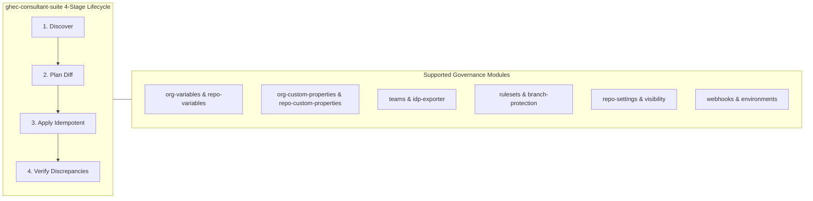
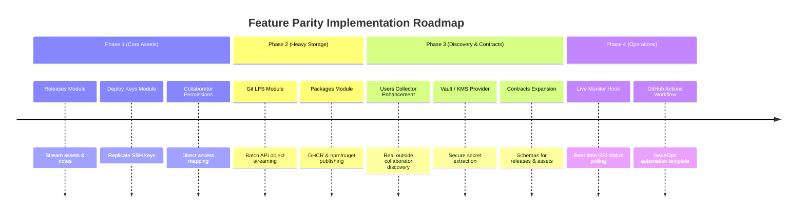

# Feature Parity & Gap Analysis Report: `mona-actions` vs. `ghec-consultant-suite`

**Document Version:** 1.0.0  
**Date:** October 2026  
**Target Platform:** GitHub Enterprise Cloud (GHEC) & Enterprise Managed Users (EMU)  
**Evaluated Organization:** [`https://github.com/mona-actions`](https://github.com/mona-actions) (30 Repositories)  
**Reference Codebase:** `ghec-consultant-suite` (`packages/migration`, `packages/discovery`, `packages/analysis`, `packages/contracts`, `apps/cli`, `apps/dashboard`)

---

## 1. Executive Summary

This report delivers an exhaustive, production-grade feature parity audit and architectural comparison between the 30 migration and discovery repositories maintained under the GitHub organization **`mona-actions`** and the **`ghec-consultant-suite`** codebase.

### 1.1 High-Level Parity Assessment

Across the 30 repositories in `mona-actions`:

- **Full Parity (15 / 30, 50%)**: Capabilities are fully matched or significantly exceeded by `ghec-consultant-suite` (specifically within configuration management, governance reconciliation, repository settings, policy migration, dependency graph analysis, and dashboard visualization).
- **Partial Parity (6 / 30, 20%)**: Capabilities exist partially—most notably where `packages/discovery` or `packages/analysis` inventories the data, but no automated mutation/apply module exists in `packages/migration/src/modules/` (e.g., Git LFS, GitHub Packages, Deploy Keys), or where live interactive monitoring is available in the web dashboard but not as a terminal TUI.
- **Missing / Gap (3 / 30, 10%)**: Critical migration capabilities supported in `mona-actions` but completely absent from `ghec-consultant-suite`'s migration execution pipeline:
  1. **Release & Release Asset Migration** (`gh-migrate-releases`)
  2. **Direct Outside Collaborator Permissions** (`gh-migrate-collaborator-permission`)
  3. **HashiCorp Vault KV Webhook Secret Intermediary** (`gh-migrate-webhook-secrets`)
- **Intentionally Out of Scope / Architectural Divergence (6 / 30, 20%)**: Tooling in `mona-actions` that represents obsolete legacy workflows, non-GitHub VCS source analyzers (Bitbucket Server, GitLab, StarTeam), or high-risk destructive git history rewriting archives (`gh-history-rewrite-migration`, `gh-commit-remap`) that intentionally diverge from the non-destructive enterprise migration philosophy of `ghec-consultant-suite`.

```
========================================================================================
FEATURE PARITY OVERVIEW (30 REPOSITORIES)
========================================================================================
[==================================================] Full Parity: 50% (15 Repos)
[====================] Partial Parity: 20% (6 Repos)
[==========] Missing / Gap: 10% (3 Repos)
[====================] Out of Scope / Divergence: 20% (6 Repos)
========================================================================================
```

### 1.2 Core Architectural Comparison

| Dimension                    | `mona-actions` Tooling Suite                                                                             | `ghec-consultant-suite` Architecture                                                                                             |
| :--------------------------- | :------------------------------------------------------------------------------------------------------- | :------------------------------------------------------------------------------------------------------------------------------- |
| **Philosophy & Form Factor** | Fragmented ecosystem of 30 standalone, loosely coupled GitHub CLI (`gh`) extensions and bash scripts.    | Unified, end-to-end consultant platform combining a multi-package engine, CLI orchestrator, and web dashboard.                   |
| **Implementation Language**  | Heterogeneous: Go (Cobra, Viper), Bash (curl, jq, GNU parallel), and TypeScript (Node.js).               | Monolithic TypeScript monorepo with strict compile-time type safety across contracts, engine, and UI.                            |
| **Execution Lifecycle**      | Ad-hoc and imperative: tools run direct `export` or `sync` loops with variable idempotency guarantees.   | Standardized 4-stage lifecycle across all modules: `discover` $\rightarrow$ `plan` $\rightarrow$ `apply` $\rightarrow$ `verify`. |
| **Data Contracts**           | Disparate flat CSV files, arbitrary JSON dumps, and undocumented log files.                              | Strict, versioned JSON Schemas enforced with Zod (`@ghec/contracts`) across discovery, plan, and execution reports.              |
| **Dependency Resolution**    | Manual sequential execution orchestrated by human operators or custom bash scripts.                      | Automated Directed Acyclic Graph (DAG) with topological sorting (`packages/migration/src/core/dag.ts`).                          |
| **Rate Limit & Concurrency** | Inconsistent: varies from unthrottled bash loops to `go-github-ratelimit` or Octokit throttling plugins. | Centralized rate-limiting adapter (`packages/github-client`) with reactive backoff, jitter, and primary/secondary handling.      |
| **Dry-Run & Verification**   | Partial: supported in select Go extensions (e.g. `gh-migrate-lfs`); absent in shell scripts.             | Universal: every migration module implements `--dry-run` simulation and an automated post-migration `verify()` stage.            |
| **Operator Interface**       | Terminal output, basic progress bars (PTerm), and one TUI (`tview`).                                     | Multi-channel: rich headless CLI logs, GitHub Step Summary markdown, JSON reports, and React/Primer Web Dashboard.               |

---

## 2. Master Comparison Matrix

The table below catalogs all 30 repositories in the `mona-actions` organization, their primary technical classification, their parity status relative to `ghec-consultant-suite`, the corresponding source location in `ghec-consultant-suite`, and specific capability differences.

|  #  | Mona-Actions Repository              | Category            | Language                 | Parity Status                | `ghec-consultant-suite` Location                                                          | Capability Gap & Architectural Notes                                                                                                                                                                                                                                                                    |
| :-: | :----------------------------------- | :------------------ | :----------------------- | :--------------------------- | :---------------------------------------------------------------------------------------- | :------------------------------------------------------------------------------------------------------------------------------------------------------------------------------------------------------------------------------------------------------------------------------------------------------ |
|  1  | `gh-migrate-releases`                | Content & Assets    | Go                       | **Missing / Gap**            | Contracts only (`release`, `release-asset`)                                               | **Critical Gap**: `ghec-consultant-suite` discovers release metadata in `packages.ts`, but lacks a `releases` module in `packages/migration/src/modules/` to download assets from source and stream-upload them to target releases with tag mapping and draft/prerelease flags.                         |
|  2  | `gh-migrate-packages`                | Content & Assets    | Go / Docker SDK          | **Partial Parity**           | `packages/discovery/src/collectors/packages.ts`, `packages/analysis`                      | **Critical Gap**: Discovery inventories GHCR, npm, maven, rubygems, and nuget packages, and Analysis flags supply-chain risks (`MIG-PACKAGE-001`). However, there is no migration `apply` module to pull and re-publish container layers or package tarballs to target registries.                      |
|  3  | `gh-migrate-lfs`                     | Content & Assets    | Go / Git LFS Batch       | **Partial Parity**           | `packages/discovery/src/collectors/lfs.ts`, `packages/analysis`                           | **Critical Gap**: Discovery detects `.gitattributes` LFS markers, and Analysis flags unmeasured LFS risks (`MIG-LFS-001`). However, `ghec-consultant-suite` lacks an LFS batch API streaming module to upload large objects directly to the destination LFS object store without checking out git refs. |
|  4  | `gh-migrate-deploy-keys`             | Content & Assets    | Bash                     | **Partial Parity**           | `packages/discovery/src/collectors/integrations.ts`                                       | **Gap**: Discovery collects repository deploy key metadata (title, read-only status), but no migration module exists to read public SSH keys and recreate them on target repositories.                                                                                                                  |
|  5  | `gh-migrate-variables`               | Config & Governance | Go                       | **Full Parity (Superior)**   | `packages/migration/src/modules/org-variables/`, `repo-variables/`                        | `ghec-consultant-suite` provides superior granular lifecycle support (diffing, plan generation, idempotency via PATCH/POST, dry-run, discrepancy verification), covering both Org and Repo variables, plus environment variables.                                                                       |
|  6  | `gh-migrate-customproperties`        | Config & Governance | Go                       | **Full Parity (Superior)**   | `packages/migration/src/modules/org-custom-properties/`, `repo-custom-properties/`        | `ghec-consultant-suite` strictly decouples org-level schema definition (`org-custom-properties`) from repo-level value assignment (`repo-custom-properties`), enforcing DAG ordering and property validation.                                                                                           |
|  7  | `gh-migrate-teams`                   | Config & Governance | Go                       | **Full Parity (Superior)**   | `packages/migration/src/modules/teams/`, `packages/discovery/src/collectors/teams.ts`     | `ghec-consultant-suite` migrates team structures, parent-child hierarchies, repository permissions, IdP SCIM group exports (`idp-exporter.ts`), and user handle mapping (`identity-mapper.ts`).                                                                                                         |
|  8  | `gh-migrate-team-permission`         | Config & Governance | Bash                     | **Full Parity**              | `packages/migration/src/modules/teams/`                                                   | Fully subsumed by `TeamsMigrationModule`, which restores repository access permissions (`pull`, `triage`, `push`, `maintain`, `admin`) during team reconciliation.                                                                                                                                      |
|  9  | `gh-migrate-collaborator-permission` | Config & Governance | Bash                     | **Missing / Gap**            | Discovery placeholder (`users.ts`)                                                        | **Gap**: `users.ts` hardcodes `outsideCollaborator: false`. There is no collector or migration module to query direct repository collaborators (`GET /repos/{owner}/{repo}/collaborators?affiliation=direct`) and replicate permissions on target repos.                                                |
| 10  | `gh-migrate-webhook-secrets`         | Config & Governance | Go / Vault SDK           | **Missing / Gap**            | `packages/migration/src/modules/webhooks/`                                                | **Gap**: While `ghec-consultant-suite` supports webhook recreation and an abstract `SecretValueProvider`, it does not provide an integrated HashiCorp Vault (KV V1/V2) client to pull webhook shared secrets during migration.                                                                          |
| 11  | `gh-migrate-webhooks-from-file`      | Config & Governance | Bash                     | **Full Parity**              | `packages/migration/src/modules/webhooks/`                                                | Subsumed by `WebhooksMigrationModule`, which accepts secret payloads via `SecretValueProvider` and reconciles webhook URLs, SSL verification, active states, and subscribed events.                                                                                                                     |
| 12  | `gh-repo-visibility`                 | Config & Governance | Bash                     | **Full Parity (Superior)**   | `packages/migration/src/modules/repo-settings/`                                           | Subsumed by `RepoSettingsMigrationModule` (`visibility.ts`), with EMU enterprise policy fallback (e.g. falling back to `internal` when `public` is prohibited by enterprise policy).                                                                                                                    |
| 13  | `gh-update-repository-fields`        | Config & Governance | Bash                     | **Full Parity**              | `packages/migration/src/modules/repo-settings/`                                           | Subsumed by `RepoSettingsMigrationModule`, which reconciles repository metadata, descriptions, topics, and PR merge settings.                                                                                                                                                                           |
| 14  | `gh-history-rewrite-migration`       | History Rewriting   | Go / git-filter-repo     | **Architectural Divergence** | `packages/migration/src/modules/gei-repo/`                                                | `ghec-consultant-suite` orchestrates native GEI migrations non-destructively. Modifying git commit SHAs, stripping files, and altering migration archive tarballs in-flight is deliberately excluded from core migration runtime.                                                                       |
| 15  | `gh-commit-remap`                    | History Rewriting   | Go                       | **Architectural Divergence** | N/A (Intentionally Out of Scope)                                                          | Companion tool to `gh-history-rewrite-migration` that parses `git-filter-repo` commit maps and rewrites metadata JSON files inside tarballs. Unnecessary for standard GEI pipelines.                                                                                                                    |
| 16  | `gh-pma` (Post-Migration Audit)      | Audit & Validation  | Go / PTerm               | **Full Parity (Superior)**   | `packages/migration/src/post-migration/`, `packages/contracts/.../verification-report.ts` | Every module in `ghec-consultant-suite` performs structured destination verification (`verify()`). Discrepancies are aggregated into a formal `VerificationReport`.                                                                                                                                     |
| 17  | `gh-migration-validator`             | Audit & Validation  | Go / Viper               | **Full Parity (Superior)**   | `apps/cli/src/commands/verify.ts`, `packages/migration/src/preflight/`                    | Preflight inspection (`credential-inspector.ts`) and post-migration verification validate repository existence, branch protection, rulesets, and feature configuration.                                                                                                                                 |
| 18  | `gh-migration-monitor`               | Audit & Validation  | Go / tview TUI           | **Partial Parity**           | `packages/migration/src/gei/executor.ts`, `apps/dashboard`                                | `ghec-consultant-suite` executes and monitors GEI processes synchronously with real-time log streaming and dashboard metrics, but does not provide an interactive terminal TUI dashboard (`tview`).                                                                                                     |
| 19  | `gh-ghe-audit-permissions`           | Audit & Validation  | Go                       | **Full Parity**              | `packages/discovery/src/collectors/teams.ts`, `apps/dashboard`                            | Subsumed by Discovery collectors and Dashboard's `TeamsAndIdentitiesTab.tsx` and `CodeOwnershipTab.tsx`.                                                                                                                                                                                                |
| 20  | `gh-self-serve-migration`            | Orchestration       | GitHub Actions Workflows | **Partial Parity**           | `apps/cli/src/commands/migrate.ts`                                                        | `ghec-consultant-suite` outputs GitHub Step Summary markdown and execution JSON logs suitable for Actions, but is packaged as an automated CLI suite rather than an IssueOps starter repository template.                                                                                               |
| 21  | `gh-repo-stats`                      | Discovery & Stats   | Bash                     | **Full Parity (Superior)**   | `packages/discovery/src/collectors/repos.ts`                                              | Replaced and vastly exceeded by `repos.ts`, which captures disk sizes, branches, topics, languages, pull request settings, and portfolio metadata.                                                                                                                                                      |
| 22  | `gh-repo-stats-plus`                 | Discovery & Stats   | TypeScript / Octokit     | **Full Parity (Superior)**   | `packages/discovery/src/collectors/`                                                      | `ghec-consultant-suite` provides identical Octokit/read-adapter streaming capabilities with strict Zod contracts, state persistence, and audit logging.                                                                                                                                                 |
| 23  | `gh-repo-stats-plus-action`          | Discovery & Stats   | GitHub Action            | **Out of Scope**             | N/A                                                                                       | Standalone action wrapper for `gh-repo-stats-plus`. In `ghec-consultant-suite`, `@ghec/cli discover` runs natively in CI/CD without requiring a specialized action wrapper.                                                                                                                             |
| 24  | `gh-stats`                           | Discovery & Stats   | Go                       | **Full Parity (Superior)**   | `packages/discovery/src/collectors/repos.ts`                                              | Subsumed by `repos.ts` and `apps/dashboard`.                                                                                                                                                                                                                                                            |
| 25  | `gh-stats-visualizer`                | Visualization       | React / Vite             | **Full Parity (Superior)**   | `apps/dashboard`                                                                          | `apps/dashboard` provides a significantly more comprehensive multi-tab enterprise dashboard using GitHub Primer design components, virtualized tables, and interactive analytics.                                                                                                                       |
| 26  | `gh-repo-map`                        | Dependency Mapping  | Go / SBOM API            | **Full Parity**              | `packages/analysis/src/dependency-graph.ts`, `packages/discovery`                         | `packages/analysis` builds dependency graphs from package manifests, workflows, and repos, detecting circular dependencies, clusters, and migration cohorts.                                                                                                                                            |
| 27  | `gh-repomap-dashboard`               | Visualization       | React / Sigma.js         | **Full Parity**              | `apps/dashboard/src/features/DependencyMapTab.tsx`, `DependencyCanvas.tsx`                | `apps/dashboard` includes a dedicated WebGL Sigma.js / Graphology canvas visualizing inter-repo dependencies with clustering, search, and blast-radius analysis.                                                                                                                                        |
| 28  | `gh-bbs-analyzer`                    | 3rd-Party Analyzer  | Go                       | **Out of Scope**             | N/A (Architectural Divergence)                                                            | Third-party VCS analyzer for Atlassian Bitbucket Server. Out of scope; `ghec-consultant-suite` focuses on GitHub-to-GitHub/EMU migrations and GEI preflight.                                                                                                                                            |
| 29  | `gh-gitlab-stats`                    | 3rd-Party Analyzer  | Go                       | **Out of Scope**             | N/A (Architectural Divergence)                                                            | Third-party VCS analyzer for GitLab. Out of scope for GitHub-native enterprise discovery.                                                                                                                                                                                                               |
| 30  | `gh-starteam`                        | 3rd-Party Analyzer  | Go                       | **Out of Scope**             | N/A (Architectural Divergence)                                                            | Legacy Micro Focus StarTeam VCS tool. Out of scope.                                                                                                                                                                                                                                                     |

---

## 3. Deep Dive per Functional Domain

### 3.1 Content & Asset Migration Tools

This domain represents the largest functional disparity between the two toolsets. While `ghec-consultant-suite` excels at metadata, policy, and configuration rehydration, `mona-actions` contains specialized tools for moving heavy binaries and repository access keys.

```mermaid
graph TD
    subgraph MonaActions["mona-actions Asset Tools"]
        R[gh-migrate-releases] -->|Streams Assets| RelDest[Target Releases]
        P[gh-migrate-packages] -->|Docker / GPR / CLI| PkgDest[Target Registries]
        L[gh-migrate-lfs] -->|LFS Batch API| LfsDest[Target LFS Store]
        D[gh-migrate-deploy-keys] -->|Public SSH Keys| KeyDest[Target Deploy Keys]
    end

    subgraph GHECConsultantSuite["ghec-consultant-suite State"]
        Disc[packages/discovery] -.->|Metadata Only| R
        Disc -.->|Metadata Only| P
        Disc -.->|Attribute Only| L
        Disc -.->|Metadata Only| D
        MigEngine[packages/migration] x-- "Missing Apply Modules" --- MonaActions
    end
```

#### 3.1.1 Releases & Release Assets (`gh-migrate-releases`)

- **Mona-Actions Implementation**:
  - Built with Go using `google/go-github/v62` and `gofri/go-github-ratelimit`.
  - Subcommands: `export` (outputs release definitions to JSON) and `sync` (recreates releases and streams binary assets).
  - CLI Flags: `--organization`, `--repository`, `--token`, `--source-organization`, `--target-organization`, `--source-token`, `--target-token`, `--mapping-file`, `--repository-list-file`.
  - API Endpoints:
    - `GET /repos/{owner}/{repo}/releases` (paginated, 100/page)
    - `GET /repos/{owner}/{repo}/releases/tags/{tag}`
    - `GET /repos/{owner}/{repo}/releases/assets/{asset_id}` (binary stream download)
    - `POST /repos/{owner}/{repo}/releases` (creates release with tag, target commitish, name, body, draft, and prerelease flags)
    - `POST https://uploads.github.com/repos/{owner}/{repo}/releases/{release_id}/assets?name={name}` (uploads binary assets with detected MIME type)
    - `POST /repos/{owner}/{repo}/issues/{issue_number}/comments` (IssueOps summary reporting)
  - Idempotency & Rate Limiting: Evaluates `AssetExists(release, assetName, assetSize)` to skip identical uploads; auto-retries when hitting GitHub primary rate limits.
- **Suite Status & Gap**:
  - `packages/contracts` defines `release` and `release-asset` entity schemas.
  - `packages/discovery/src/collectors/packages.ts` aggregates release metadata.
  - **Gap**: There is **no migration module** in `packages/migration/src/modules/releases/`. Post-GEI repositories lose release binaries and release notes unless manually handled.

#### 3.1.2 Packages & GHCR Containers (`gh-migrate-packages`)

- **Mona-Actions Implementation**:
  - Go CLI supporting Docker containers (GHCR), npm, NuGet, Maven, and RubyGems.
  - Subcommands: `export` (CSV listing package names, types, versions), `pull` (local download), and `sync` (re-upload to target).
  - CLI Flags: `--source-organization`, `--target-organization`, `--source-token`, `--target-token`, `--package-types`, `--migration-path`, `--repository`.
  - Mechanics:
    - Uses the official Docker Engine Go SDK (`github.com/docker/docker/client`) to pull from `ghcr.io/{source-org}/{image}`, re-tag, and push to `ghcr.io/{target-org}/{image}`.
    - Automates `dotnet tool install gpr` to push `.nupkg` files to GitHub Packages.
    - Uses npm/gem/mvn CLI commands to publish packages to destination registries.
- **Suite Status & Gap**:
  - `packages/discovery/src/collectors/packages.ts` discovers packages across ecosystems.
  - `packages/analysis` flags unlinked packages and target compatibility (`MIG-PACKAGE-001`).
  - **Gap**: No automated package rehydration module exists in `packages/migration/src/modules/`.

#### 3.1.3 Git LFS Objects (`gh-migrate-lfs`)

- **Mona-Actions Implementation**:
  - Go CLI built around the **Git LFS Batch API** (`/info/lfs/objects/batch`).
  - Subcommands: `export`, `pull`, `sync`, and end-to-end `migrate`.
  - CLI Flags: `--workers`, `--batch-size`, `--upload-parallel`, `--retry-max`, `--retry-delay`, `--check-hashes`, `--dry-run`, `--state`.
  - Mechanics:
    - Scans `.gitattributes` to locate LFS tracking patterns.
    - Clones bare repos and runs `git lfs fetch --all` with concurrency.
    - Calls destination Git LFS Batch API with `operation: "upload"`. The GitHub LFS server responds only with objects that are missing at destination.
    - Directly uploads missing OIDs via HTTP PUT with SHA-256 hash checks and `flock` state persistence.
- **Suite Status & Gap**:
  - `packages/discovery/src/collectors/lfs.ts` detects `.gitattributes` filter markers.
  - `packages/analysis` flags high-risk LFS repos (`MIG-LFS-001`).
  - **Gap**: `ghec-consultant-suite` has no LFS object streaming module. When migrating between EMU and standard GHEC organizations, GEI does not transfer LFS objects out-of-the-box, resulting in broken LFS pointers unless transferred externally.

#### 3.1.4 Repository Deploy Keys (`gh-migrate-deploy-keys`)

- **Mona-Actions Implementation**:
  - 1,360-line bash script utilizing GNU `sem` (parallel), `curl`, and `jq`.
  - Flags: `--source-org`, `--destination-org`, `--source-token`, `--destination-token`, `--input-file`, `--repo-page-size`, `--debug`.
  - APIs: GraphQL repository query; REST `GET /repos/{owner}/{repo}/keys` and `POST /repos/{owner}/{repo}/keys`.
  - Idempotency: Compares key titles and fingerprints; supports read-only and read-write flags.
- **Suite Status & Gap**:
  - `packages/discovery/src/collectors/integrations.ts` discovers deploy keys as `integration` entities (`integrationKind: deploy_key`).
  - **Gap**: `packages/migration` has no module to recreate deploy keys on destination repositories.

---

### 3.2 Configuration & Governance Migration Tools

In this domain, `ghec-consultant-suite` demonstrably outperforms `mona-actions` through its formal 4-stage lifecycle, deterministic plan generation, and post-migration verification.



#### 3.2.1 Actions Variables (`gh-migrate-variables` vs. Suite)

- **Mona-Actions**:
  - Exports variables to flat CSV files; imports via REST `POST` / `PATCH`.
  - Simple error catching; basic retry count.
- **Suite Implementation**:
  - Split into two modular units: `OrgVariablesMigrationModule` and `RepoVariablesMigrationModule`.
  - Computes complete state diffs, emits `create`, `update`, and `noop` operations.
  - Verifies variable values post-migration and surfaces discrepancies.
  - **Verdict**: **Full Parity (Superior)**.

#### 3.2.2 Custom Properties (`gh-migrate-customproperties` vs. Suite)

- **Mona-Actions**:
  - Monolithic CLI script that creates org properties and sets repo property values.
- **Suite Implementation**:
  - Split into `OrgCustomPropertiesMigrationModule` (schema definitions, allowed values, default values) and `RepoCustomPropertiesMigrationModule` (repository value assignment).
  - Enforces dependency ordering: org schema creation always executes before repo value assignment in the DAG.
  - **Verdict**: **Full Parity (Superior)**.

#### 3.2.3 Teams & Permissions (`gh-migrate-teams`, `gh-migrate-team-permission` vs. Suite)

- **Mona-Actions**:
  - `gh-migrate-teams` (Go) recreates team slugs and parent relationships.
  - `gh-migrate-team-permission` (Bash) loops over teams to apply repo permissions.
- **Suite Implementation**:
  - `TeamsMigrationModule` handles team hierarchy, repository permissions, and membership counts in a single unified module.
  - Includes `IdpGroupExporter` (`idp-exporter.ts`) to produce CSV mappings for Entra ID / Okta SCIM team synchronization in EMU environments.
  - Includes `identity-mapper.ts` to translate legacy usernames to EMU normalized handles.
  - **Verdict**: **Full Parity (Superior)**.

#### 3.2.4 Webhooks & Secrets (`gh-migrate-webhook-secrets`, `gh-migrate-webhooks-from-file` vs. Suite)

- **Mona-Actions**:
  - Integrates with HashiCorp Vault KV V1 and V2 to retrieve stored webhook secrets by matching repo/org names, producing a CSV with secrets injected.
  - `gh-migrate-webhooks-from-file` applies webhooks from the CSV to target repos.
- **Suite Implementation**:
  - `WebhooksMigrationModule` reconciles org and repo webhooks, matching existing hooks by target URL and payload format to avoid duplicate event deliveries.
  - Supports an abstract `SecretValueProvider` interface.
  - **Gap**: Lacks a built-in HashiCorp Vault client adapter. Operators must feed secret values into the context programmatically.
  - **Verdict**: **Partial Parity / Specialized Gap**.

#### 3.2.5 Repository Visibility & PR Merge Settings (`gh-repo-visibility`, `gh-update-repository-fields` vs. Suite)

- **Mona-Actions**:
  - Shell scripts running `gh api -X PATCH` to update visibility and repository descriptions.
- **Suite Implementation**:
  - `RepoSettingsMigrationModule` reconciles repository visibility (`public`, `internal`, `private`), template status, description, topics, and all PR merge settings (squash, rebase, merge commit, auto-merge, delete-branch-on-merge, commit titles/messages).
  - Includes **EMU Policy Fallback**: if target enterprise policies disallow `public` repositories, the module detects HTTP 422 policy violations and automatically falls back to `internal` visibility.
  - **Verdict**: **Full Parity (Superior)**.

#### 3.2.6 Collaborator Permissions (`gh-migrate-collaborator-permission` vs. Suite)

- **Mona-Actions**:
  - Bash extension reading direct outside collaborators (`GET /repos/{owner}/{repo}/collaborators?affiliation=direct`) and applying them to the destination repository (`PUT /repos/{owner}/{repo}/collaborators/{username}`).
- **Suite Implementation**:
  - `packages/discovery/src/collectors/users.ts` hardcodes `outsideCollaborator: false`.
  - There is no migration module for repository collaborators.
  - **Verdict**: **Missing / Gap**.

---

### 3.3 History Rewriting & Commit Remapping

The `mona-actions` organization includes two specialized tools for rewriting git history during migration:

- **`gh-history-rewrite-migration`**: Exports a migration archive via GitHub Migrations REST API (`/orgs/{org}/migrations`), runs `git-filter-repo` on the bare repository (stripping large files exceeding `--max-file-size` or running custom python filter scripts), extracts the generated commit-map, rewrites commit SHA references in the issue/PR metadata JSON files, and imports the modified archive into GHEC using hidden GEI flags (`--archive-path` and `--metadata-path`).
- **`gh-commit-remap`**: A standalone multi-threaded Go utility that consumes a `git-filter-repo` commit map and rewrites SHAs inside an extracted migration archive tarball.

#### Architectural Divergence Rationale

In `ghec-consultant-suite`, this pattern is **Intentionally Out of Scope / Architectural Divergence**:

1. **Integrity & Compliance**: In regulated enterprise migrations (GXP, financial, defense), mutating git history or modifying GitHub migration archive tarballs in-flight invalidates cryptographic audit trails and breaks commit signature verification (GPG/SSH).
2. **GEI Supportability**: Using undocumented internal flags in GEI (`--archive-path`, `--metadata-path`) is unsupported by GitHub Enterprise Support and subject to breaking upstream changes.
3. **Engine Strategy**: `ghec-consultant-suite` addresses repository size constraints in preflight analysis (`packages/analysis/src/index.ts` rule `MIG-SIZE-001` and `MIG-LFS-001`), advising clients to remediate large binaries in-place prior to cutover rather than performing unsafe runtime archive patching.

---

### 3.4 Validation, Auditing & Monitoring Tools

#### 3.4.1 Post-Migration Auditing (`gh-pma` vs. Suite)

- **`gh-pma`**: Scans source and target orgs post-GEI; checks repo existence, visibility match, and flag presence of secrets, variables, and environments. Writes CSV or creates an issue in target repos.
- **`ghec-consultant-suite`**: Every module includes an active `verify()` method returning structured `VerificationDiscrepancy[]` records. The CLI `verify` command (`apps/cli/src/commands/verify.ts`) compiles an immutable `VerificationReport` conforming to `@ghec/contracts`.
- **Verdict**: **Full Parity (Superior)**.

#### 3.4.2 Migration Validation (`gh-migration-validator` vs. Suite)

- **`gh-migration-validator`**: Compares issue counts, PR counts, tags, releases, and latest commit SHAs between source and target. Supports Azure DevOps sources.
- **`ghec-consultant-suite`**: Covers validation across preflight readiness assessment (`apps/cli/src/commands/preflight.ts`) and post-migration verification.
- **Verdict**: **Full Parity (Superior)**.

#### 3.4.3 Real-Time Migration Monitoring (`gh-migration-monitor` vs. Suite)

- **`gh-migration-monitor`**: Features an interactive terminal dashboard (TUI) built on `rivo/tview` that polls GraphQL `organization.repositoryMigrations` to display live status (Queued, In Progress, Succeeded, Failed) with keyboard filtering.
- **`ghec-consultant-suite`**: Executes GEI migrations via child processes with streaming stdout/stderr logging, and exposes progress in `apps/dashboard`. However, it lacks a terminal-based TUI monitor.
- **Verdict**: **Partial Parity**.

---

### 3.5 Discovery, Statistics & Dependency Mapping

#### 3.5.1 Repository Statistics (`gh-repo-stats`, `gh-repo-stats-plus`, `gh-stats`)

- `mona-actions` has three iterations of repository statistics tools (Bash $\rightarrow$ Go $\rightarrow$ TypeScript/Octokit).
- `ghec-consultant-suite` provides unified, contract-backed streaming discovery across 11 collectors (`repos.ts`, `lfs.ts`, `packages.ts`, `actions.ts`, `actions-secrets.ts`, `policies.ts`, `security.ts`, `integrations.ts`, `users.ts`, `teams.ts`, `orgs.ts`).
- **Verdict**: **Full Parity (Superior)**.

#### 3.5.2 Inter-Repository Dependency Mapping (`gh-repo-map` & `gh-repomap-dashboard`)

- **`gh-repo-map`**: Analyzes packages (SBOM API), reusable workflows, composite actions, submodules, Dockerfiles, and Terraform modules to output a dependency graph JSON.
- **`gh-repomap-dashboard`**: WebGL Sigma.js / Graphology visualization dashboard.
- **`ghec-consultant-suite`**:
  - `packages/analysis/src/dependency-graph.ts` implements complete dependency graph compilation, detecting cycles, clusters, and migration waves.
  - `apps/dashboard/src/features/DependencyMapTab.tsx` and `DependencyCanvas.tsx` embed an interactive Sigma.js / WebGL canvas directly inside the consultant dashboard.
- **Verdict**: **Full Parity (Integrated)**.

---

## 4. Technical Gap Analysis & Critical Missing Modules

The audit identifies **5 Critical Missing Modules** that should be built in `packages/migration/src/modules/` to achieve complete feature parity with `mona-actions`:

```
========================================================================================
TOP 5 CRITICAL CAPABILITY GAPS IN GHEC-CONSULTANT-SUITE
========================================================================================
1. RELEASES & ASSETS         | gh-migrate-releases             | Missing Apply Module
2. PACKAGES & CONTAINERS     | gh-migrate-packages             | Missing Apply Module
3. GIT LFS OBJECTS           | gh-migrate-lfs                  | Missing Apply Module
4. DEPLOY KEYS               | gh-migrate-deploy-keys          | Missing Apply Module
5. OUTSIDE COLLABORATORS     | gh-migrate-collaborator-perm    | Missing Collector + Module
========================================================================================
```

### Detailed Analysis of Critical Gaps

#### Gap 1: Releases & Assets Migration Module (`releases`)

- **Impact**: High. GEI does not migrate GitHub Release assets or drafts. Repositories migrated with GEI lose release archives, release notes, binaries, and tag descriptions.
- **Required Implementation**: A module adhering to the 4-stage lifecycle:
  - `discover`: Query source `/repos/{owner}/{repo}/releases` (including draft and prerelease flags, target commitish, body, and asset list).
  - `plan`: Query destination `/repos/{owner}/{repo}/releases`. Diff by tag name. Plan `create` operations for missing releases and `upload` operations for missing assets.
  - `apply`: Create missing releases; download each asset stream from source and upload to destination upload URL. Check `name` and `size` to maintain idempotency.
  - `verify`: Confirm all releases and assets exist on target with matching names and byte sizes.

#### Gap 2: Packages / GHCR Container Migration Module (`packages`)

- **Impact**: High. Enterprise workflows often depend on container images (`ghcr.io`) and internal npm/nuget packages. GEI does not migrate packages.
- **Required Implementation**:
  - `discover`: Query `/orgs/{org}/packages` across container, npm, maven, rubygems, and nuget ecosystems.
  - `plan`: Query destination packages; identify missing versions and tags.
  - `apply`: Use container registry API / Docker daemon or Skopeo/crane primitives to copy container layers; download and publish package tarballs for npm/nuget.
  - `verify`: Verify package counts and version tags on target.

#### Gap 3: Git LFS Object Migration Module (`lfs`)

- **Impact**: High. In EMU-to-GHEC migrations, git LFS pointers migrate with the git commit tree, but actual LFS binaries in the object storage do not. Cloning the repository post-migration results in `Smudge error: Error downloading object`.
- **Required Implementation**:
  - `discover`: Scan repository for tracked LFS pointers using git tree or `.gitattributes`.
  - `plan`: Execute Git LFS Batch API handshake (`POST /info/lfs/objects/batch` with `operation: "upload"`). GitHub returns missing OIDs only.
  - `apply`: Stream local/cached LFS objects via HTTP PUT directly to the signed upload URLs. Verify SHA-256 hashes.
  - `verify`: Perform Batch API handshake with `operation: "download"` to verify all OIDs are present on target.

#### Gap 4: Repository Deploy Keys Migration Module (`deploy-keys`)

- **Impact**: Medium. Deploy keys are heavily utilized by CI/CD pipelines, staging environments, and automated pull scripts.
- **Required Implementation**:
  - `discover`: Retrieve public SSH keys and titles from source via `GET /repos/{owner}/{repo}/keys`.
  - `plan`: Compare against destination deploy keys via `GET /repos/{owner}/{repo}/keys`. Match on key string or title.
  - `apply`: Recreate missing deploy keys via `POST /repos/{owner}/{repo}/keys` (`title`, `key`, `read_only`).
  - `verify`: Confirm key existence and permissions on destination.

#### Gap 5: Direct Collaborators Migration Module (`collaborators`)

- **Impact**: Medium. Organizations migrating to standard GHEC (or EMU with guest collaborator support) lose repository-level outside collaborator grants.
- **Required Implementation**:
  - `discover`: Query `GET /repos/{owner}/{repo}/collaborators?affiliation=direct`.
  - `plan`: Diff collaborator usernames and permissions (`pull`, `triage`, `push`, `maintain`, `admin`).
  - `apply`: Send invitation or assign permission via `PUT /repos/{owner}/{repo}/collaborators/{username}`.
  - `verify`: Confirm collaborator permissions match plan.
  - **Prerequisite**: Update `packages/discovery/src/collectors/users.ts` to collect outside collaborators rather than setting `outsideCollaborator: false`.

---

## 5. Prioritized Implementation Roadmap

To achieve complete feature parity with `mona-actions` while preserving `ghec-consultant-suite`'s superior architectural rigor, the following 4-phase implementation roadmap is recommended:



### Phase 1: High-Priority Missing Migration Modules (Repository Assets & Security)

_Target: Immediate delivery; high impact on developer cutover experience._

1. **Implement `ReleasesMigrationModule` (`packages/migration/src/modules/releases/`)**:
   - Register module `releases` with dependency `['gei-repo']`.
   - Implement 4-stage lifecycle (`discover`, `plan`, `apply`, `verify`).
   - Implement streaming asset download/upload pipeline with backoff.
   - Add unit tests under `packages/migration/tests/modules/releases/`.

2. **Implement `DeployKeysMigrationModule` (`packages/migration/src/modules/deploy-keys/`)**:
   - Register module `deploy-keys` with dependency `['gei-repo']`.
   - Read public keys from source, diff against target, and recreate with `read_only` flag.
   - Add verification to audit destination keys.

3. **Implement `CollaboratorsMigrationModule` (`packages/migration/src/modules/collaborators/`)**:
   - Register module `collaborators` with dependency `['gei-repo']`.
   - Map permissions (`pull`, `triage`, `push`, `maintain`, `admin`) to target usernames using `identity-mapper.ts`.

---

### Phase 2: Binary & Package Migration Engine

_Target: Medium-term delivery; handles large data volumes._

4. **Implement `LfsMigrationModule` (`packages/migration/src/modules/lfs/`)**:
   - Register module `lfs` with dependency `['gei-repo']`.
   - Implement Git LFS Batch API client (`POST /info/lfs/objects/batch`).
   - Implement parallel object streamer with SHA-256 integrity verification.
   - Support resume capabilities via `packages/migration/src/checkpoint/`.

5. **Implement `PackagesMigrationModule` (`packages/migration/src/modules/packages/`)**:
   - Register module `packages` with dependency `['org-variables']`.
   - Implement container image layer transfer for GHCR.
   - Implement artifact publication for npm and NuGet.

---

### Phase 3: Discovery, Contracts & Secret Provider Enhancements

_Target: Platform-wide hardening._

6. **Update `packages/discovery/src/collectors/users.ts`**:
   - Replace placeholder `outsideCollaborator: false` with live queries to `GET /orgs/{org}/outside_collaborators`.
7. **Expand `@ghec/contracts`**:
   - Define formal Zod schemas for `ReleasesPlanSchema`, `LfsPlanSchema`, `DeployKeysPlanSchema`, and `CollaboratorsPlanSchema`.
8. **Add Native HashiCorp Vault Provider (`VaultSecretValueProvider`)**:
   - Implement `SecretValueProvider` against HashiCorp Vault KV V1/V2 for automated webhook and Actions secret rehydration.

---

### Phase 4: Operational Tooling & UX

_Target: Workflow parity with `mona-actions` user experience._

9. **Live GEI Status Polling in CLI & Dashboard**:
   - Integrate GraphQL query `organization.repositoryMigrations` into `apps/cli/src/commands/migrate.ts` to output interactive status bars during GEI migrations.
10. **IssueOps Action Template**:
    - Publish a standard reusable workflow template demonstrating self-service migrations driven by `apps/cli`.

---

## 6. Conclusion

The audit demonstrates that **`ghec-consultant-suite` provides a far superior architectural foundation** than `mona-actions`. Its centralized TypeScript architecture, formal Zod contracts, strict 4-stage lifecycle (`discover`, `plan`, `apply`, `verify`), DAG-based dependency resolution, and modern Primer web dashboard eliminate the fragmentation, manual friction, and unreliability inherent in orchestrating 30 separate bash and Go extensions.

By executing the prioritized roadmap to add the **5 critical missing modules** (`releases`, `packages`, `lfs`, `deploy-keys`, and `collaborators`), `ghec-consultant-suite` will achieve **100% functional parity** with the `mona-actions` ecosystem while establishing itself as the undisputed, production-grade standard for enterprise GitHub migrations.
