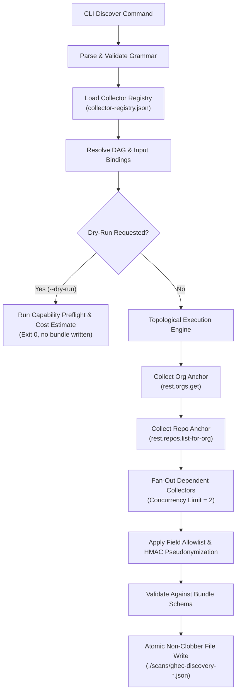

# CLI Architecture & Registry Orchestration

The discovery CLI orchestrates read-only evidence collection for GitHub Enterprise Cloud discovery, migration readiness, and security posture assessment.

---

## 1. Command Grammar and Input Options

```text
ghec-consultant-cli [--help | --version]
ghec-consultant-cli discover --modules <list|all>
  (--organization <name> | --enterprise <slug>)
  [--output <directory|bundle.json>] [--format json] [--dry-run]
  [--include-sensitive-metadata] [--redaction-profile <standard|minimal>]
  [--continue-on-error] [--verbose]
```

**CLI-CMD-001.** Exactly one target scope (`--organization` or `--enterprise`) is required.

- `--modules` is canonical; no alias exists. Selection accepts a comma-separated list or `all`.
- `all` must stand alone and expands to all 11 default baseline modules (`orgs`, `repos`, `lfs`, `teams`, `actions`, `actions-secrets`, `policies`, `security`, `integrations`, `users`, `packages`).
- The selection resolves required parent anchors: `orgs` is always added; any module other than `orgs` and `users` automatically adds `repos` for reference anchors.
- No credential flags or tokens are accepted on the command line; credentials are read from `GHEC_TOKEN` or an approved local credential store.

**CLI-CMD-002.** Default output directory is `./scans`; format is `json`; default redaction profile is `standard`. All booleans default to `false`. Unknown flags exit with code 2 and never echo user input.

---

## 2. Manifest-Driven Collector Registry Integration

The CLI orchestrator is driven directly by the machine-readable [collector registry](../../research/github/collector-registry.json):



### Module and Collector Classification

- **Default Collectors**: 237 planned collectors mapped to the 11 baseline modules. They run automatically when their parent module is specified in `--modules`.
- **Optional Collectors**: High-volume, enterprise-only, or advanced domain collectors (e.g. `billing`, `copilot`, `governance`, `network`, `api-activity`). They require explicit module selection (e.g. `--modules billing,copilot`).
- **Expensive Collectors**: Operations with high fan-out (e.g. detailed workflow runs per repository). Subject to strict operator request budgets and bounded page limits (max 100 per page, default 30-day window).
- **Sensitive Collectors**: Collectors marked `confidential-metadata` or `restricted`. Strict field allowlists discard all free-text fields and personal identifiers.
- **Deferred Operations**: 406 endpoints inventoried in `endpoint-inventory.json` with disposition `Deferred`. They cannot be selected in this phase.
- **Excluded Operations**: 123 endpoints inventoried with disposition `Excluded`. They are hard-blocked by schema screening (credentials, private keys, variable values, repo file contents, binary downloads).

---

## 3. Dependency Resolution and Shared Discovery

Earlier architectural scaffolding assumed broad, coarse module dependencies. The collector registry refines this into an exact, fine-grained **Directed Acyclic Graph (DAG)**:

1. **Shared Anchors**:
   - `rest.orgs.get` establishes the immutable Organization ID and verified login.
   - `rest.repos.list-for-org` executes once per organization. Discovered `{owner, repo}` tuples are cached in memory as resource anchors.
2. **Child Resource Discovery**:
   - Child collectors (e.g. `rest.repos.get-branch-protection`, `rest.actions.list-workflow-runs-for-repo`) consume the discovered repository anchors.
   - Child collectors never re-fetch the repository list or invent artificial repository names.
3. **Missing Anchor Handling**:
   - If `rest.repos.list-for-org` fails or returns an empty set, dependent repository collectors are not run; they are marked `skipped` with reason `Repository anchor missing`. No dangling foreign keys are emitted.

---

## 4. Enterprise-Level Collection vs Per-Organization Execution

- **Organization Scope (`--organization <name>`)**:
  - The CLI restricts all operations to the specified organization.
  - The resulting bundle contains exactly one entry in `organizations` matching the target.
- **Enterprise Scope (`--enterprise <slug>`)**:
  - The CLI queries enterprise-accessible organizations.
  - Each accessible organization is collected as an independent scope boundary.
  - Inaccessible organizations are recorded with `scope.enumeration = 'partial'` and the count of inaccessible organizations is disclosed.
  - Enterprise totals describe only observed resources; unobserved organizations are never assumed to be empty or secure.

---

## 5. Capability Preflight and Dry-Run Behavior

**CLI-DRY-001.** When `--dry-run` is invoked:

1. Validates command grammar and target scope.
2. Resolves selected modules against the collector registry and constructs the execution DAG.
3. Performs a lightweight authentication probe against the root organization/enterprise endpoint.
4. Calculates estimated HTTP request volume:
   $$\text{Estimated Requests} = \sum_{\text{scoped resources}} \max\left(1, \left\lceil \frac{\text{Estimated Records}}{\text{Page Size}} \right\rceil\right)$$
5. Outputs a sanitized, redacted execution plan to stdout showing:
   - Selected collectors and phases (C1/C2).
   - Proven vs unverified permissions.
   - Estimated lower-bound request count and concurrency limits.
   - Declared runtime blockers.
6. **Exits 0 without collecting data, calling dependent collectors, or writing a discovery bundle.**
   _(Note: In the current scaffold release, `--dry-run` exits 3 with `NOT_IMPLEMENTED` until live preflight is implemented in Phase C1)._

---

## 6. Execution, Cancellation, and Failure Lifecycle

**CLI-EXEC-001.** HTTP Transport Policies:

- Bounded concurrency: Default 2 concurrent API requests per organization scope to prevent secondary rate-limit triggers.
- Timeouts: 30 seconds per individual request.
- Retries: Maximum 4 attempts with exponential backoff and full jitter; maximum cumulative retry delay of 300 seconds.
- Cancellation: All network operations accept an `AbortSignal`. When SIGINT (`Ctrl+C`) is received, pending requests are aborted cleanly and the run exits 130.

**CLI-ERR-001.** Error and Continuation Handling:

- Without `--continue-on-error`: A fatal error (such as 401 Bad Credentials or rate-limit exhaustion) halts execution immediately. Unscheduled collectors are marked `skipped`, and completed evidence is safely packaged if an organization anchor exists.
- With `--continue-on-error`: Independent modules continue execution. A partial bundle is published containing all successful evidence, explicit error records, and coverage disclosures. Exit code is `4` (usable partial bundle).
- Exit Codes:
  - `0`: Complete scan success (or successful dry-run preflight).
  - `1`: Fatal runtime or filesystem error.
  - `2`: Invalid command syntax or conflicting options.
  - `3`: Scaffold placeholder (`NOT_IMPLEMENTED`).
  - `4`: Partial discovery bundle produced with non-fatal errors.
  - `130`: Interrupted by operator (SIGINT).

---

## 7. Output Publication and Dashboard Handoff

**CLI-OUT-001.** Publication Lifecycle:

1. Evidence records are collected into in-memory normalized data structures.
2. Prohibited fields are stripped and allowlists are applied. User IDs are pseudonymized via HMAC-SHA256.
3. The final bundle is validated against the data contract (`DiscoveryBundleSchema` in `packages/contracts`).
4. An exclusive, same-directory temporary file (`.tmp`) is created with restricted permissions (0600).
5. The temporary file is flushed to disk and atomically renamed to the final destination:
   `ghec-discovery-<scope-kind>-<sanitized-scope>-<YYYYMMDDTHHmmssSSSZ>-<run-id>.json`.
6. Existing files are never implicitly overwritten.

**CLI-OUT-002.** Offline Dashboard Handoff:

- The resulting JSON bundle is completely self-contained, portable, and offline-compatible.
- The local dashboard imports this bundle directly via browser filesystem APIs.
- The dashboard never needs GitHub credentials or external network access.
