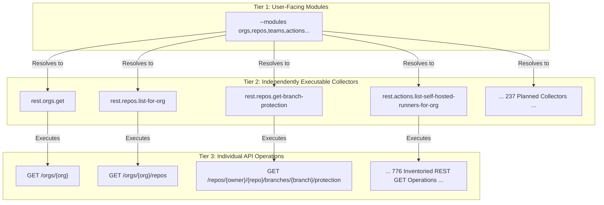

# Collector Catalog and Taxonomy

This document defines the architecture and taxonomy of discovery collectors for GitHub Enterprise Cloud (GHEC) assessment.

---

## 1. Three-Tier Architectural Taxonomy

To cleanly separate customer CLI intent, internal execution planning, and GitHub REST API boundaries, the system defines a three-tier taxonomy:

1. **User-Facing CLI Modules (Tier 1)**:
   - Logical operational boundaries specified via CLI flags (`--modules <list|all>`).
   - Starting taxonomy: `orgs`, `repos`, `lfs`, `teams`, `actions`, `actions-secrets`, `policies`, `security`, `integrations`, `users`, and `packages`.
   - Proposed optional domains for advanced discovery: `billing`, `copilot`, `governance`, `identity`, `network`, `api-activity`.
   - Command-line module selection is case-sensitive, whitespace-trimmed, and order-independent.
2. **Independently Executable Collectors (Tier 2)**:
   - Discrete, testable units of collection registered in [collector-registry.json](../../research/github/collector-registry.json).
   - Exactly **237 planned collectors**, each having a stable ID (e.g., `rest.orgs.get`, `rest.actions.get-actions-cache-list`), declared inputs, dependencies, pagination policies, allowlisted output fields, and synthetic acceptance tests.
   - Each collector has an authoritative specification in `docs/specs/collectors/<id>.md`.
   - Runtime execution remains disabled (`executable: false`, with documented runtime blockers) in this specification phase.
3. **Individual API Operations (Tier 3)**:
   - Every evaluated REST GET endpoint in GitHub Enterprise Cloud.
   - Exactly **776 inventoried operations** tracked in [endpoint-inventory.json](../../research/github/endpoint-inventory.json) and reconciled in [coverage-and-gap-report.md](coverage-and-gap-report.md).
   - Each operation is assigned exactly one disposition: `Planned` (237), `Deferred` (406), `Excluded` (123), or `Unresolved` (10).

---

## 2. Core Collector Standards

**COL-BASE-001.** Every implemented collector must page completely, bound retries (maximum 4 attempts, 300s budget), honor cancellation via `AbortSignal`, record source timestamps and coverage, redact diagnostics, and return unknown/unavailable data honestly without synthesizing zero or false.
_Acceptance Criteria_: Each collector passes multi-page, permission denial, throttle, partial-response, and cancellation tests before changing status from placeholder.

**COL-PERM-001.** The [permissions matrix](permissions-matrix.md) is the single source of truth for token models (fine-grained PAT, classic PAT, GitHub App installation tokens, GitHub App user tokens) and required roles.
_Acceptance Criteria_: Collector implementation is release-blocked until exact operations and permission combinations are verified with official citations and empirical test evidence.

**COL-DEP-001.** Collectors declare explicit input bindings and upstream dependencies in `collector-registry.json`. Shared discovery work (such as repository enumeration via `rest.repos.list-for-org`) is executed once and reused as parent anchors for all child resource collectors without duplicating network requests.

**COL-SEC-001.** Strict adherence to retrieval boundaries: no collector may request or persist secret values, variable values, private keys, webhook secrets, passwords, repository file contents, job logs, or binary downloads.

---

## 3. Module Mapping to Planned Collectors

The 237 planned collectors map to user-facing modules as follows:

### `orgs` — Organization Boundaries and Administration

- **Module ID:** `orgs` | **Planned Collectors:** 8 | **Priority:** P0 / P1 | **Phase:** C1 / C2
- **Key Collectors:**
  - `rest.orgs.get` (Core Anchor): Organization details, plan type, verified domain indicators, default repo permissions.
  - `rest.orgs.list-members`: Organization members (pseudonymized).
  - `rest.orgs.list-outside-collaborators`: Outside collaborators.
  - `rest.orgs.get-membership-for-user`: Membership state.
  - `rest.orgs.list-pending-invitations`, `rest.orgs.list-invitation-teams`, `rest.orgs.list-failed-invitations`.
  - `rest.orgs.list-security-manager-teams`: Teams assigned security manager role.
- **Dependencies:** None (root anchor).

### `repos` — Repository Inventory & Characteristics

- **Module ID:** `repos` | **Planned Collectors:** 10 | **Priority:** P0 / P1 | **Phase:** C1 / C2
- **Key Collectors:**
  - `rest.repos.list-for-org` (Core Anchor): Paged repository inventory, visibility, archive state, default branch, disk usage.
  - `rest.repos.get`: Detailed repository metadata.
  - `rest.repos.list-branches`: Branch inventory.
  - `rest.repos.list-tags`: Release tag inventory.
  - `rest.repos.list-languages`: Classified language byte counts.
  - `rest.repos.list-forks`: Fork hierarchy.
  - `rest.repos.get-all-topics`: Topic tags.
  - `rest.repos.list-collaborators`: Collaborator access levels.
  - `rest.repos.get-collaborator-permission-level`: Detailed collaborator permissions.
  - `rest.repos.list-invitations`: Pending repository invitations.
- **Dependencies:** `rest.orgs.get`.

### `lfs` — Git Large File Storage (LFS) Indicators

- **Module ID:** `lfs` | **Planned Collectors:** 1 (in C1/C2; detailed storage deferred to C4)
- **Status:** Partially observable. Repository `size` indicates Git disk usage, not LFS storage.
- **Dependencies:** `rest.repos.list-for-org`.

### `teams` — Teams, Hierarchy, and Access

- **Module ID:** `teams` | **Planned Collectors:** 20 | **Priority:** P1 / P2 | **Phase:** C2
- **Key Collectors:**
  - `rest.teams.list`: Root organization teams.
  - `rest.teams.get-by-name`: Team details and slug.
  - `rest.teams.list-child-in-org`: Nested child team hierarchy.
  - `rest.teams.list-members-in-org`: Team member counts and roles.
  - `rest.teams.list-repos-in-org`: Team repository permissions.
  - Enterprise teams: `rest.enterprise-teams.list`, `rest.enterprise-team-memberships.list`, `rest.enterprise-team-organizations.get-assignments`.
- **Dependencies:** `rest.orgs.get`.

### `actions` — Workflows, Runners, Policies, and Caches

- **Module ID:** `actions` | **Planned Collectors:** 90 | **Priority:** P1 / P2 | **Phase:** C2
- **Key Collectors:**
  - Enterprise/Org Actions permissions & policies: `get-enterprise-actions-policies`, `get-org-actions-policies`, `get-workflow-access-to-repository`.
  - Self-hosted runners & groups: `list-self-hosted-runners-for-org`, `list-self-hosted-runner-groups-for-org`, `list-self-hosted-runners-for-repo`.
  - Hosted runner images & specs: `list-hosted-runners-for-org`, `get-hosted-runners-machine-specs-for-org`, `list-hosted-runners-for-enterprise`.
  - Cache metrics: `get-actions-cache-usage`, `get-actions-cache-list`.
  - Workflow & run metadata: `list-workflow-runs-for-repo`, `list-artifacts-for-repo`.
- **Dependencies:** `rest.orgs.get`, `rest.repos.list-for-org`.

### `actions-secrets` — Secret & Variable Names and Scopes

- **Module ID:** `actions-secrets` | **Planned Collectors:** 4 | **Priority:** P1 | **Phase:** C2
- **Key Collectors:**
  - `rest.actions.list-org-secrets`: Org secret names, update timestamps, sharing policies.
  - `rest.actions.list-repo-secrets`: Repo secret names and update timestamps.
  - `rest.actions.list-environment-secrets`: Environment secret metadata.
  - `rest.actions.list-selected-repos-for-org-secret`: Org secret repository scopes.
- **Safety Boundary:** All value-returning operations (e.g. `/actions/variables/{name}`) are excluded.
- **Dependencies:** `rest.orgs.get`, `rest.repos.list-for-org`.

### `policies` — Branch Protection, Rulesets, and Environments

- **Module ID:** `policies` | **Planned Collectors:** 16 | **Priority:** P1 | **Phase:** C2
- **Key Collectors:**
  - Branch protection: `get-branch-protection`, `get-status-checks-protection`, `get-branch-rules`.
  - Rulesets: `get-org-rulesets`, `get-org-ruleset`, `get-repo-rulesets`, `get-repo-ruleset`.
  - Environments & deployment policies: `get-all-environments`, `get-environment`, `get-all-deployment-protection-rules`.
  - Immutable releases: `get-immutable-releases-settings`, `check-immutable-releases`.
- **Dependencies:** `rest.orgs.get`, `rest.repos.list-for-org`.

### `security` — Code Security Configurations & Posture

- **Module ID:** `security` | **Planned Collectors:** 17 | **Priority:** P1 | **Phase:** C2
- **Key Collectors:**
  - Code security configurations: `get-configurations-for-org`, `get-default-configurations`, `get-configurations-for-enterprise`.
  - Code scanning setup: `get-default-setup`, `get-ai-scan-enablement-for-org`.
  - Secret scanning: `get-security-analysis-settings-for-enterprise`, `get-scan-history`.
  - Dependabot: `dependabot.list-org-secrets`, `dependabot.list-repo-secrets`.
- **Dependencies:** `rest.orgs.get`, `rest.repos.list-for-org`.

### `integrations` — Apps, Installations, and Private Registries

- **Module ID:** `integrations` | **Planned Collectors:** 6 | **Priority:** P1 | **Phase:** C2
- **Key Collectors:**
  - App installations: `orgs.list-app-installations`, `apps.get-org-installation`, `apps.get-repo-installation`, `apps.list-repos-accessible-to-installation`.
  - Private registries: `private-registries.list-org-private-registries`, `private-registries.get-org-private-registry`.
- **Dependencies:** `rest.orgs.get`.

### `users` — Identity Posture and Organization Access

- **Module ID:** `users` | **Planned Collectors:** 2 | **Priority:** P1 | **Phase:** C2
- **Key Collectors:**
  - `rest.users.get-context-for-user`: Organization user context (pseudonymized).
  - Outside collaborator access verification.
- **Dependencies:** `rest.orgs.get`.

### `packages` — Registries and Release Assets

- **Module ID:** `packages` | **Planned Collectors:** 5 | **Priority:** P2 | **Phase:** C2
- **Key Collectors:**
  - `rest.packages.list-packages-for-organization`: Package listing.
  - `rest.packages.get-package-for-organization`: Package details.
  - `rest.packages.get-all-package-versions-for-package-owned-by-org`: Package version metadata.
  - `rest.repos.list-release-assets`: Release asset metadata.
- **Dependencies:** `rest.orgs.get`.

---

## 4. Proposed Optional Domains (Expanded Surface)

The following domains are audited in the registry and planned for Phase C2:

- **`governance` (17 collectors)**: Custom properties schemas (`custom-properties-for-repos-get-organization-definitions`), custom repository roles (`list-custom-repo-roles`), organization roles (`list-org-roles`).
- **`billing` (13 collectors)**: Budgets (`get-all-budgets`, `get-budget`), cost centers (`get-all-cost-centers`), license counts (`get-consumed-licenses`).
- **`copilot` (6 collectors)**: Copilot org details (`get-copilot-organization-details`), seat allocations (`list-copilot-seats`), coding agent permissions.
- **`network` (4 collectors)**: Hosted compute network configurations for enterprise and orgs.
- **`migration` (3 collectors)**: Organization migration status and repository lists.
- **`api-activity` (3 collectors)**: API Insights summary and subject statistics.
