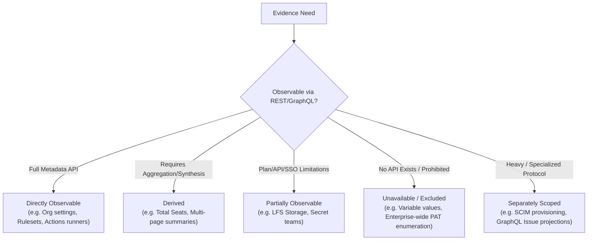

# GHEC API Surface Coverage, Reconciliation, and Gap Report

This authoritative report establishes the complete research accounting, endpoint reconciliation, domain coverage, evidence observability, privacy boundary enforcement, and remaining research gaps for the GitHub Enterprise Cloud (GHEC) discovery CLI.

All analysis is based on pinned primary sources and reproducible offline validation tooling (`scripts/collectors/validate.py`).

---

## 1. Research Scope, Methodology, and Pinned Inputs

Collection research was conducted using GitHub Enterprise Cloud documentation and official OpenAPI descriptions pinned to API version **`2026-03-10`**.

### Pinned Primary Sources

| Source Identifier      | Source Description                               | Revision / Pinned Reference                                                   | File Path                                                                                      | SHA256 Digest                                                                                                                            |
| ---------------------- | ------------------------------------------------ | ----------------------------------------------------------------------------- | ---------------------------------------------------------------------------------------------- | ---------------------------------------------------------------------------------------------------------------------------------------- |
| `seed-app-permissions` | Official GitHub App Permissions Reference Table  | API Version `2026-03-10`                                                      | `research/github/sources/app-permissions.html`<br>`research/github/sources/app-permissions.md` | `c1b17679d615e9338956c4185ad5f1bb0be1b29d19abe85967e00308a82182c6`<br>`32ee3e18bed89a197067f3ef7f3bcaac0dcff5b3d9b877ef92b4adf4c03e4edb` |
| `ghec-openapi`         | Official GitHub REST API OpenAPI 3.0 Description | Git commit `f1c9c4e4958b27996e2b5f451b761fc6c57d6b2c` (`x-github-plan: ghec`) | `research/github/sources/ghec.2026-03-10.json`                                                 | `4f05e42c9670ac2847ac1139412c15833822ca762983d3ae661330141f32c173`                                                                       |
| `fine-grained-pat`     | Permissions Required for Fine-Grained PATs       | Current Reference (`2026-03-10`)                                              | `research/github/sources/047f030efe47b8a5.md`                                                  | `8f896645965ab0b27f85a8833cb33b61a90849fb7e15a49eeffc0eb0474458a4`                                                                       |
| `classic-pat`          | Scopes for OAuth Apps and Classic PATs           | Current Reference (`2026-03-10`)                                              | `research/github/sources/f0d89c2d1756987d.md`                                                  | `9a11b36b263968641a3024a1bcfb9fc2a326cda371d7771e22f67f118ede68fc`                                                                       |
| `git-lfs-billing`      | Git LFS Concepts and Quotas                      | Current Reference (`2026-03-10`)                                              | `research/github/sources/7614ccf40eceaefc.md`                                                  | `5d6a59ce64c625db35617f00ac813f60e18dc7606db5b292a4dcaa2301963531`                                                                       |
| `enterprise-emu`       | About Enterprise Managed Users (EMU)             | Current Reference (`2026-03-10`)                                              | `research/github/sources/56f4b8f901845920.md`                                                  | `d46e3803bed92ea48a198e6372649167dc14fde4e9a9e4e1ee59dbf2bc4c9441`                                                                       |
| `audit-log-docs`       | Enterprise Audit Log & Streaming API             | Current Reference (`2026-03-10`)                                              | `research/github/sources/6d3dce639a6e07a0.md`                                                  | `616126a487502f2d9181e32b8ba9ab810eef741576c4541ea633d5c245ebf034`                                                                       |

### Extraction & Reconciliation Methodology

1. **HTTP Method Filtering**: All entries across all permission sections (enterprise, organization, repository, and user) were extracted programmatically by HTTP method `GET`. We did not filter by permission access level (`read` vs `write`), capturing 28 GET operations located under write-access headings.
2. **Deduplication with Source Preservation**: Raw table occurrences (527) were deduplicated by path and method into 503 unique GET operations, preserving all section associations, token types (`IAT`, `UAT`, `PAT`), and additional-permission annotations (`✓`).
3. **OpenAPI Cross-Reconciliation**: The seed operations were reconciled with the official GHEC OpenAPI description (`766` unique GET operations).
4. **Union Accounting**: Every single operation in the union (`776` total) was assigned exactly one disposition, audited for safety hazards, mapped to authentication requirements, and documented in machine-readable manifests (`endpoint-inventory.json` and `reconciliation.json`).

---

## 2. API Surface Reconciliation Summary

```text
  Seed Raw GET Occurrences:         527
  Seed Unique GET Operations:       503
  OpenAPI Unique GET Operations:    766
  -----------------------------------------
  Overlap (Seed ∩ OpenAPI):         493
  Seed-Only Operations:              10 (Billing usage endpoints absent from pinned GHEC OpenAPI)
  OpenAPI-Only Operations:          273 (Enterprise-admin, hosted compute, public metadata, etc.)
  =========================================
  Total Reconciled Operations:      776
```

### Dispositions Breakdown

| Disposition    |   Count | Percentage | Definition & Product Policy                                                                                                                                                                                                                                                                                                      |
| -------------- | ------: | ---------: | -------------------------------------------------------------------------------------------------------------------------------------------------------------------------------------------------------------------------------------------------------------------------------------------------------------------------------- |
| **Planned**    | **241** |  **31.1%** | Mapped 1-to-1 to collector IDs or query catalog templates. Metadata-safe evidence with declared output field allowlists. 4 org billing usage endpoints reconciled from Unresolved.                                                                                                                                               |
| **Deferred**   | **408** |  **52.6%** | Valid discovery capabilities deferred to Phase C3 or C4 (e.g. collaboration issues/PRs requiring selective GraphQL projection, SCIM attribute minimization, raw audit log event streaming, global user/search scopes, or secondary metered AI credits).                                                                          |
| **Excluded**   | **127** |  **16.3%** | Strictly excluded from collection on security, privacy, or architectural grounds (retrieval of credentials, secret values, variable values, private keys, webhook secrets, file contents, git blobs, archive downloads, signed URLs, or personal/educational/marketplace endpoints). 4 personal user billing endpoints excluded. |
| **Unresolved** |   **0** |   **0.0%** | All 10 initial seed-only billing usage endpoints have been reconciled in `advanced-domain-reconciliation.json`. Zero unresolved endpoints remain.                                                                                                                                                                                |
| **Total**      | **776** | **100.0%** | **Complete inventory coverage of all evaluated GET operations.**                                                                                                                                                                                                                                                                 |

---

## 3. Domain Coverage and Disposition Audit

All 776 inventoried operations are audited across 33 functional domains:

| Domain                | Planned | Deferred | Excluded | Unresolved |   Total | Primary Focus & Assessment                                                                                                                                                   |
| --------------------- | ------: | -------: | -------: | ---------: | ------: | ---------------------------------------------------------------------------------------------------------------------------------------------------------------------------- |
| `actions`             |      90 |       20 |        4 |          0 |     114 | Enterprise/org/repo Actions policies, runner groups, self-hosted runners, hosted runner images, cache metrics, workflow metadata. Excludes job logs and archive downloads.   |
| `actions-secrets`     |       4 |        6 |        9 |          0 |      19 | Secret & variable metadata (names, timestamps, scopes). Excludes all operations returning secret or variable values (`/actions/variables/{name}`).                           |
| `activity`            |       0 |        3 |        1 |          0 |       4 | Repository subscription and notification metadata. Excludes personal feed endpoints.                                                                                         |
| `api-activity`        |       3 |        6 |        0 |          0 |       9 | API Insights summary, time, and subject statistics for API usage monitoring.                                                                                                 |
| `apps`                |       0 |        0 |        6 |          0 |       6 | Authenticated GitHub App identity and webhook delivery configurations (delivery payloads excluded).                                                                          |
| `audit`               |       0 |        7 |        8 |          0 |      15 | Enterprise audit log streaming configurations. Raw audit events deferred to C3; streaming credentials excluded.                                                              |
| `billing`             |      17 |       10 |        4 |          0 |      31 | Enterprise budgets, cost centers, consumed licenses, license sync status. Reconciled in `advanced-domain-reconciliation.json`.                                               |
| `classroom`           |       0 |        6 |        0 |          0 |       6 | GitHub Classroom assignments/grades (deferred, outside enterprise discovery).                                                                                                |
| `codes-of-conduct`    |       0 |        0 |        2 |          0 |       2 | Platform static open-source metadata (excluded).                                                                                                                             |
| `codespaces`          |       4 |       15 |        3 |          0 |      22 | Org codespace inventory and secret metadata. Excludes personal user codespaces and secret values.                                                                            |
| `collaboration`       |       2 |       53 |        2 |          0 |      57 | Issue types and custom fields. PRs, comments, and issue bodies deferred to C3 GraphQL projection.                                                                            |
| `copilot`             |       6 |       25 |       19 |          0 |      50 | Copilot organization details, seat assignments, coding agent permissions. Excludes content exclusion rules, prompts, and custom agent source code.                           |
| `deployments`         |       2 |        6 |        2 |          0 |      10 | GitHub Pages settings and build status. Excludes deployment status logs.                                                                                                     |
| `emojis`              |       0 |        0 |        1 |          0 |       1 | Platform static content (excluded).                                                                                                                                          |
| `gists`               |       0 |        0 |       10 |          0 |      10 | Personal gists and comments (excluded).                                                                                                                                      |
| `gitignore`           |       0 |        0 |        2 |          0 |       2 | Platform templates (excluded).                                                                                                                                               |
| `governance`          |      17 |        5 |        0 |          0 |      22 | Enterprise/org custom properties schemas, custom repository roles, organization roles.                                                                                       |
| `identity`            |       5 |       10 |        1 |          0 |      16 | External IDP groups, team synchronization mappings, SAML SSO authorizations. SCIM endpoints deferred to C3.                                                                  |
| `integrations`        |       6 |       17 |       22 |          0 |      45 | Org app installations, installation repository access, private registries. Excludes webhook secrets, URLs, and private keys.                                                 |
| `meta`                |       0 |        2 |        3 |          0 |       5 | Root hypermedia, versions, and zen endpoints (excluded/deferred).                                                                                                            |
| `migration`           |       3 |        6 |        2 |          0 |      11 | Organization migration status, archives, and repositories. Excludes direct archive tarball downloads.                                                                        |
| `network`             |       4 |        2 |        0 |          0 |       6 | Hosted compute network configurations for enterprise and organizations.                                                                                                      |
| `orgs`                |       8 |       12 |        0 |          0 |      20 | Organization details, memberships, outside collaborators, invitations, security managers, PAT grant requests.                                                                |
| `packages`            |       5 |       20 |        1 |          0 |      26 | Package metadata, versions, and release assets. Excludes raw package version file downloads.                                                                                 |
| `policies`            |      16 |       30 |        0 |          0 |      46 | Branch protection, repo rulesets, org rulesets, environment protection rules, immutable releases.                                                                            |
| `rate-limit`          |       0 |        1 |        0 |          0 |       1 | Global rate limit status (deferred to adapter diagnostic layer).                                                                                                             |
| `repos`               |      10 |       47 |       13 |          0 |      70 | Repository inventory, branches, tags, languages, forks, topics, collaborators, environment metadata. Excludes repo content, git commits, blobs, trees, archives.             |
| `search`              |       0 |        4 |        1 |          0 |       5 | Global search endpoints (code, commits, issues, repos); deferred to C4 due to non-enumerable enterprise semantics.                                                           |
| `security`            |      17 |       47 |        9 |          0 |      73 | Code security configurations, code scanning default setup, AI scan enablement, secret scanning settings/history, Dependabot secret metadata. Detailed alerts deferred to C3. |
| `security-advisories` |       0 |        2 |        0 |          0 |       2 | Global security advisories (deferred to C3).                                                                                                                                 |
| `teams`               |      20 |       14 |        0 |          0 |      34 | Team hierarchy, membership, repo access, enterprise teams, enterprise team memberships, assignments.                                                                         |
| `users`               |       2 |       32 |        2 |          0 |      36 | User organization membership and outside collaborator status (pseudonymized). Excludes personal emails, SSH keys, GPG keys, and social accounts.                             |
| **Total**             | **237** |  **406** |  **123** |     **10** | **776** |                                                                                                                                                                              |

---

## 4. Evidence Observability Audit (All Mandatory Domains)

For each evidence domain, this audit specifies whether the required evidence is **Directly Observable**, **Derived**, **Partially Observable**, **Unavailable**, or requires a **Separately Scoped Approach**:



### Detailed Observability Breakdown

1. **Enterprise & Organization Discovery, Settings, Policies, Scope Visibility**:
   - _Status_: **Partially Observable**.
   - _Analysis_: Organization details (`/orgs/{org}`), membership policies, and custom properties are directly observable. However, enterprise-wide organization enumeration (`/enterprises/{enterprise}/...`) requires Enterprise Owner privileges; fine-grained PATs cannot span an entire enterprise. If token privileges are restricted, enumeration is partial; inaccessible organizations must remain `unknown` without guessing counts.
2. **Repositories, Forks, Templates, Archive State, Branches, Tags, Languages, Size Indicators**:
   - _Status_: **Directly Observable & Derived**.
   - _Analysis_: Repository metadata (`/orgs/{org}/repos`), branches, tags, topics, and forks are directly observable. Language breakdown (`/repos/{owner}/{repo}/languages`) provides byte counts of classified code. Size in `repos` is a disk-usage indicator, NOT a measure of Git LFS storage.
3. **Teams, Nested Membership, Collaborators, Invitations, Effective-Access Limitations**:
   - _Status_: **Partially Observable**.
   - _Analysis_: Team hierarchy (`parent_team_id`), membership, invitations, and explicit repository permissions are directly observable. Secret teams and IdP-managed groups may be invisible without specific admin roles. "Effective access" across nested teams, base org permissions, and custom roles must be derived analytically, not assumed from a single API call.
4. **SAML/SSO, SCIM, Enterprise Managed Users (EMU), Credential Authorization**:
   - _Status_: **Separately Scoped & Partially Observable**.
   - _Analysis_: Org SAML SSO authorizations (`/orgs/{org}/saml/sso/authorizations`) and IdP group mappings are observable. SCIM user provisioning (`/scim/v2/...`) returns extensive identity attributes that require dedicated response minimization and EMU-specific credential authorization. SCIM is deferred to Phase C3.
5. **Branch Protection, Rulesets, Inheritance, Bypasses, Environments**:
   - _Status_: **Directly Observable & Derived**.
   - _Analysis_: Classic branch protection (`/repos/{owner}/{repo}/branches/{branch}/protection`), repo rulesets, and org-level rulesets (`/orgs/{org}/rulesets`) are directly observable. Determining effective rule enforcement and bypass hierarchy requires client-side derivation from both org and repo ruleset definitions.
6. **Actions Policies, Workflows, Runs/Jobs Metadata, Runners, Hosted Runners, Caches, Artifact Metadata**:
   - _Status_: **Directly Observable**.
   - _Analysis_: Workflow list, cache usage/retention limits, self-hosted runners, hosted runner images, and runner groups are directly observable. Workflow run histories and job steps can be queried via REST metadata. Workflow file contents and job logs are strictly excluded.
7. **Secret Metadata and Variable Capabilities at Enterprise, Org, Repo, Environment Scope**:
   - _Status_: **Partially Observable (Names & Metadata Only)**.
   - _Analysis_: Secret names, update timestamps, and repository sharing selections are directly observable (`list-org-secrets`, `list-repo-secrets`). Secret values are never exposed. Variable names are observable, but detail variable endpoints (`/actions/variables/{name}`) return values and are strictly excluded.
8. **Apps, Installations, Integrations, Webhooks, Approved Key Metadata**:
   - _Status_: **Partially Observable**.
   - _Analysis_: Organization app installations and repository access lists are directly observable. Webhook presence and event subscriptions are observable, but webhook secret values, delivery URLs, and payload deliveries are excluded for privacy.
9. **Code Security Configurations, Code Scanning, Dependabot, Secret Protection, Advisories**:
   - _Status_: **Directly Observable (Configuration) & Separately Scoped (Alerts)**.
   - _Analysis_: Security configurations at enterprise and org scope (`/code-security/configurations`), default setup status, and enablement settings are directly observable. Detailed alert backlogs contain code snippets and vulnerability details, requiring filtered aggregate extraction in Phase C3.
10. **Audit Logs, Streaming Configuration, Events, API Activity**:
    - _Status_: **Partially Observable & Separately Scoped**.
    - _Analysis_: Audit log streaming configurations (`/enterprises/{enterprise}/audit-log/streams`) and API Insights usage stats are directly observable. Querying live audit log event history requires specialized query cursors, high request budgets, and event allowlists; deferred to Phase C3.
11. **Packages, Registries, Releases, Assets, Pages, Deployment Metadata**:
    - _Status_: **Directly Observable**.
    - _Analysis_: Org package lists, package versions, release assets, and Pages builds are observable. Binary downloads and package payloads are prohibited and excluded.
12. **Copilot Seats, Usage, Metrics, Policies, Agent Configuration**:
    - _Status_: **Directly Observable & Derived**.
    - _Analysis_: Copilot organization details, seat allocations (`/orgs/{org}/copilot/billing/seats`), total seat counts, active/inactive seat metrics, and coding agent repository permissions are directly observable. Content exclusion rules and prompts are excluded.
13. **Billing, Budgets, Licenses, Metered Usage, Storage, LFS Limitations**:
    - _Status_: **Partially Observable**.
    - _Analysis_: Enterprise budgets, cost centers, consumed license counts, and license sync status are directly observable. Git LFS billable storage is NOT directly observable per repository through standard REST metadata; repository `size` must not be equated to LFS usage.
14. **Issues, Pull Requests, Reviews, Projects, Discussions, Collaboration Metadata**:
    - _Status_: **Separately Scoped (Requires GraphQL Projection)**.
    - _Analysis_: Organization issue types and project fields are directly observable. Full issues, pull requests, reviews, and discussions return unstructured markdown text, user comments, and code diffs in REST responses. Safe collection requires selective GraphQL query projections in Phase C3.
15. **Codespaces, Network Configuration, Custom Properties, Custom Roles**:
    - _Status_: **Directly Observable**.
    - _Analysis_: Hosted compute network configurations, enterprise/org custom repository property schemas (`/orgs/{org}/properties/schema`), and custom organization/repository role definitions are directly observable.

---

## 5. Security & Privacy Boundary Enforcement

The discovery tooling enforces strict boundaries to protect customer confidential data and intellectual property:

```text
+------------------------------------------------------------------------------------+
|                                STRICTLY PROHIBITED                                 |
|  - Passwords, PATs, OAuth access/refresh tokens, private keys, client secrets      |
|  - Actions secret values, variable values, webhook secret tokens, stream keys      |
|  - Repository source files, git blobs, git commit patches, pull request diffs      |
|  - Workflow source YAML files, Actions job logs, runner debug logs                 |
|  - Raw webhook delivery payloads, customer free-text bodies/comments               |
|  - Binary downloads, tarballs, zipballs, package version archives                  |
|  - Signed AWS S3 / Azure Blob download URLs                                        |
+------------------------------------------------------------------------------------+
```

### Concrete Boundary Enforcement Mechanisms

1. **Schema-Level Screening**: Every success response schema was traversed to leaf properties. Operations exposing prohibited fields without a safe metadata-only mode were marked `Excluded` (e.g. `rest.actions.get-environment-variable`, `rest.repos.download-tarball-archive`, `rest.enterprise-admin.get-audit-log-stream-key`).
2. **Field Allowlists (`BASE_FIELDS`)**: Collectors emit ONLY explicitly approved metadata fields (names, timestamps, states, booleans, counts, IDs). Undeclared fields are dropped during normalization.
3. **Blacklist Safeguards (`NEVER_FIELDS`)**: Even if present in an API response, fields named `body`, `content`, `payload`, `value`, `secret`, `token`, `key`, `raw_key`, `public_key`, `email`, `download_url`, etc., are unconditionally stripped.
4. **Pseudonymization**: Individual human user IDs, actor IDs, and subject IDs are pseudonymized using run-scoped HMAC-SHA256 with an ephemeral key that is destroyed upon bundle publication. No identity reverse-mapping is retained.
5. **No Opt-In Bypasses**: The `--include-sensitive-metadata` and `--redaction-profile minimal` CLI options cannot bypass prohibited field exclusions.

---

## 6. Full Gap Disclosure & Next Research Steps

### 1. The 10 Seed-Only Billing Usage Endpoints

Ten billing usage operations are documented in the App Permissions seed table but absent from the pinned `ghec.2026-03-10.json` OpenAPI specification:

- `/organizations/{org}/settings/billing/ai_credit/usage`
- `/organizations/{org}/settings/billing/budgets`
- `/organizations/{org}/settings/billing/budgets/{budget_id}`
- `/organizations/{org}/settings/billing/premium_request/usage`
- `/organizations/{org}/settings/billing/usage`
- `/organizations/{org}/settings/billing/usage/summary`
- `/users/{username}/settings/billing/ai_credit/usage`
- `/users/{username}/settings/billing/premium_request/usage`
- `/users/{username}/settings/billing/usage`
- `/users/{username}/settings/billing/usage/summary`

_Verification Next Step_: Query GitHub's public documentation endpoint and test against live synthetic enterprise accounts during Phase C3 to verify if these endpoints are supported on GHEC or restricted to GitHub Enterprise Cloud with data residency (GHEC-DR).

### 2. Empirical Permission Verification Gaps

While documentation-derived permissions are recorded for fine-grained PATs, classic scopes, and GitHub Apps, empirical verification against live synthetic test environments has not yet been performed (`empiricalStatus: not-tested`).
_Verification Next Step_: Before releasing any collector for live execution, execute test probes in isolated synthetic organizations with minimal tokens to confirm exact permission thresholds and role constraints.

### 3. Detail Selectors Requiring Caller-Supplied IDs

Certain detail operations (e.g. `rest.enterprise-admin.get-runner-version-deprecation-for-enterprise`) require specific input parameters (such as `version`) that have no parent list enumeration endpoint.
_Verification Next Step_: Maintain explicit `caller-supplied` input classifications; never synthesize artificial IDs or claim complete enumeration for resources where GitHub provides no list API.
