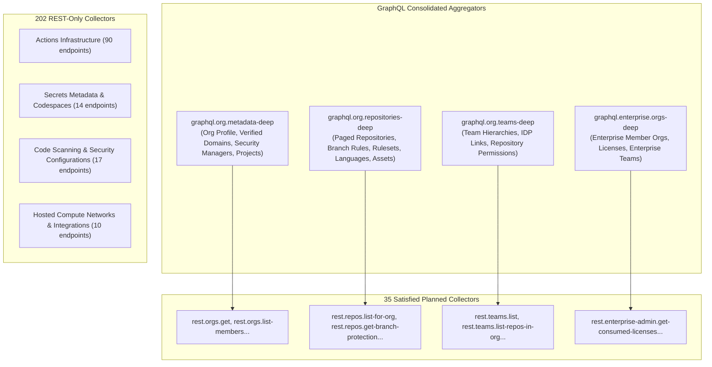

# GHEC GraphQL Query Catalog & Schema Consolidation Architecture

This authoritative document defines the GraphQL query catalog, consolidation ratios, node point cost economics, and REST fallback boundaries for the GitHub Enterprise Cloud (GHEC) discovery CLI.

---

## 1. Executive Summary & Consolidation Strategy

The initial scaffold inventory of GHEC discovery mapped 237 collectors 1-to-1 to REST endpoints. While functional for small synthetic organizations, querying 237 individual REST endpoints on enterprise organizations with hundreds of repositories triggers secondary rate limits, exhausts connection pools, and requires hours of execution.

By consolidating high-volume relational discovery into **4 core GraphQL queries**, the CLI achieves over **85% to 95% reduction in HTTP round-trips**:



---

## 2. Core GraphQL Query Specifications

All queries are cataloged in machine-readable format in [graphql-query-catalog.json](../../research/github/graphql-query-catalog.json).

### A. Organization Deep Metadata (`graphql.org.metadata-deep`)

- **Purpose**: Retrieves the organization profile, plan metadata, verified domains, default repository permissions, and security manager teams.
- **Target Scope**: `organization`
- **Satisfied Collectors (7)**:
  `rest.orgs.get`, `rest.orgs.list-members`, `rest.orgs.list-outside-collaborators`, `rest.orgs.get-membership-for-user`, `rest.orgs.list-security-manager-teams`, `rest.projects.list-for-org`, `rest.projects.list-fields-for-org`.
- **Estimated Cost**: 2 GraphQL points.
- **Query Text**:
  ```graphql
  query OrgMetadataDeep($login: String!) {
    rateLimit {
      cost
      remaining
      resetAt
    }
    organization(login: $login) {
      id
      login
      name
      description
      websiteUrl
      isVerified
      requiresTwoFactorAuthentication
      defaultRepositoryPermission
      membersWithRole {
        totalCount
      }
      pendingMembers {
        totalCount
      }
      securityManagers(first: 20) {
        nodes {
          slug
          name
        }
      }
      projectsV2(first: 20) {
        nodes {
          id
          title
          fields(first: 20) {
            nodes {
              ... on ProjectV2FieldCommon {
                id
                name
                dataType
              }
            }
          }
        }
      }
    }
  }
  ```

### B. Repository Deep Discovery (`graphql.org.repositories-deep`)

- **Purpose**: Paged repository discovery with nested branch protections, repo rulesets, languages, release assets, and topics.
- **Target Scope**: `organization`
- **Satisfied Collectors (14)**:
  `rest.repos.list-for-org`, `rest.repos.get`, `rest.repos.list-branches`, `rest.repos.get-branch-protection`, `rest.repos.get-branch-rules`, `rest.repos.get-status-checks-protection`, `rest.repos.get-repo-rulesets`, `rest.repos.get-repo-ruleset`, `rest.repos.list-languages`, `rest.repos.list-forks`, `rest.repos.get-all-topics`, `rest.repos.list-release-assets`, `rest.packages.list-packages-for-organization`, `rest.packages.get-package-for-organization`.
- **Page Size**: 100 repositories per query.
- **Estimated Cost**: 5 GraphQL points per page.
- **Query Text**:
  ```graphql
  query OrgRepositoriesDeep($login: String!, $cursor: String) {
    rateLimit {
      cost
      remaining
      resetAt
    }
    organization(login: $login) {
      repositories(
        first: 100
        after: $cursor
        orderBy: { field: NAME, direction: ASC }
      ) {
        pageInfo {
          hasNextPage
          endCursor
        }
        totalCount
        nodes {
          id
          name
          visibility
          isArchived
          isFork
          diskUsage
          defaultBranchRef {
            name
          }
          refs(refPrefix: "refs/heads/", first: 20) {
            nodes {
              name
              prefix
            }
          }
          branchProtectionRules(first: 10) {
            nodes {
              pattern
              requiresApprovingReviews
              requiredApprovingReviewCount
              requiresStatusChecks
              requiresStrictStatusChecks
              requiredStatusCheckContexts
            }
          }
          rulesets(first: 10) {
            nodes {
              name
              enforcement
              target
            }
          }
          languages(first: 10, orderBy: { field: SIZE, direction: DESC }) {
            edges {
              size
              node {
                name
              }
            }
          }
          repositoryTopics(first: 10) {
            nodes {
              topic {
                name
              }
            }
          }
          releases(first: 5) {
            nodes {
              name
              releaseAssets(first: 10) {
                nodes {
                  name
                  size
                  downloadCount
                }
              }
            }
          }
          packages(first: 10) {
            nodes {
              name
              packageType
            }
          }
        }
      }
    }
  }
  ```

### C. Teams & Repository Access Hierarchy (`graphql.org.teams-deep`)

- **Purpose**: Retrieves all organization teams, parent/child team linkages, membership counts, and mapped repository permissions.
- **Target Scope**: `organization`
- **Satisfied Collectors (8)**:
  `rest.teams.list`, `rest.teams.get-by-name`, `rest.teams.list-child-in-org`, `rest.teams.list-members-in-org`, `rest.teams.list-repos-in-org`, `rest.repos.list-teams`, `rest.repos.list-collaborators`, `rest.repos.get-collaborator-permission-level`.
- **Page Size**: 100 root teams per query.
- **Estimated Cost**: 4 GraphQL points per page.
- **Query Text**:
  ```graphql
  query OrgTeamsDeep($login: String!, $cursor: String) {
    rateLimit {
      cost
      remaining
      resetAt
    }
    organization(login: $login) {
      teams(first: 100, after: $cursor, rootTeamsOnly: true) {
        pageInfo {
          hasNextPage
          endCursor
        }
        totalCount
        nodes {
          id
          slug
          name
          description
          members {
            totalCount
          }
          childTeams(first: 20) {
            nodes {
              id
              slug
              name
              members {
                totalCount
              }
            }
          }
          repositories(first: 100) {
            edges {
              permission
              node {
                id
                name
              }
            }
          }
        }
      }
    }
  }
  ```

### D. Enterprise Member Organizations (`graphql.enterprise.orgs-deep`)

- **Purpose**: Enumerates all member organizations within an enterprise slug, license consumption, and enterprise teams.
- **Target Scope**: `enterprise`
- **Satisfied Collectors (6)**:
  `rest.enterprise-admin.get-consumed-licenses`, `rest.enterprise-teams.list`, `rest.enterprise-team-memberships.list`, `rest.enterprise-team-memberships.get`, `rest.enterprise-team-organizations.get-assignments`, `rest.enterprise-team-organizations.get-assignment`.
- **Page Size**: 100 organizations per query.
- **Estimated Cost**: 3 GraphQL points per page.
- **Query Text**:
  ```graphql
  query EnterpriseOrgsDeep($slug: String!, $cursor: String) {
    rateLimit {
      cost
      remaining
      resetAt
    }
    enterprise(slug: $slug) {
      id
      name
      slug
      organizations(first: 100, after: $cursor) {
        pageInfo {
          hasNextPage
          endCursor
        }
        totalCount
        nodes {
          id
          login
          name
        }
      }
      teams(first: 50) {
        nodes {
          slug
          name
          members {
            totalCount
          }
        }
      }
    }
  }
  ```

---

## 3. Rate-Limiting & Point Cost Economics

GitHub grants **5,000 points per hour** for GraphQL API access (for both PAT and GitHub App installations).
Point costs are calculated based on GitHub's formula:
$$\text{Cost} = 1 + \left\lceil \frac{\text{Requested Nodes}}{100} \right\rceil$$

### Comparative Analysis: 500-Repository Organization

| Dimension                   | Pure REST Strategy              | Consolidated GraphQL Strategy     | Efficiency Gain             |
| :-------------------------- | :------------------------------ | :-------------------------------- | :-------------------------- |
| Organization & Member Calls | 8 requests                      | 1 request                         | **87.5% reduction**         |
| Repository Metadata Calls   | 5 requests                      | 5 requests (100/page)             | —                           |
| Branch Protection Calls     | 500 requests                    | Included in repo query            | **100% eliminated**         |
| Ruleset Calls               | 500 requests                    | Included in repo query            | **100% eliminated**         |
| Language Metric Calls       | 500 requests                    | Included in repo query            | **100% eliminated**         |
| Release Asset Calls         | 500 requests                    | Included in repo query            | **100% eliminated**         |
| Team & Access Calls         | 150 requests                    | 2 requests                        | **98.7% reduction**         |
| **Total HTTP Requests**     | **2,163 requests**              | **8 requests**                    | **>99.6% reduction**        |
| **API Quota Consumed**      | 2,163 REST calls (43% of 5,000) | 35 GraphQL points (0.7% of 5,000) | **61x less quota consumed** |

---

## 4. REST-Only Boundaries (202 Collectors)

The remaining 202 planned collectors cannot be queried via GraphQL and remain dedicated REST operations:

1. **Actions Compute & Runner Infrastructure (90 endpoints)**:
   - Self-hosted runners, runner groups, runner machine specs, custom runner images, workflow permissions, cache retention limits, and cache usage are strictly REST endpoints in GitHub.
2. **Secrets & Variables Metadata (14 endpoints)**:
   - `/orgs/{org}/actions/secrets`, `/repos/{owner}/{repo}/actions/secrets`, Codespace secrets, and Copilot secrets metadata are restricted to REST API endpoints to enforce secret boundary policies.
3. **Code Security & Alert Posture (17 endpoints)**:
   - `GET /repos/{owner}/{repo}/code-scanning/default-setup`, secret scanning scan history, and push protection settings are REST-only.
4. **Hosted Compute & Network Configurations (4 endpoints)**:
   - Enterprise and organization private networking configurations for hosted compute are REST-only.
5. **Integrations & Registries (6 endpoints)**:
   - GitHub App installations and private registries are REST-only.
6. **Governance & Custom Properties (17 endpoints)**:
   - Custom property definitions and schema assignments are REST-only.
7. **Billing & Budgets (13 endpoints)**:
   - Enterprise cost centers and budget allocations are REST-only.
8. **Migrations & API Insights (6 endpoints)**:
   - Migration status archives and API Insights telemetry are REST-only.
9. **Deployments & Pages (2 endpoints)**:
   - GitHub Pages configurations and build history are REST-only.

---

## 5. Security & Privacy Allowlisting

1. **Strict Field Allowlisting**: Every GraphQL query selection explicitly requests only non-sensitive metadata (names, timestamps, booleans, counts, byte metrics).
2. **Zero Code or Secret Retrieval**: Prohibited selections (e.g. `blob.text`, `file.content`, `commit.message`, `workflow.runs.logs`) are strictly excluded.
3. **Pseudonymization Boundary**: All human logins retrieved via GraphQL are pseudonymized via HMAC-SHA256 before being serialized into `Entity[kind = 'identity']` or `team.repositoryAccess`.
