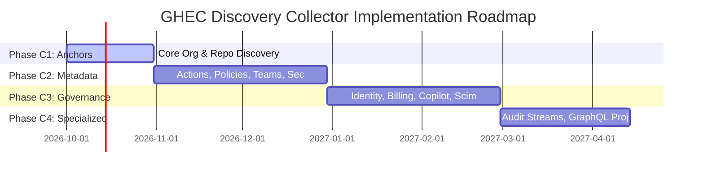

# Phased Implementation Roadmap for GHEC Discovery Collectors

This roadmap establishes the phased engineering sequence, release gates, entry/exit criteria, and dependency progression for implementing live discovery collectors in the CLI.

---

## Roadmap Overview

| Phase        | Focus Domain                        |    Planned Collectors | Key Operations                                                                                                                  | Target Contract                     | Runtime Readiness                           |
| ------------ | ----------------------------------- | --------------------: | ------------------------------------------------------------------------------------------------------------------------------- | ----------------------------------- | ------------------------------------------- |
| **Phase C1** | **Core Anchors & Scope**            |                 **3** | `rest.orgs.get` `rest.repos.list-for-org` `rest.repos.get`                                                                | Contract v1.0.0 / v2.0.0 foundation | Recommended First Implementation Phase      |
| **Phase C2** | **Default Configuration & Posture** |               **234** | Actions policies/runners/caches, branch rulesets, secret metadata, teams hierarchy, code security settings, custom roles        | Proposed Contract v2.0.0            | Blocked pending C1 verification             |
| **Phase C3** | **Advanced Governance & Identity**  | _Deferred_ (C3 scope) | Filtered security alert metrics, SAML/SCIM identity reconciliation, enterprise billing budgets, Copilot seats, migration status | Proposed Contract v2.1.0            | Blocked pending C2 completion & SCIM review |
| **Phase C4** | **Specialized & Streaming Domains** | _Deferred_ (C4 scope) | Audit log event streaming, fine-grained PAT grants, GraphQL collaboration projections, historical exports                       | Proposed Contract v3.0.0            | Blocked pending enterprise streaming infra  |

---

## Phase C1: Core Anchor Collectors (Foundation)

### Objective

Establish authoritative organization descriptors and repository resource anchors. Every downstream collector depends on either the organization anchor or repository anchors to bind evidence records.

### Operations in Scope (3 Collectors)

1. `rest.orgs.get` (`/orgs/{org}`): Basic organization details, plan type, verified domain indicators, default repo permissions.
2. `rest.repos.list-for-org` (`/orgs/{org}/repos`): Multi-page repository inventory, visibility (public/private/internal), archived status, default branch, disk usage size, fork state.
3. `rest.repos.get` (`/repos/{owner}/{repo}`): Detailed repository metadata anchor when scoping a single target repository.

### Prerequisites & Entry Criteria

- Shared HTTP adapter implemented with Octokit, supporting link-header pagination, backoff retry, and abort signal.
- Verified least-privilege token model in synthetic test organization (Fine-grained PAT with Repository: Read, Organization: Read).
- Preflight credential check to detect expired tokens (401) without printing credentials.

### Exit Criteria & Release Gate (Gate C1)

- [ ] Multi-page pagination passes with synthetic mock (page 1, page 2, empty terminal page).
- [ ] Rate limit throttling (403/429) backoff with jitter verified via mock clock.
- [ ] Output records conform strictly to Contract v1.0.0 (`packages/contracts/src/index.ts`).
- [ ] Repository IDs are derived from immutable GitHub numeric IDs, namespaced by organization.
- [ ] Missing or inaccessible organization produces clean error without synthetic hallucination.

---

## Phase C2: Default Configuration & Governance Metadata

### Objective

Implement the 234 default configuration and security posture collectors across Actions, branch protection, rulesets, teams, secret metadata, code security, package metadata, and custom repository properties.

### Major Capability Groups

1. **Actions & Runners (90 collectors)**:
   - Policies (`get-enterprise-actions-policies`, `get-org-actions-policies`, `get-workflow-access-to-repository`).
   - Self-hosted runners and runner groups (`list-self-hosted-runners-for-org`, `list-self-hosted-runner-groups-for-org`).
   - Hosted runner machine specs and images (`list-hosted-runners-for-org`, `get-hosted-runners-machine-specs-for-org`).
   - Cache metrics (`get-actions-cache-usage`, `get-actions-cache-list`).
   - Workflow run and artifact metadata (`list-workflow-runs-for-repo`, `list-artifacts-for-repo`).
2. **Branch Protection & Rulesets (16 collectors)**:
   - Classic branch protection (`get-branch-protection`, `get-status-checks-protection`).
   - Organization and repository rulesets (`get-org-rulesets`, `get-repo-rulesets`, `get-repo-ruleset`).
   - Custom deployment protection rules and environments (`get-all-environments`, `get-environment`).
3. **Teams & Hierarchy (20 collectors)**:
   - Team listings, child teams, membership counts, repository access mappings (`list-child-in-org`, `list-repos-in-org`).
   - Enterprise team memberships and org assignments (`enterprise-teams.list`, `enterprise-team-organizations.get-assignments`).
4. **Secret & Variable Metadata (4 collectors)**:
   - Secret names, update timestamps, and selected repository scopes (`list-org-secrets`, `list-repo-secrets`, `list-selected-repos-for-org-secret`).
   - Environment secret metadata (`list-environment-secrets`).
5. **Code Security Settings (17 collectors)**:
   - Enterprise and organization code security configurations (`get-configurations-for-org`, `get-default-configurations`).
   - Code scanning default setup (`get-default-setup`) and AI scan enablement (`get-ai-scan-enablement-for-org`).
   - Secret scanning security analysis settings (`get-security-analysis-settings-for-enterprise`).
6. **Governance & Custom Properties (17 collectors)**:
   - Custom property schemas for repositories and organizations (`custom-properties-for-repos-get-organization-definitions`).
   - Custom repository roles and organization roles (`list-custom-repo-roles`, `list-org-roles`).
7. **Packages & Deployments (7 collectors)**:
   - Package lists and versions (`list-packages-for-organization`, `get-all-package-versions-for-package-owned-by-org`).
   - GitHub Pages configuration and build status (`get-pages`, `list-pages-builds`).

### Exit Criteria & Release Gate (Gate C2)

- [ ] Contract v2.0.0 reader and writer approved, registered in contracts package.
- [ ] All declared output fields conform strictly to `BASE_FIELDS` allowlists.
- [ ] Zero execution of value-bearing operations (variable values, webhook secrets, file contents).
- [ ] Fan-out bounded to concurrency limit 2 per organization.
- [ ] Partial execution correctly reported when child resources (e.g. environments) encounter 403.

---

## Phase C3: Advanced Governance, Identity, and Billing

### Objective

Expand discovery to restricted enterprise domains requiring dedicated response minimization, identity pseudonymization, or selective GraphQL query projections.

### Capabilities in Scope

1. **SAML / SCIM Identity Reconciliation**:
   - SCIM v2 enterprise users and groups (`/scim/v2/enterprises/{enterprise}/Users`).
   - Response minimization to strip personal email, physical addresses, and external identity attributes.
   - Reconciliation of EMU identity mappings against internal organization memberships.
2. **Enterprise Billing & Budgets**:
   - Enterprise cost centers, budget user states, and license consumption (`get-consumed-licenses`, `get-all-budgets`, `get-all-cost-centers`).
   - Verification of the 10 seed billing usage endpoints.
3. **Copilot License & Seat Management**:
   - Copilot organization details (`get-copilot-organization-details`).
   - Copilot seat assignments, activity dates, and breakdown metrics (`list-copilot-seats`, `list-copilot-seats-for-enterprise`).
   - Coding agent repository permissions.
4. **Security Alert Backlog Metrics**:
   - Aggregate open/closed alert counts for Dependabot, Code Scanning, and Secret Scanning without extracting code snippets or confidential remediation advice.
5. **Selective GraphQL Collaboration Metadata**:
   - Query PR, issue, and discussion counts, review turnaround times, and migration readiness metrics using GraphQL field selection to exclude message bodies and diffs.

### Exit Criteria & Release Gate (Gate C3)

- [ ] SCIM attribute allowlist approved by privacy stakeholders.
- [ ] Identity pseudonymization key destruction verified under audit logging.
- [ ] GraphQL query cost calculation and pagination verified against GitHub GraphQL schema.

---

## Phase C4: Specialized & Streaming Domains

### Objective

Address enterprise-scale streaming data, fine-grained PAT management, and legacy API deprecation migrations.

### Capabilities in Scope

1. **Audit Log Event Ingestion**:
   - Enterprise audit log streaming endpoint validation (`/enterprises/{enterprise}/audit-log/streams`).
   - Historical audit log query with strict date-window bounds and event category allowlists.
2. **Fine-Grained PAT Grant Management**:
   - Organization PAT grant requests and repository associations (`list-pat-grants`, `list-pat-grant-requests`).
3. **Enterprise Search & Large Asset Auditing**:
   - Search query boundaries for enterprise migration planning.
   - Large asset and Git LFS storage reconciliation against customer billing attestations.
4. **Legacy API Migration Tooling**:
   - Automated detection of deprecated endpoint usage and seamless normalizer migration to replacement endpoints.

### Exit Criteria & Release Gate (Gate C4)

- [ ] Audit log streaming credential isolation verified.
- [ ] Large-bundle (100MB+) memory consumption within CLI runtime budgets.
- [ ] Deprecated endpoint fallback paths tested and documented.

---

## Release Recommendation

**Recommended Immediate Next Step**: Execute **Phase C1** (Core Anchors).
By implementing the 3 anchor collectors (`rest.orgs.get`, `rest.repos.list-for-org`, `rest.repos.get`) and validating their live execution in a synthetic test organization, the team will establish the live transport layer, verify rate limiting with real GitHub headers, and validate the primary resource graph before scaling to the 234 Phase C2 collectors.
