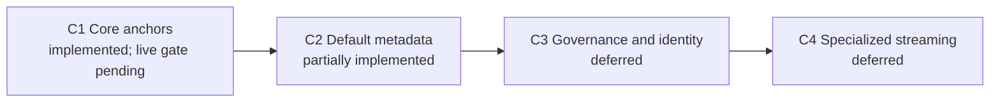

# Phased Implementation Roadmap for GHEC Discovery Collectors

This roadmap separates implemented runtime scope from the broader researched
collector catalog. Runtime support is determined by executable code and
recorded verification, not by the existence of a collector specification.

## Roadmap Overview

| Phase  | Focus                                                              |          Catalog scope | Executable status                                                                                                             | Contract status            |
| ------ | ------------------------------------------------------------------ | ---------------------: | ----------------------------------------------------------------------------------------------------------------------------- | -------------------------- |
| **C1** | Core organization and repository anchors                           |    3 anchor operations | Implemented and mock-tested; approved synthetic live evidence pending                                                         | v1.0.0                     |
| **C2** | Default configuration and posture                                  | 234 planned operations | Partially implemented through 11 user-facing modules and selected GraphQL/REST collectors; the full catalog is not executable | v1.0.0 frozen; v2 deferred |
| **C3** | Advanced governance, identity, billing, and Copilot                |               Deferred | Research exists; broad runtime implementation and privacy approval pending                                                    | Future decision            |
| **C4** | Audit streams, PAT grants, search, and historical/large-scale data |               Deferred | Not implemented as a complete runtime phase                                                                                   | Future decision            |

## Phase C1: Core Anchor Collectors

### Implemented Scope

- Organization descriptors and repository anchors.
- REST pagination, retry/backoff, abort handling, and rate-limit awareness.
- GraphQL-first repository aggregation with REST fallback behavior.
- Immutable/namespaced relationship IDs, provenance, partial outcomes, and
  v1.0.0 contract validation.
- Mock integration coverage for multi-page enumeration, inaccessible scope,
  enterprise boundaries, and bundle generation.

### Remaining C1 Release Gate

- Run the read-only adapter against an explicitly approved synthetic GitHub
  organization.
- Record real pagination and rate-limit headers without recording credentials
  or raw sensitive responses.
- Verify missing, inaccessible, and SSO-restricted targets with least-privilege
  credentials.
- Attach the live evidence and exact tested permissions to the release record.

Until that evidence exists, C1 is **implemented**, not live-verified.

## Phase C2: Default Configuration and Governance Metadata

### Implemented Runtime Baseline

The CLI exposes these 11 user-facing modules:

1. `orgs`
2. `repos`
3. `lfs`
4. `teams`
5. `actions`
6. `actions-secrets`
7. `policies`
8. `security`
9. `integrations`
10. `users`
11. `packages`

Selected GraphQL aggregators and REST fallback collectors currently emit typed
repository, policy, team, Actions, security, integration, identity, package,
asset, and LFS evidence. Advanced entities include runner groups, runners,
workflows, policy/configuration metadata, releases, ownership, projects, and
dependency records where supported by the active collector path or fixtures.

### Catalog Expansion Boundary

The 234 C2 entries describe the desired operation-level collection surface.
They include Actions infrastructure, branch protection, rulesets, teams,
secret metadata, code security, governance, packages, and deployments. Most
entries remain specifications or are consolidated behind a smaller runtime
collector. Do not report “234 collectors implemented” without operation-level
execution evidence.

### Remaining C2 Release Gate

- Maintain the specialized positive and 403/permission-denied fixtures as the
  runtime surface evolves.
- Keep the implemented v1.0.0 shape frozen; route new typed scope through the
  version-review rules in ADRs 0002 and 0004.
- Preserve strict field allowlists and prohibit value-bearing operations.
- Verify bounded fan-out and partial collection against approved synthetic
  targets.
- Publish an operation-level support matrix showing implemented, consolidated,
  deferred, and excluded operations.

## Phase C3: Advanced Governance, Identity, and Billing

This phase remains deferred beyond the current release baseline.

Candidate capabilities include:

- SAML/SCIM and Enterprise Managed User reconciliation with an approved
  attribute allowlist.
- Enterprise billing, cost-center, budget, and license summaries.
- Copilot seat and coding-agent governance.
- Aggregated security-alert backlog metrics without code snippets or secret
  content.
- Selective GraphQL collaboration metrics that exclude message bodies and
  diffs.

Entry requires privacy approval, verified permissions, contract capacity, and
completion of the C1/C2 release gates.

## Phase C4: Specialized and Streaming Domains

This phase also remains deferred.

Candidate capabilities include:

- Enterprise audit-log stream configuration and bounded historical queries.
- Fine-grained PAT grant metadata.
- Enterprise search and large-asset/LFS reconciliation.
- Deprecated endpoint detection and explicit normalizer migrations.

Entry requires streaming credential isolation, resource budgets, retention
rules, and tested fallback behavior.

## Contract Boundary

The executable writer and reader support **v1.0.0 only**, frozen for this
release by ADR 0004. References to v2 or later in collector specifications are
deferred design targets. A new version does not exist until a separate ADR is
approved and the contracts package registers a reader/writer with fixtures,
migration behavior, producer changes, and dashboard compatibility messaging.

## Immediate Recommendation

Do not begin another broad collector phase yet. Close the current release
baseline in this order:

1. Land the implementation through review and activate the monorepo CI gate.
2. Complete approved synthetic live-read validation.
3. Record dashboard browser, accessibility, responsive, visual, and performance
   evidence.

The authoritative item-level backlog is
[`agent-tasks/CURRENT-TASKS.md`](../../agent-tasks/CURRENT-TASKS.md).
